```mermaid
graph TD
    subgraph "C# 메모리 관리"
        CS_ALLOC["객체 할당<br/>new Person()"]
        CS_HEAP["매니지드 힙"]
        CS_REF["참조가 힙을 가리킴"]
        CS_GC_CHECK["GC가 주기적으로 도달 불가능한<br/>객체가 있는지 확인"]
        CS_SWEEP["Mark and Sweep<br/>컬렉션 방식"]
        CS_PAUSE["[단점] GC 일시 중단 발생"]
        
        CS_ALLOC --> CS_HEAP
        CS_HEAP --> CS_REF
        CS_REF --> CS_GC_CHECK
        CS_GC_CHECK --> CS_SWEEP
        CS_SWEEP --> CS_PAUSE
        
        CS_ISSUES["[단점] 비결정론적 정리<br/>[단점] 메모리 압박 발생<br/>[단점] 종료자(Finalization) 복잡성<br/>[장점] 사용하기 편리함"]
    end
    
    subgraph "Rust 소유권 시스템"
        RUST_ALLOC["값 생성<br/>Person { ... }"]
        RUST_OWNER["스택 또는 힙의<br/>단일 소유자"]
        RUST_BORROW["빌림 시스템<br/>&T, &mut T"]
        RUST_SCOPE["스코프 기반 정리<br/>Drop 트레이트"]
        RUST_COMPILE["컴파일 타임 검증"]
        
        RUST_ALLOC --> RUST_OWNER
        RUST_OWNER --> RUST_BORROW
        RUST_BORROW --> RUST_SCOPE
        RUST_SCOPE --> RUST_COMPILE
        
        RUST_BENEFITS["[장점] 결정론적 정리<br/>[장점] 런타임 비용 제로<br/>[장점] 메모리 누수 없음<br/>[단점] 학습 곡선이 높음"]
    end
    
    style CS_ISSUES fill:#ffebee,color:#000
    style RUST_BENEFITS fill:#e8f5e8,color:#000
    style CS_PAUSE fill:#ffcdd2,color:#000
    style RUST_COMPILE fill:#c8e6c9,color:#000
```

## 소유권의 이해

> **학습 목표:** Rust의 소유권(Ownership) 시스템을 배웁니다. 왜 `let s2 = s1`이 (C#의 참조 복사와 달리) `s1`을 무효화하는지, 소유권의 세 가지 규칙, `Copy`와 `Move` 타입의 차이, `&`와 `&mut`을 이용한 빌림(Borrowing), 그리고 빌림 검사기가 어떻게 가비지 컬렉션을 대체하는지 이해합니다.
>
> **난이도:** 🟡 중급

소유권은 Rust의 가장 독특한 특징이며, C# 개발자에게 가장 큰 개념적 변화를 요구하는 부분입니다. 단계별로 접근해 보겠습니다.

### C# 메모리 모델 (복습)
```csharp
// C# - 자동 메모리 관리
public void ProcessData()
{
    var data = new List<int> { 1, 2, 3, 4, 5 };
    ProcessList(data);
    // data는 여기서 여전히 접근 가능합니다.
    Console.WriteLine(data.Count);  // 잘 작동함
    
    // 더 이상 참조가 남지 않으면 GC가 정리합니다.
}

public void ProcessList(List<int> list)
{
    list.Add(6);  // 원본 리스트를 수정함
}
```

### Rust 소유권 규칙
1. **각 값은 정확히 하나의 소유자(Owner)를 가집니다.** (`Rc<T>`/`Arc<T>`를 통해 공유 소유권을 선택하지 않는 한 — [스마트 포인터](ch07-3-smart-pointers-beyond-single-ownership.md) 참고)
2. **소유자가 스코프(Scope)를 벗어나면, 그 값은 해제(Drop)됩니다.** (결정론적인 정리 — [Drop](ch07-3-smart-pointers-beyond-single-ownership.md#drop-rust의-idisposable) 참고)
3. **소유권은 이전(Move)될 수 있습니다.**

```rust
// Rust - 명시적인 소유권 관리
fn process_data() {
    let data = vec![1, 2, 3, 4, 5];  // data가 벡터를 소유함
    process_list(data);              // 소유권이 함수 내부로 이동됨
    // println!("{:?}", data);       // ❌ 에러: data는 더 이상 여기서 소유되지 않음
}

fn process_list(mut list: Vec<i32>) {  // 이제 list가 벡터를 소유함
    list.push(6);
    // 함수가 끝나면 list가 해제(Drop)됨
}
```

### C# 개발자를 위한 "이동(Move)"의 이해
```csharp
// C# - 참조가 복사되고 객체는 제자리에 머뭅니다.
// (클래스와 같은 참조 타입만 이렇게 작동하며, 
//  C#의 struct와 같은 값 타입은 다르게 동작합니다.)
var original = new List<int> { 1, 2, 3 };
var reference = original;  // 두 변수 모두 같은 객체를 가리킴
original.Add(4);
Console.WriteLine(reference.Count);  // 4 - 동일한 객체임
```

```rust
// Rust - 소유권 자체가 이전됩니다.
let original = vec![1, 2, 3];
let moved = original;       // 소유권 이전
// println!("{:?}", original);  // ❌ 에러: original은 더 이상 데이터를 소유하지 않음
println!("{:?}", moved);    // ✅ 작동함: 이제 moved가 데이터를 소유함
```

### Copy 타입 vs Move 타입
```rust
// Copy 타입 (C#의 값 타입과 유사) - 이동되지 않고 복사됨
let x = 5;        // i32는 Copy를 구현함
let y = x;        // x의 값이 y로 복사됨
println!("{}", x); // ✅ 작동함: x는 여전히 유효함

// Move 타입 (C#의 참조 타입과 유사) - 복사되지 않고 이동됨
let s1 = String::from("hello");  // String은 Copy를 구현하지 않음
let s2 = s1;                     // s1이 s2로 이동됨
// println!("{}", s1);           // ❌ 에러: s1은 더 이상 유효하지 않음
```

### 실전 예제: 값 바꾸기(Swapping)
```csharp
// C# - 단순한 참조 교체
public void SwapLists(ref List<int> a, ref List<int> b)
{
    var temp = a;
    a = b;
    b = temp;
}
```

```rust
// Rust - 소유권을 고려한 교체
fn swap_vectors(a: &mut Vec<i32>, b: &mut Vec<i32>) {
    std::mem::swap(a, b);  // 내장된 swap 함수 사용
}

// 또는 수동 방식
fn manual_swap() {
    let mut a = vec![1, 2, 3];
    let mut b = vec![4, 5, 6];
    
    let temp = a;  // a를 temp로 이동
    a = b;         // b를 a로 이동
    b = temp;      // temp를 b로 이동
    
    println!("a: {:?}, b: {:?}", a, b);
}
```

***

## 빌림(Borrowing) 기초

빌림은 C#에서 참조를 얻는 것과 비슷하지만, 컴파일 타임에 안전성이 보장됩니다.

### C# 참조 매개변수
```csharp
// C# - ref 및 out 매개변수
public void ModifyValue(ref int value)
{
    value += 10;
}

public void ReadValue(in int value)  // 읽기 전용 참조
{
    Console.WriteLine(value);
}

public bool TryParse(string input, out int result)
{
    return int.TryParse(input, out result);
}
```

### Rust 빌림
```rust
// Rust - & 및 &mut를 사용한 빌림
fn modify_value(value: &mut i32) {  // 가변 빌림
    *value += 10;
}

fn read_value(value: &i32) {        // 불변 빌림
    println!("{}", value);
}

fn main() {
    let mut x = 5;
    
    read_value(&x);      // 불변으로 빌려줌
    modify_value(&mut x); // 가변으로 빌려줌
    
    println!("{}", x);   // x의 소유권은 여전히 여기에 있음
}
```

### 빌림 규칙 (컴파일 타임에 강제됨!)
```rust
fn borrowing_rules() {
    let mut data = vec![1, 2, 3];
    
    // 규칙 1: 여러 개의 불변 빌림은 허용됨
    let r1 = &data;
    let r2 = &data;
    println!("{:?} {:?}", r1, r2);  // ✅ 작동함
    
    // 규칙 2: 가변 빌림은 한 번에 오직 하나만 가능함
    let r3 = &mut data;
    // let r4 = &mut data;  // ❌ 에러: 두 번 가변으로 빌릴 수 없음
    // let r5 = &data;      // ❌ 에러: 가변으로 빌려준 동안에는 불변으로도 빌릴 수 없음
    
    r3.push(4);  // 가변 빌림 사용
    // r3는 여기서 스코프를 벗어남
    
    // 규칙 3: 이전 빌림들이 끝나면 다시 빌릴 수 있음
    let r6 = &data;  // ✅ 이제 다시 빌릴 수 있음
    println!("{:?}", r6);
}
```

### C# vs Rust: 참조 안전성
```csharp
// C# - 런타임 에러 가능성
public class ReferenceSafety
{
    private List<int> data = new List<int>();
    
    public List<int> GetData() => data;  // 내부 데이터에 대한 참조를 반환
    
    public void UnsafeExample()
    {
        var reference = GetData();
        
        // 여기서 다른 스레드가 data를 수정할 수도 있습니다!
        Thread.Sleep(1000);
        
        // reference가 유효하지 않게 되거나 값이 변했을 수 있습니다.
        reference.Add(42);  // 잠재적인 데이터 경합 발생
    }
}
```

```rust
// Rust - 컴파일 타임 안전성
pub struct SafeContainer {
    data: Vec<i32>,
}

impl SafeContainer {
    // 불변 빌림 반환 - 호출자가 수정할 수 없음
    // &Vec<i32>보다는 &[i32]를 반환하는 것이 좋습니다 (더 넓은 범위를 수용함)
    pub fn get_data(&self) -> &[i32] {
        &self.data
    }
    
    // 가변 빌림 반환 - 독점적 접근 보장
    pub fn get_data_mut(&mut self) -> &mut Vec<i32> {
        &mut self.data
    }
}

fn safe_example() {
    let mut container = SafeContainer { data: vec![1, 2, 3] };
    
    let reference = container.get_data();
    // container.get_data_mut();  // ❌ 에러: 불변으로 빌려준 동안에는 가변으로 빌릴 수 없음
    
    println!("{:?}", reference);  // 불변 참조 사용
    // reference는 여기서 스코프를 벗어남
    
    let mut_reference = container.get_data_mut();  // ✅ 이제 가능함
    mut_reference.push(4);
}
```

***

## 이동 의미론(Move Semantics)

### C# 값 타입 vs 참조 타입
```csharp
// C# - 값 타입은 복사됩니다.
struct Point
{
    public int X { get; set; }
    public int Y { get; set; }
}

var p1 = new Point { X = 1, Y = 2 };
var p2 = p1;  // 복사 발생
p2.X = 10;
Console.WriteLine(p1.X);  // 여전히 1임

// C# - 참조 타입은 객체를 공유합니다.
var list1 = new List<int> { 1, 2, 3 };
var list2 = list1;  // 참조 복사
list2.Add(4);
Console.WriteLine(list1.Count);  // 4 - 동일한 객체임
```

### Rust 이동 의미론
```rust
// Rust - Copy를 구현하지 않은 타입은 기본적으로 이동(Move)합니다.
#[derive(Debug)]
struct Point {
    x: i32,
    y: i32,
}

fn move_example() {
    let p1 = Point { x: 1, y: 2 };
    let p2 = p1;  // 이동 (복사가 아님)
    // println!("{:?}", p1);  // ❌ 에러: p1은 이동됨
    println!("{:?}", p2);    // ✅ 작동함
}

// 복사를 가능하게 하려면 Copy 트레이트를 구현해야 합니다.
#[derive(Debug, Copy, Clone)]
struct CopyablePoint {
    x: i32,
    y: i32,
}

fn copy_example() {
    let p1 = CopyablePoint { x: 1, y: 2 };
    let p2 = p1;  // 복사 발생 (Copy 트레이트 덕분)
    println!("{:?}", p1);  // ✅ 작동함
    println!("{:?}", p2);  // ✅ 작동함
}
```

### 값이 이동되는 시점
```rust
fn demonstrate_moves() {
    let s = String::from("hello");
    
    // 1. 할당 시 이동 발생
    let s2 = s;  // s가 s2로 이동됨
    
    // 2. 함수 호출 시 이동 발생
    take_ownership(s2);  // s2가 함수 내부로 이동됨
    
    // 3. 함수 반환 시 이동 발생
    let s3 = give_ownership();  // 반환값이 s3로 이동됨
    
    println!("{}", s3);  // s3는 유효함
}

fn take_ownership(s: String) {
    println!("{}", s);
    // 여기서 s가 해제(Drop)됨
}

fn give_ownership() -> String {
    String::from("yours")  // 소유권이 호출자에게 이전됨
}
```

### 빌림을 통해 이동 피하기
```rust
fn demonstrate_borrowing() {
    let s = String::from("hello");
    
    // 이동 대신 빌림 사용
    let len = calculate_length(&s);  // s를 빌려줌
    println!("'{}'의 길이는 {}입니다", s, len);  // s는 여전히 유효함
}

fn calculate_length(s: &String) -> usize {
    s.len()  // 소유하지 않으므로 함수가 끝나도 해제되지 않음
}
```

***

## 메모리 관리: GC vs RAII

### C# 가비지 컬렉션(GC)
```csharp
// C# - 자동 메모리 관리
public class Person
{
    public string Name { get; set; }
    public List<string> Hobbies { get; set; } = new List<string>();
    
    public void AddHobby(string hobby)
    {
        Hobbies.Add(hobby);  // 메모리 할당이 자동으로 이루어짐
    }
    
    // 명시적인 정리가 필요 없음 - GC가 처리함
    // 하지만 리소스를 위해 IDisposable 패턴 존재
}

using var file = new FileStream("data.txt", FileMode.Open);
// 'using'은 Dispose()가 호출됨을 보장합니다.
```

### Rust 소유권과 RAII
```rust
// Rust - 컴파일 타임 메모리 관리
pub struct Person {
    name: String,
    hobbies: Vec<String>,
}

impl Person {
    pub fn add_hobby(&mut self, hobby: String) {
        self.hobbies.push(hobby);  // 메모리 관리가 컴파일 타임에 추적됨
    }
    
    // Drop 트레이트가 자동으로 구현됨 - 정리가 보장됨
    // C#의 IDisposable과 비교해 보세요:
    //   C#:   using var file = new FileStream(...)    // using 블록 끝에서 Dispose() 호출
    //   Rust: let file = File::open(...)?             // 스코프 끝에서 drop() 호출 — 별도의 'using' 불필요
}

// RAII - Resource Acquisition Is Initialization (리소스 획득은 초기화임)
{
    let file = std::fs::File::open("data.txt")?;
    // 'file'이 스코프를 벗어나면 파일이 자동으로 닫힘
    // 별도의 'using' 문이 필요 없으며 타입 시스템이 이를 처리함
}
```



***


<details>
<summary><strong>🏋️ 실습: 빌림 검사기 에러 수정하기</strong> (펼치기)</summary>

**도전 과제**: 아래 각 코드 조각에는 빌림 검사기 에러가 있습니다. 출력 결과를 바꾸지 않고 에러를 수정해 보세요.

```rust
// 1. 사용 후 이동(Move) 발생
fn problem_1() {
    let name = String::from("앨리스");
    let greeting = format!("안녕하세요, {name}님!");
    let upper = name.to_uppercase();  // 힌트: 이동 대신 빌림 사용하기
    println!("{greeting} — {upper}");
}

// 2. 가변 빌림과 불변 빌림의 중첩
fn problem_2() {
    let mut numbers = vec![1, 2, 3];
    let first = &numbers[0];
    numbers.push(4);            // 힌트: 작업 순서 변경하기
    println!("첫 번째 요소 = {first}");
}

// 3. 로컬 변수에 대한 참조 반환
fn problem_3() -> String {
    let s = String::from("안녕하세요");
    s   // 힌트: &str이 아닌 소유권이 있는 값 반환하기
}
```

<details>
<summary>🔑 해답</summary>

```rust
// 1. format!은 이미 인자를 빌려옵니다. 사실 원본 코드도 잘 작동합니다!
//    하지만 `let greeting = name;` 처럼 소유권이 완전히 넘어가는 상황이었다면
//    &name을 사용하여 해결해야 합니다.
fn solution_1() {
    let name = String::from("앨리스");
    let greeting = format!("안녕하세요, {}님!", &name); // 빌림
    let upper = name.to_uppercase();             // name이 여전히 유효함
    println!("{greeting} — {upper}");
}

// 2. 가변 작업이 일어나기 전에 불변 빌림을 먼저 사용하세요:
fn solution_2() {
    let mut numbers = vec![1, 2, 3];
    let first = numbers[0]; // i32 값을 복사함 (i32는 Copy 타입이므로)
    numbers.push(4);
    println!("첫 번째 요소 = {first}");
}

// 3. 소유권이 있는 String을 반환하세요 (이미 올바른 형태입니다 — 초보자들이 자주 혼동하는 부분):
fn solution_3() -> String {
    let s = String::from("안녕하세요");
    s // 소유권이 호출자에게 이전됨 — 이것이 올바른 패턴입니다.
}
```

**핵심 포인트**:
- `format!()` 매크로는 인자를 이동시키지 않고 빌려옵니다.
- `i32`와 같은 기본 타입은 `Copy`를 구현하므로, 인덱싱 시 값이 복사됩니다.
- 소유권이 있는 값을 반환하면 소유권이 호출자에게 이전되므로 수명(Lifetime) 문제가 발생하지 않습니다.

</details>
</details>
