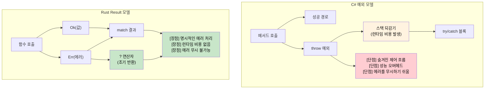

## 예외(Exceptions) vs `Result<T, E>`

> **학습 내용:** Rust가 예외 대신 `Result<T, E>`와 `Option<T>`를 사용하는 이유, 간결한 에러 전파를 위한 `?` 연산자, 그리고 명시적인 에러 처리가 어떻게 C#의 `try`/`catch` 코드에서 발생하는 숨겨진 제어 흐름을 제거하는지.
>
> **난이도:** 🟡 중급
>
> **참고**: `thiserror`와 `anyhow`를 활용한 실전 에러 패턴은 [크레이트 수준 에러 타입](ch09-1-crate-level-error-types-and-result-alias.md)을, 에러 관련 크레이트 생태계는 [필수 크레이트](ch15-1-essential-crates-for-c-developers.md)를 참조하십시오.

### C#의 예외 기반 에러 처리
```csharp
// C# - 예외 기반 에러 처리
public class UserService
{
    public User GetUser(int userId)
    {
        if (userId <= 0)
        {
            throw new ArgumentException("사용자 ID는 양수여야 합니다.");
        }
        
        var user = database.FindUser(userId);
        if (user == null)
        {
            throw new UserNotFoundException($"사용자 {userId}를 찾을 수 없습니다.");
        }
        
        return user;
    }
    
    public async Task<string> GetUserEmailAsync(int userId)
    {
        try
        {
            var user = GetUser(userId);
            return user.Email ?? throw new InvalidOperationException("사용자에게 이메일이 없습니다.");
        }
        catch (UserNotFoundException ex)
        {
            logger.Warning("사용자를 찾을 수 없음: {UserId}", userId);
            return "noreply@company.com";
        }
        catch (Exception ex)
        {
            logger.Error(ex, "사용자 이메일을 가져오는 중 예상치 못한 에러 발생");
            throw; // 다시 던지기
        }
    }
}
```

### Rust의 Result 기반 에러 처리
```rust
use std::fmt;

#[derive(Debug)]
pub enum UserError {
    InvalidId(i32),
    NotFound(i32),
    NoEmail,
    DatabaseError(String),
}

impl fmt::Display for UserError {
    fn fmt(&self, f: &mut fmt::Formatter<'_>) -> fmt::Result {
        match self {
            UserError::InvalidId(id) => write!(f, "유효하지 않은 사용자 ID: {}", id),
            UserError::NotFound(id) => write!(f, "사용자 {}를 찾을 수 없습니다", id),
            UserError::NoEmail => write!(f, "사용자에게 이메일 주소가 없습니다"),
            UserError::DatabaseError(msg) => write!(f, "데이터베이스 에러: {}", msg),
        }
    }
}

impl std::error::Error for UserError {}

pub struct UserService {
    // 데이터베이스 연결 등
}

impl UserService {
    pub fn get_user(&self, user_id: i32) -> Result<User, UserError> {
        if user_id <= 0 {
            return Err(UserError::InvalidId(user_id));
        }
        
        // 데이터베이스 조회 시뮬레이션
        self.database_find_user(user_id)
            .ok_or(UserError::NotFound(user_id))
    }
    
    pub fn get_user_email(&self, user_id: i32) -> Result<String, UserError> {
        let user = self.get_user(user_id)?; // ? 연산자는 에러를 상위로 전파합니다.
        
        user.email
            .ok_or(UserError::NoEmail)
    }
    
    pub fn get_user_email_or_default(&self, user_id: i32) -> String {
        match self.get_user_email(user_id) {
            Ok(email) => email,
            Err(UserError::NotFound(_)) => {
                log::warn!("사용자를 찾을 수 없음: {}", user_id);
                "noreply@company.com".to_string()
            }
            Err(err) => {
                log::error!("사용자 이메일 조회 중 에러: {}", err);
                "error@company.com".to_string()
            }
        }
    }
}
```



***

### ? 연산자: 간결한 에러 전파
```csharp
// C# - 예외 전파 (암시적)
public async Task<string> ProcessFileAsync(string path)
{
    var content = await File.ReadAllTextAsync(path);  // 에러 발생 시 예외 던짐
    var processed = ProcessContent(content);          // 에러 발생 시 예외 던짐
    return processed;
}
```

```rust
// Rust - ?를 이용한 에러 전파
fn process_file(path: &str) -> Result<String, ConfigError> {
    let content = read_config(path)?;  // Err일 경우 ?가 에러를 전파함
    let processed = process_content(&content)?;  // Err일 경우 ?가 에러를 전파함
    Ok(processed)  // 성공 값을 Ok로 감싸서 반환
}

fn process_content(content: &str) -> Result<String, ConfigError> {
    if content.is_empty() {
        Err(ConfigError::InvalidFormat)
    } else {
        Ok(content.to_uppercase())
    }
}
```

### `Option<T>`: 널 가능 값(Nullable Values)을 위해
```csharp
// C# - Nullable 참조 타입
public string? FindUserName(int userId)
{
    var user = database.FindUser(userId);
    return user?.Name;  // 사용자를 찾지 못하면 null 반환
}

public void ProcessUser(int userId)
{
    string? name = FindUserName(userId);
    if (name != null)
    {
        Console.WriteLine($"사용자: {name}");
    }
    else
    {
        Console.WriteLine("사용자를 찾을 수 없음");
    }
}
```

```rust
// Rust - 선택적 값을 위한 Option<T>
fn find_user_name(user_id: u32) -> Option<String> {
    // 데이터베이스 조회 시뮬레이션
    if user_id == 1 {
        Some("Alice".to_string())
    } else {
        None
    }
}

fn process_user(user_id: u32) {
    match find_user_name(user_id) {
        Some(name) => println!("사용자: {}", name),
        None => println!("사용자를 찾을 수 없음"),
    }
    
    // 또는 if let 사용 (패턴 매칭 축약형)
    if let Some(name) = find_user_name(user_id) {
        println!("사용자: {}", name);
    } else {
        println!("사용자를 찾을 수 없음");
    }
}
```

### Option과 Result의 조합
```rust
fn safe_divide(a: f64, b: f64) -> Option<f64> {
    if b != 0.0 {
        Some(a / b)
    } else {
        None
    }
}

fn parse_and_divide(a_str: &str, b_str: &str) -> Result<Option<f64>, ParseFloatError> {
    let a: f64 = a_str.parse()?;  // 유효하지 않으면 파싱 에러 반환
    let b: f64 = b_str.parse()?;  // 유효하지 않으면 파싱 에러 반환
    Ok(safe_divide(a, b))         // Ok(Some(결과)) 또는 Ok(None) 반환
}

use std::num::ParseFloatError;

fn main() {
    match parse_and_divide("10.0", "2.0") {
        Ok(Some(result)) => println!("결과: {}", result),
        Ok(None) => println!("0으로 나눌 수 없습니다"),
        Err(error) => println!("파싱 에러: {}", error),
    }
}
```

***


<details>
<summary><strong>🏋️ 연습 문제: 크레이트 수준 에러 타입 만들기</strong> (클릭하여 확장)</summary>

**도전 과제**: I/O 에러, JSON 파싱 에러, 검증 에러가 발생할 수 있는 파일 처리 애플리케이션을 위한 `AppError` 열거형을 만드십시오. 자동 `?` 전파를 위해 `From` 변환을 구현하십시오.

```rust
// 시작 코드
use std::io;

// TODO: 다음 변이(variant)를 가진 AppError 정의:
//   Io(io::Error), Json(serde_json::Error), Validation(String)
// TODO: Display 및 Error 트레이트 구현
// TODO: From<io::Error> 및 From<serde_json::Error> 구현
// TODO: 타입 별칭 정의: type Result<T> = std::result::Result<T, AppError>;

fn load_config(path: &str) -> Result<Config> {
    let content = std::fs::read_to_string(path)?;  // io::Error → AppError
    let config: Config = serde_json::from_str(&content)?;  // serde 에러 → AppError
    if config.name.is_empty() {
        return Err(AppError::Validation("이름은 비어 있을 수 없습니다".into()));
    }
    Ok(config)
}
```

<details>
<summary>🔑 정답</summary>

```rust
use std::io;
use thiserror::Error;

#[derive(Error, Debug)]
pub enum AppError {
    #[error("I/O 에러: {0}")]
    Io(#[from] io::Error),

    #[error("JSON 에러: {0}")]
    Json(#[from] serde_json::Error),

    #[error("검증 실패: {0}")]
    Validation(String),
}

pub type Result<T> = std::result::Result<T, AppError>;

#[derive(serde::Deserialize)]
struct Config {
    name: String,
    port: u16,
}

fn load_config(path: &str) -> Result<Config> {
    let content = std::fs::read_to_string(path)?;
    let config: Config = serde_json::from_str(&content)?;
    if config.name.is_empty() {
        return Err(AppError::Validation("이름은 비어 있을 수 없습니다".into()));
    }
    Ok(config)
}
```

**핵심 요점**:
- `thiserror`는 속성(attribute)으로부터 `Display`와 `Error` 구현을 자동으로 생성합니다.
- `#[from]`은 `From<T>` 구현을 생성하여, `?`를 통한 자동 변환을 가능하게 합니다.
- `Result<T>` 별칭을 사용하면 크레이트 전체에서 반복되는 코드를 줄일 수 있습니다.
- C# 예외와 달리, 에러 타입이 모든 함수의 시그니처에 명확히 드러납니다.

</details>
</details>
