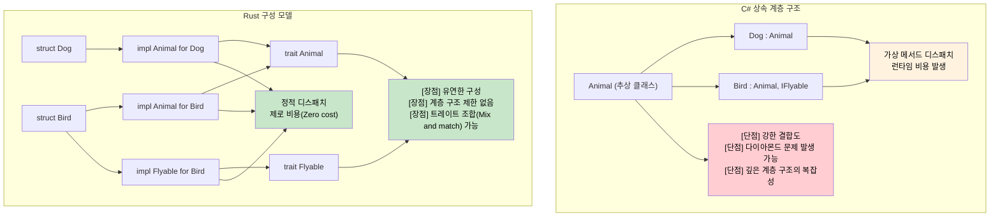

## 상속(Inheritance) vs 구성(Composition)

> **학습 내용:** Rust에 클래스 상속이 없는 이유, 트레이트(Trait)와 구조체(Struct)가 어떻게 깊은 클래스 계층 구조를 대체하는지, 그리고 구성을 통해 다형성을 달성하는 실전 패턴.
>
> **난이도:** 🟡 중급

```csharp
// C# - 클래스 기반 상속
public abstract class Animal
{
    public string Name { get; protected set; }
    public abstract void MakeSound();
    
    public virtual void Sleep()
    {
        Console.WriteLine($"{Name}이(가) 잠을 잡니다.");
    }
}

public class Dog : Animal
{
    public Dog(string name) { Name = name; }
    
    public override void MakeSound()
    {
        Console.WriteLine("멍멍!");
    }
    
    public void Fetch()
    {
        Console.WriteLine($"{Name}이(가) 공을 물어옵니다.");
    }
}

// 인터페이스 기반 계약
public interface IFlyable
{
    void Fly();
}

public class Bird : Animal, IFlyable
{
    public Bird(string name) { Name = name; }
    
    public override void MakeSound()
    {
        Console.WriteLine("짹짹!");
    }
    
    public void Fly()
    {
        Console.WriteLine($"{Name}이(가) 날아갑니다.");
    }
}
```

### Rust의 구성(Composition) 모델
```rust
// Rust - 트레이트를 이용한 상속보다 구성 우선 원칙
pub trait Animal {
    fn name(&self) -> &str;
    fn make_sound(&self);
    
    // 기본 구현 (C#의 가상 메서드와 유사)
    fn sleep(&self) {
        println!("{}이(가) 잠을 잡니다", self.name());
    }
}

pub trait Flyable {
    fn fly(&self);
}

// 데이터와 동작을 분리
#[derive(Debug)]
pub struct Dog {
    name: String,
}

#[derive(Debug)]
pub struct Bird {
    name: String,
    wingspan: f64,
}

// 각 타입에 대한 동작 구현
impl Animal for Dog {
    fn name(&self) -> &str {
        &self.name
    }
    
    fn make_sound(&self) {
        println!("멍멍!");
    }
}

impl Dog {
    pub fn new(name: String) -> Self {
        Dog { name }
    }
    
    pub fn fetch(&self) {
        println!("{}이(가) 공을 물어옵니다", self.name);
    }
}

impl Animal for Bird {
    fn name(&self) -> &str {
        &self.name
    }
    
    fn make_sound(&self) {
        println!("짹짹!");
    }
}

impl Flyable for Bird {
    fn fly(&self) {
        println!("{}이(가) {:.1}m의 날개로 날아갑니다", self.name, self.wingspan);
    }
}

// 다중 트레이트 바운드 (여러 인터페이스를 구현하는 것과 유사)
fn make_flying_animal_sound<T>(animal: &T) 
where 
    T: Animal + Flyable,
{
    animal.make_sound();
    animal.fly();
}
```



---

## 연습 문제

<details>
<summary><strong>🏋️ 연습 문제: 상속을 트레이트로 교체하기</strong> (클릭하여 확장)</summary>

다음 상속을 사용하는 C# 코드를 Rust의 트레이트 구성을 사용하는 코드로 다시 작성하십시오.

```csharp
public abstract class Shape { public abstract double Area(); }
public abstract class Shape3D : Shape { public abstract double Volume(); }
public class Cylinder : Shape3D
{
    public double Radius { get; }
    public double Height { get; }
    public Cylinder(double r, double h) { Radius = r; Height = h; }
    public override double Area() => 2.0 * Math.PI * Radius * (Radius + Height);
    public override double Volume() => Math.PI * Radius * Radius * Height;
}
```

요구사항:
1. `fn area(&self) -> f64`를 가진 `HasArea` 트레이트 정의
2. `fn volume(&self) -> f64`를 가진 `HasVolume` 트레이트 정의
3. 두 트레이트를 모두 구현하는 `Cylinder` 구조체 정의
4. `fn print_shape_info(shape: &(impl HasArea + HasVolume))` 함수 작성 (상속 없이 트레이트 바운드 조합을 사용하는 점에 유의하십시오)

<details>
<summary>🔑 정답</summary>

```rust
use std::f64::consts::PI;

trait HasArea {
    fn area(&self) -> f64;
}

trait HasVolume {
    fn volume(&self) -> f64;
}

struct Cylinder {
    radius: f64,
    height: f64,
}

impl HasArea for Cylinder {
    fn area(&self) -> f64 {
        2.0 * PI * self.radius * (self.radius + self.height)
    }
}

impl HasVolume for Cylinder {
    fn volume(&self) -> f64 {
        PI * self.radius * self.radius * self.height
    }
}

fn print_shape_info(shape: &(impl HasArea + HasVolume)) {
    println!("면적:   {:.2}", shape.area());
    println!("부피:   {:.2}", shape.volume());
}

fn main() {
    let c = Cylinder { radius: 3.0, height: 5.0 };
    print_shape_info(&c);
}
```

**핵심 통찰**: C#은 3단계 계층 구조(Shape → Shape3D → Cylinder)가 필요합니다. 반면 Rust는 평면적인 트레이트 구성 방식을 사용합니다. `impl HasArea + HasVolume` 구문은 상속의 깊이 없이도 필요한 기능들을 결합해 줍니다.

</details>
</details>

***
