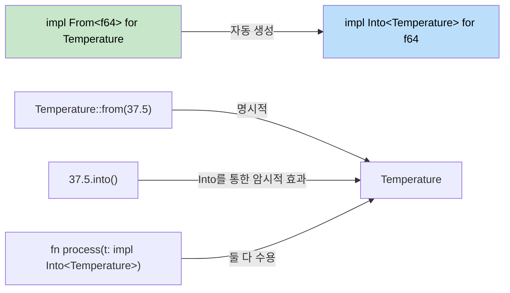

## Rust의 타입 변환(Type Conversions)

> **학습 내용:** Rust의 `From`/`Into` 트레이트와 C#의 암시적/명시적(implicit/explicit) 연산자 비교, 실패할 수 있는 변환을 위한 `TryFrom`/`TryInto`, 문자열 파싱을 위한 `FromStr`, 그리고 관용적인 문자열 변환 패턴.
>
> **난이도:** 🟡 중급

C#은 암시적/명시적 변환과 캐스팅 연산자를 사용합니다. Rust는 안전하고 명시적인 변환을 위해 `From`과 `Into` 트레이트를 사용합니다.

### C#의 변환 패턴
```csharp
// C# 암시적/명시적 변환
public class Temperature
{
    public double Celsius { get; }
    
    public Temperature(double celsius) { Celsius = celsius; }
    
    // 암시적 변환
    public static implicit operator double(Temperature t) => t.Celsius;
    
    // 명시적 변환
    public static explicit operator Temperature(double d) => new Temperature(d);
}

double temp = new Temperature(100.0);  // 암시적
Temperature t = (Temperature)37.5;     // 명시적
```

### Rust의 From과 Into
```rust
#[derive(Debug)]
struct Temperature {
    celsius: f64,
}

impl From<f64> for Temperature {
    fn from(celsius: f64) -> Self {
        Temperature { celsius }
    }
}

impl From<Temperature> for f64 {
    fn from(temp: Temperature) -> f64 {
        temp.celsius
    }
}

fn main() {
    // From 사용
    let temp = Temperature::from(100.0);
    
    // Into 사용 (From을 구현하면 자동으로 사용 가능)
    let temp2: Temperature = 37.5.into();
    
    // 함수 인자에서도 활용 가능
    fn process_temp(temp: impl Into<Temperature>) {
        let t: Temperature = temp.into();
        println!("온도: {:.1}°C", t.celsius);
    }
    
    process_temp(98.6);
    process_temp(Temperature { celsius: 0.0 });
}
```



> **기본 원칙**: `From`을 구현하십시오. 그러면 `Into`를 공짜로 얻게 됩니다. 호출자는 문맥상 더 읽기 좋은 쪽을 골라 사용할 수 있습니다.

### TryFrom: 실패할 수 있는 변환
```rust
use std::convert::TryFrom;

impl TryFrom<i32> for Temperature {
    type Error = String;
    
    fn try_from(value: i32) -> Result<Self, Self::Error> {
        if value < -273 {
            Err(format!("온도 {}°C는 절대 영도보다 낮습니다", value))
        } else {
            Ok(Temperature { celsius: value as f64 })
        }
    }
}

fn main() {
    match Temperature::try_from(-300) {
        Ok(t) => println!("유효: {:?}", t),
        Err(e) => println!("에러: {}", e),
    }
}
```

### 문자열 변환
```rust
// Display 트레이트를 통한 ToString 구현
impl std::fmt::Display for Temperature {
    fn fmt(&self, f: &mut std::fmt::Formatter<'_>) -> std::fmt::Result {
        write!(f, "{:.1}°C", self.celsius)
    }
}

// 이제 .to_string()이 자동으로 작동합니다.
let s = Temperature::from(100.0).to_string(); // "100.0°C"

// 파싱을 위한 FromStr 구현
use std::str::FromStr;

impl FromStr for Temperature {
    type Err = String;
    
    fn from_str(s: &str) -> Result<Self, Self::Err> {
        let s = s.trim_end_matches("°C").trim();
        let celsius: f64 = s.parse().map_err(|e| format!("유효하지 않은 온도: {}", e))?;
        Ok(Temperature { celsius })
    }
}

let t: Temperature = "100.0°C".parse().unwrap();
```

---

## 연습 문제

<details>
<summary><strong>🏋️ 연습 문제: 화폐 변환기</strong> (클릭하여 확장)</summary>

전체 타입 변환 생태계를 보여주는 `Money` 구조체를 만드십시오.

1. `Money { cents: i64 }` 정의 (부동 소수점 오차를 피하기 위해 센트 단위로 값을 저장함)
2. `From<i64>` 구현 (입력을 달러 단위로 간주하여 `cents = dollars * 100`으로 변환)
3. `TryFrom<f64>` 구현 — 음수 금액은 거부하고, 가장 가까운 센트 단위로 반올림
4. `Display`를 구현하여 `"$1.50"` 형식으로 출력
5. `FromStr`을 구현하여 `"$1.50"` 또는 `"1.50"` 문자열을 다시 `Money`로 파싱
6. 값을 합산하는 함수 `fn total(items: &[impl Into<Money> + Copy]) -> Money` 작성

<details>
<summary>🔑 정답</summary>

```rust
use std::fmt;
use std::str::FromStr;

#[derive(Debug, Clone, Copy)]
struct Money { cents: i64 }

impl From<i64> for Money {
    fn from(dollars: i64) -> Self {
        Money { cents: dollars * 100 }
    }
}

impl TryFrom<f64> for Money {
    type Error = String;
    fn try_from(value: f64) -> Result<Self, Self::Error> {
        if value < 0.0 {
            Err(format!("음수 금액: {value}"))
        } else {
            Ok(Money { cents: (value * 100.0).round() as i64 })
        }
    }
}

impl fmt::Display for Money {
    fn fmt(&self, f: &mut fmt::Formatter<'_>) -> fmt::Result {
        write!(f, "${}.{:02}", self.cents / 100, self.cents.abs() % 100)
    }
}

impl FromStr for Money {
    type Err = String;
    fn from_str(s: &str) -> Result<Self, Self::Err> {
        let s = s.trim_start_matches('$');
        let val: f64 = s.parse().map_err(|e| format!("{e}"))?;
        Money::try_from(val)
    }
}

fn main() {
    let a = Money::from(10);                       // $10.00
    let b = Money::try_from(3.50).unwrap();         // $3.50
    let c: Money = "$7.25".parse().unwrap();        // $7.25
    println!("{a} + {b} + {c}");
}
```

</details>
</details>

***
