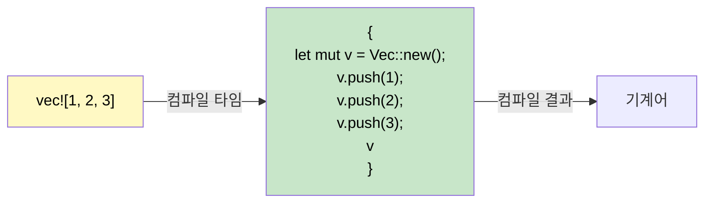

## 매크로(Macros): 코드를 작성하는 코드

> **학습 내용:** Rust에 매크로가 필요한 이유(오버로딩 및 가변 인자 미지원 보완), `macro_rules!` 기초, `!` 접미사 관례, 일반적인 파생(derive) 매크로, 그리고 빠른 디버깅을 위한 `dbg!()`.
>
> **난이도:** 🟡 중급

C#에는 Rust의 매크로와 직접적으로 대응되는 기능이 없습니다. 매크로가 왜 존재하는지, 그리고 어떻게 작동하는지 이해하면 C# 개발자들이 느끼는 큰 혼란 중 하나를 해소할 수 있습니다.

### Rust에 매크로가 존재하는 이유



```csharp
// C#은 매크로를 불필요하게 만드는 기능들을 갖추고 있습니다:
Console.WriteLine("Hello");           // 메서드 오버로딩 (1~16개 매개변수)
Console.WriteLine("{0}, {1}", a, b);  // params 배열을 통한 가변 인자
var list = new List<int> { 1, 2, 3 }; // 컬렉션 초기화 구문
```

```rust
// Rust에는 함수 오버로딩도, 가변 인자도, 특별한 초기화 구문도 없습니다.
// 매크로가 이 빈자리를 채웁니다:
println!("Hello");                    // 매크로 — 컴파일 타임에 0개 이상의 인자를 처리함
println!("{}, {}", a, b);             // 매크로 — 컴파일 타임에 타입을 검사함
let list = vec![1, 2, 3];            // 매크로 — Vec::new() + push() 코드로 확장됨
```

### 매크로 식별법: `!` 접미사

모든 매크로 호출은 `!`로 끝납니다. 호출 코드 끝에 `!`가 붙어 있다면 그것은 함수가 아니라 매크로입니다.

```rust
println!("hello");     // 매크로 — 컴파일 타임에 포맷 문자열 처리 코드를 생성함
format!("{x}");        // 매크로 — String을 반환하며, 컴파일 타임에 형식 검사 수행
vec![1, 2, 3];         // 매크로 — Vec을 생성하고 값을 채워넣음
todo!();               // macro — "아직 구현되지 않음" 메시지와 함께 패닉 발생
dbg!(expression);      // 매크로 — 파일명:줄번호 + 식 + 결과값을 출력하고 결과를 반환함
assert_eq!(a, b);      // 매크로 — a와 b가 다르면 차이점과 함께 패닉 발생
cfg!(target_os = "linux"); // 매크로 — 컴파일 타임에 플랫폼을 감지함
```

### `macro_rules!`를 이용한 간단한 매크로 작성
```rust
// 키-값 쌍을 전달받아 HashMap을 생성하는 매크로 정의
macro_rules! hashmap {
    // 패턴: 쉼표로 구분된 key => value 쌍 (마지막 쉼표 허용)
    ( $( $key:expr => $value:expr ),* $(,)? ) => {{
        let mut map = std::collections::HashMap::new();
        $( map.insert($key, $value); )*
        map
    }};
}

fn main() {
    let scores = hashmap! {
        "Alice" => 100,
        "Bob"   => 85,
        "Carol" => 92,
    };
    println!("{scores:?}");
}
```

### 파생(Derive) 매크로: 트레이트 자동 구현
```rust
// #[derive]는 트레이트 구현 코드를 생성하는 절차적(procedural) 매크로입니다.
#[derive(Debug, Clone, PartialEq, Eq, Hash)]
struct User {
    name: String,
    age: u32,
}
// 컴파일러가 구조체 필드를 분석하여 Debug::fmt, Clone::clone,
// PartialEq::eq 등을 자동으로 생성해 줍니다.
```

```csharp
// C# 대응 기능: 없음 — IEquatable, ICloneable 등을 직접 구현해야 함
// 단, 레코드(record)는 유사한 개념입니다: public record User(string Name, int Age);
// 레코드는 Equals, GetHashCode, ToString을 자동 생성해 주는데, 이와 비슷한 원리입니다.
```

### 자주 쓰이는 파생 매크로

| 파생 트레이트 | 용도 | C# 대응 개념 |
|--------|---------|---------------|
| `Debug` | `{:?}` 포맷 출력을 지원함 | `ToString()` 오버라이드 |
| `Clone` | `.clone()`을 통한 깊은 복사 지원 | `ICloneable` |
| `Copy` | 암시적 비트 복사 (상태 전달 시 복사됨) | 값 타입(`struct`) 시맨틱 |
| `PartialEq`, `Eq` | `==` 비교 연산 지원 | `IEquatable<T>` |
| `PartialOrd`, `Ord` | `<`, `>` 비교 및 정렬 지원 | `IComparable<T>` |
| `Hash` | `HashMap`의 키로 쓰기 위한 해싱 지원 | `GetHashCode()` |
| `Default` | `Default::default()`를 통한 기본값 제공 | 매개변수 없는 생성자 |
| `Serialize`, `Deserialize` | JSON/TOML 등 변환 (serde 활용) | `[JsonProperty]` 등의 속성 |

> **기본 원칙:** 모든 타입에 일단 `#[derive(Debug)]`를 붙이십시오. 필요에 따라 `Clone`, `PartialEq` 등을 추가하십시오. API나 파일, 데이터베이스와 연동되는 타입에는 `Serialize`, `Deserialize`를 추가하십시오.

### 절차적 매크로 및 속성 매크로 (인지 수준)

파생 매크로는 **절차적 매크로(Procedural macro)**의 일종으로, 컴파일 타임에 코드를 읽어 새로운 코드를 생성합니다. 그 외에 다음 두 가지 형태도 자주 접하게 됩니다.

**속성(Attribute) 매크로** — `#[...]` 형태로 아이템에 붙습니다.
```rust
#[tokio::main]          // main() 함수를 비동기 런타임 진입점으로 변환함
async fn main() { }

#[test]                 // 함수를 유닛 테스트로 표시함
fn it_works() { assert_eq!(2 + 2, 4); }

#[cfg(test)]            // 테스트 중에만 이 모듈을 컴파일함
mod tests { /* ... */ }
```

**함수형(Function-like) 매크로** — 함수 호출처럼 보입니다.
```rust
// sqlx::query!는 컴파일 타임에 실제 데이터베이스와 대조하여 SQL을 검증함
let users = sqlx::query!("SELECT id, name FROM users WHERE active = $1", true)
    .fetch_all(&pool)
    .await?;
```

> **C# 개발자를 위한 핵심 요약:** 절차적 매크로를 직접 *작성*하는 일은 드뭅니다. 이는 라이브러리 제작자를 위한 고급 도구입니다. 하지만 `#[derive(...)]`, `#[tokio::main]`, `#[test]` 등을 통해 끊임없이 *사용*하게 될 것입니다. C#의 소스 제너레이터(Source Generators)와 비슷하다고 생각하십시오. 구현법을 몰라도 그 혜택을 누릴 수 있습니다.

### `#[cfg]`를 이용한 조건부 컴파일

Rust의 `#[cfg]` 속성은 C#의 `#if DEBUG` 전처리기 지시문과 유사하지만, 타입 검사까지 수행됩니다.

```rust
// Linux에서만 이 함수를 컴파일함
#[cfg(target_os = "linux")]
fn platform_specific() {
    println!("리눅스에서 실행 중");
}

// 디버그 빌드에서만 실행되는 단언문 (C#의 Debug.Assert와 유사)
#[cfg(debug_assertions)]
fn expensive_check(data: &[u8]) {
    assert!(data.len() < 1_000_000, "데이터가 예상보다 큽니다");
}

// 기능 플래그 (C#의 #if FEATURE_X와 비슷하지만 Cargo.toml에서 선언함)
#[cfg(feature = "json")]
pub fn to_json<T: Serialize>(val: &T) -> String {
    serde_json::to_string(val).unwrap()
}
```

```csharp
// C# 대응 코드
#if DEBUG
    Debug.Assert(data.Length < 1_000_000);
#endif
```

### `dbg!()` — 디버깅의 가장 친한 친구
```rust
fn calculate(x: i32) -> i32 {
    let intermediate = dbg!(x * 2);     // 출력: [src/main.rs:3] x * 2 = 10
    let result = dbg!(intermediate + 1); // 출력: [src/main.rs:4] intermediate + 1 = 11
    result
}
// dbg!는 표준 에러(stderr)에 파일명:줄번호와 함께 식 및 값을 출력하고, 그 값을 다시 반환합니다.
// 디버깅 용도로는 Console.WriteLine보다 훨씬 강력하고 편리합니다!
```

<details>
<summary><strong>🏋️ 연습 문제: min! 매크로 작성하기</strong> (클릭하여 확장)</summary>

**도전 과제**: 2개 이상의 인자를 받아 그중 가장 작은 값을 반환하는 `min!` 매크로를 작성하십시오.

```rust
// 다음과 같이 작동해야 합니다:
let smallest = min!(5, 3, 8, 1, 4); // → 1 반환
let pair = min!(10, 20);             // → 10 반환
```

<details>
<summary>🔑 정답</summary>

```rust
macro_rules! min {
    // 기본 케이스: 인자가 하나일 때
    ($x:expr) => ($x);
    // 재귀 케이스: 첫 번째 값과 나머지 값들의 최솟값을 비교함
    ($x:expr, $($rest:expr),+) => {{
        let first = $x;
        let rest = min!($($rest),+);
        if first < rest { first } else { rest }
    }};
}

fn main() {
    assert_eq!(min!(5, 3, 8, 1, 4), 1);
    assert_eq!(min!(10, 20), 10);
    assert_eq!(min!(42), 42);
    println!("모든 단언문 통과!");
}
```

**핵심 요점**: `macro_rules!`는 토큰 트리(token trees)에 대한 패턴 매칭을 사용합니다. 이는 값에 대한 `match`가 아니라 코드 구조에 대한 `match`라고 생각하면 이해하기 쉽습니다.

</details>
</details>

***
