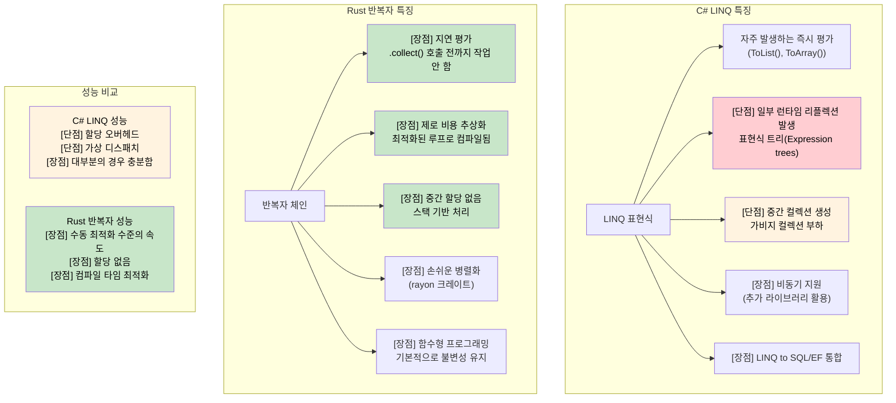

## Rust 클로저(Closures)와 반복자(Iterators)

> **학습 내용:** 소유권을 인식하는 캡처 방식(`Fn`/`FnMut`/`FnOnce`)을 가진 클로저와 C# 람다의 비교, LINQ를 대체하는 제로 비용 추상화인 Rust 반복자, 지연(Lazy) 평가와 즉시(Eager) 평가의 차이, 그리고 `rayon`을 이용한 병렬 반복.
>
> **난이도:** 🟡 중급

Rust의 클로저는 C#의 람다(Lambdas) 및 델리게이트(Delegates)와 유사하지만, 소유권을 고려하여 변수를 캡처한다는 점이 다릅니다.

### C# 람다와 델리게이트
```csharp
// C# - 람다는 참조로 캡처함
Func<int, int> doubler = x => x * 2;
Action<string> printer = msg => Console.WriteLine(msg);

// 외부 변수를 캡처하는 클로저
int multiplier = 3;
Func<int, int> multiply = x => x * multiplier;
Console.WriteLine(multiply(5)); // 15 출력

// LINQ는 람다를 광범위하게 사용함
var evens = numbers.Where(n => n % 2 == 0).ToList();
```

### Rust 클로저
```rust
// Rust 클로저 - 소유권 인식
let doubler = |x: i32| x * 2;
let printer = |msg: &str| println!("{}", msg);

// 참조로 캡처 (불변 캡처의 기본값)
let multiplier = 3;
let multiply = |x: i32| x * multiplier; // multiplier를 빌림
println!("{}", multiply(5)); // 15 출력
println!("{}", multiplier); // 여전히 접근 가능

// 이동(move)을 통한 캡처
let data = vec![1, 2, 3];
let owns_data = move || {
    println!("{:?}", data); // data가 클로저 내부로 이동됨
};
owns_data();
// println!("{:?}", data); // 에러: data가 이미 이동됨

// 반복자와 함께 클로저 사용하기
let numbers = vec![1, 2, 3, 4, 5];
let evens: Vec<&i32> = numbers.iter().filter(|&&n| n % 2 == 0).collect();
```

### 클로저 타입 (Fn, FnMut, FnOnce)
```rust
// Fn - 캡처한 값을 불변으로 빌림
fn apply_fn(f: impl Fn(i32) -> i32, x: i32) -> i32 {
    f(x)
}

// FnMut - 캡처한 값을 가변으로 빌림
fn apply_fn_mut(mut f: impl FnMut(i32), values: &[i32]) {
    for &v in values {
        f(v);
    }
}

// FnOnce - 캡처한 값의 소유권을 가져옴
fn apply_fn_once(f: impl FnOnce() -> Vec<i32>) -> Vec<i32> {
    f() // 한 번만 호출 가능
}

fn main() {
    // Fn 예시
    let multiplier = 3;
    let result = apply_fn(|x| x * multiplier, 5);
    
    // FnMut 예시
    let mut sum = 0;
    apply_fn_mut(|x| sum += x, &[1, 2, 3, 4, 5]);
    println!("합계: {}", sum); // 15 출력
    
    // FnOnce 예시
    let data = vec![1, 2, 3];
    let result = apply_fn_once(move || data); // data를 이동시킴
}
```

***

## LINQ vs Rust 반복자(Iterators)

### C# LINQ (Language Integrated Query)
```csharp
// C# LINQ - 선언적 데이터 처리
var numbers = new[] { 1, 2, 3, 4, 5, 6, 7, 8, 9, 10 };

var result = numbers
    .Where(n => n % 2 == 0)           // 짝수 필터링
    .Select(n => n * n)               // 제곱
    .Where(n => n > 10)               // 10보다 큰 것 필터링
    .OrderByDescending(n => n)        // 내림차순 정렬
    .Take(3)                          // 처음 3개 선택
    .ToList();                        // 구체화(Materialize)

// 복잡한 객체를 사용하는 LINQ
var users = GetUsers();
var activeAdults = users
    .Where(u => u.IsActive && u.Age >= 18)
    .GroupBy(u => u.Department)
    .Select(g => new {
        Department = g.Key,
        Count = g.Count(),
        AverageAge = g.Average(u => u.Age)
    })
    .OrderBy(x => x.Department)
    .ToList();

// 비동기 LINQ (추가 라이브러리 필요)
var results = await users
    .ToAsyncEnumerable()
    .WhereAwait(async u => await IsActiveAsync(u.Id))
    .SelectAwait(async u => await EnrichUserAsync(u))
    .ToListAsync();
```

### Rust 반복자
```rust
// Rust 반복자 - 지연 평가, 제로 비용 추상화
let numbers = vec![1, 2, 3, 4, 5, 6, 7, 8, 9, 10];

let result: Vec<i32> = numbers
    .iter()
    .filter(|&&n| n % 2 == 0)        // 짝수 필터링
    .map(|&n| n * n)                 // 제곱
    .filter(|&n| n > 10)             // 10보다 큰 것 필터링
    .collect::<Vec<_>>()             // Vec으로 수집
    .into_iter()
    .rev()                           // 역순 (내림차순 효과)
    .take(3)                         // 처음 3개 선택
    .collect();                      // 구체화

// 복잡한 반복자 체인
use std::collections::HashMap;

#[derive(Debug, Clone)]
struct User {
    name: String,
    age: u32,
    department: String,
    is_active: bool,
}

fn process_users(users: Vec<User>) -> HashMap<String, (usize, f64)> {
    users
        .into_iter()
        .filter(|u| u.is_active && u.age >= 18)
        .fold(HashMap::new(), |mut acc, user| {
            let entry = acc.entry(user.department.clone()).or_insert((0, 0.0));
            entry.0 += 1;  // 카운트
            entry.1 += user.age as f64;  // 나이 합계
            acc
        })
        .into_iter()
        .map(|(dept, (count, sum))| (dept, (count, sum / count as f64)))  // 평균
        .collect()
}

// rayon을 이용한 병렬 처리
use rayon::prelude::*;

fn parallel_processing(numbers: Vec<i32>) -> Vec<i32> {
    numbers
        .par_iter()                  // 병렬 반복자
        .filter(|&&n| n % 2 == 0)
        .map(|&n| expensive_computation(n))
        .collect()
}

fn expensive_computation(n: i32) -> i32 {
    // 무거운 계산 시뮬레이션
    (0..1000).fold(n, |acc, _| acc + 1)
}
```



***


<details>
<summary><strong>🏋️ 연습 문제: LINQ를 반복자로 변환하기</strong> (클릭하여 확장)</summary>

**도전 과제**: 다음 C# LINQ 파이프라인을 관용적인 Rust 반복자로 변환하십시오.

```csharp
// C# — Rust로 변환하십시오
record Employee(string Name, string Dept, int Salary);

var result = employees
    .Where(e => e.Salary > 50_000)
    .GroupBy(e => e.Dept)
    .Select(g => new {
        Department = g.Key,
        Count = g.Count(),
        AvgSalary = g.Average(e => e.Salary)
    })
    .OrderByDescending(x => x.AvgSalary)
    .ToList();
```

<details>
<summary>🔑 정답</summary>

```rust
use std::collections::HashMap;

struct Employee { name: String, dept: String, salary: u32 }

#[derive(Debug)]
struct DeptStats { department: String, count: usize, avg_salary: f64 }

fn department_stats(employees: &[Employee]) -> Vec<DeptStats> {
    let mut by_dept: HashMap<&str, Vec<u32>> = HashMap::new();
    for e in employees.iter().filter(|e| e.salary > 50_000) {
        by_dept.entry(&e.dept).or_default().push(e.salary);
    }

    let mut stats: Vec<DeptStats> = by_dept
        .into_iter()
        .map(|(dept, salaries)| {
            let count = salaries.len();
            let avg = salaries.iter().sum::<u32>() as f64 / count as f64;
            DeptStats { department: dept.to_string(), count, avg_salary: avg }
        })
        .collect();

    stats.sort_by(|a, b| b.avg_salary.partial_cmp(&a.avg_salary).unwrap());
    stats
}
```

**핵심 요점**:
- Rust 반복자에는 내장된 `group_by`가 없습니다. `HashMap`과 `fold` 또는 `for` 루프를 사용하는 것이 관용적인 패턴입니다.
- `itertools` 크레이트를 사용하면 더 LINQ와 유사한 `.group_by()` 문법을 쓸 수 있습니다.
- 반복자 체인은 제로 비용입니다. 컴파일러가 이를 단순한 루프로 최적화합니다.

</details>
</details>


<!-- ch12.0a: itertools — LINQ 파워 툴 -->
## itertools: 부족한 LINQ 연산 채우기

표준 Rust 반복자는 `map`, `filter`, `fold`, `take`, `collect` 등을 지원합니다. 하지만 C# 개발자가 자주 쓰는 `GroupBy`, `Zip`, `Chunk`, `SelectMany`, `Distinct` 등은 표준에 없거나 사용법이 다를 수 있습니다. 이를 **`itertools`** 크레이트가 해결해 줍니다.

```toml
# Cargo.toml
[dependencies]
itertools = "0.12"
```

### 비교 분석: LINQ vs itertools

```csharp
// C# — GroupBy
var byDept = employees.GroupBy(e => e.Department)
    .Select(g => new { Dept = g.Key, Count = g.Count() });

// C# — Chunk (일정 개수씩 묶기)
var batches = items.Chunk(100);  // IEnumerable<T[]>

// C# — Distinct / DistinctBy (중복 제거)
var unique = users.DistinctBy(u => u.Email);

// C# — SelectMany (평탄화)
var allTags = posts.SelectMany(p => p.Tags);

// C# — Zip (두 시퀀스 결합)
var pairs = names.Zip(scores, (n, s) => new { Name = n, Score = s });

// C# — Sliding window (이동 평균 등)
var windows = data.Zip(data.Skip(1), data.Skip(2))
    .Select(triple => (triple.First + triple.Second + triple.Third) / 3.0);
```

```rust
use itertools::Itertools;

// Rust — group_by (정렬된 입력 필요)
let by_dept = employees.iter()
    .sorted_by_key(|e| &e.department)
    .group_by(|e| &e.department);
for (dept, group) in &by_dept {
    println!("{}: {} employees", dept, group.count());
}

// Rust — chunks (배칭 처리)
let batches = items.iter().chunks(100);
for batch in &batches {
    process_batch(batch.collect::<Vec<_>>());
}

// Rust — unique / unique_by (중복 제거)
let unique: Vec<_> = users.iter().unique_by(|u| &u.email).collect();

// Rust — flat_map (SelectMany에 대응 — 표준 내장!)
let all_tags: Vec<&str> = posts.iter().flat_map(|p| &p.tags).collect();

// Rust — zip (표준 내장!)
let pairs: Vec<_> = names.iter().zip(scores.iter()).collect();

// Rust — tuple_windows (슬라이딩 윈도우)
let moving_avg: Vec<f64> = data.iter()
    .tuple_windows::<(_, _, _)>()
    .map(|(a, b, c)| (*a + *b + *c) as f64 / 3.0)
    .collect();
```

### itertools 빠른 참조표

| LINQ 메서드 | itertools 대응 기능 | 비고 |
|------------|---------------------|-------|
| `GroupBy(key)` | `.sorted_by_key().group_by()` | 정렬된 입력 필요 (LINQ와 다름) |
| `Chunk(n)` | `.chunks(n)` | 반복자의 반복자를 반환 |
| `Distinct()` | `.unique()` | `Eq + Hash` 구현 필요 |
| `DistinctBy(key)` | `.unique_by(key)` | |
| `SelectMany()` | `.flat_map()` | 표준 내장 — 크레이트 불필요 |
| `Zip()` | `.zip()` | 표준 내장 |
| `Aggregate()` | `.fold()` | 표준 내장 |
| `Any()` / `All()` | `.any()` / `.all()` | 표준 내장 |
| `First()` / `Last()` | `.next()` / `.last()` | 표준 내장 |
| `Skip(n)` / `Take(n)` | `.skip(n)` / `.take(n)` | 표준 내장 |
| `OrderBy()` | `.sorted()` / `.sorted_by()` | `itertools` (표준에는 없음) |
| `ThenBy()` | `.sorted_by(\|a,b\| a.x.cmp(&b.x).then(a.y.cmp(&b.y)))` | `Ordering::then` 체이닝 |
| `Intersect()` | `HashSet` 교집합 | 직접적인 반복자 메서드 없음 |
| `Concat()` | `.chain()` | 표준 내장 |
| Sliding window | `.tuple_windows()` | 고정 크기 튜플 반환 |
| Cartesian product | `.cartesian_product()` | `itertools` 제공 |
| Interleave | `.interleave()` | `itertools` 제공 |
| Permutations | `.permutations(k)` | `itertools` 제공 |

### 실전 사례: 로그 분석 파이프라인

```rust
use itertools::Itertools;
use std::collections::HashMap;

#[derive(Debug)]
struct LogEntry { level: String, module: String, message: String }

fn analyze_logs(entries: &[LogEntry]) {
    // 가장 로그가 많은 상위 5개 모듈 (LINQ의 GroupBy + OrderByDescending + Take 조합)
    let noisy: Vec<_> = entries.iter()
        .into_group_map_by(|e| &e.module) // itertools: HashMap으로 직접 그룹화
        .into_iter()
        .sorted_by(|a, b| b.1.len().cmp(&a.1.len()))
        .take(5)
        .collect();

    for (module, entries) in &noisy {
        println!("{}: {} entries", module, entries.len());
    }

    // 100개 단위 윈도우별 에러율 (슬라이딩 윈도우)
    let error_rates: Vec<f64> = entries.iter()
        .map(|e| if e.level == "ERROR" { 1.0 } else { 0.0 })
        .collect::<Vec<_>>()
        .windows(100)  // 표준 슬라이스 메서드
        .map(|w| w.iter().sum::<f64>() / 100.0)
        .collect();

    // 연속으로 중복되는 로그 메시지 제거
    let deduped: Vec<_> = entries.iter().dedup_by(|a, b| a.message == b.message).collect();
    println!("중복 제거: {} → {} entries", entries.len(), deduped.len());
}
```

***
