## 스레드 안전성: 관례(Convention) vs 타입 시스템의 보장

> **학습 내용:** Rust가 컴파일 타임에 스레드 안전성을 강제하는 방식과 C#의 관례 기반 방식 비교, `Arc<Mutex<T>>` vs `lock`, 채널(Channels) vs `ConcurrentQueue`, `Send`/`Sync` 트레이트, 스코프 스레드(Scoped threads), 그리고 비동기(async/await)로의 연결.
>
> **난이도:** 🔴 고급

> **심화 학습**: 스트림 처리, 정상 종료(Graceful shutdown), 커넥션 풀링, 취소 안전성 등 실전 비동기 패턴은 [Async Rust Training](../../async-book/src/summary.md) 가이드를 참조하십시오.
>
> **선행 학습**: [소유권과 대여](ch07-ownership-and-borrowing.md) 및 [스마트 포인터](ch07-3-smart-pointers-beyond-single-ownership.md) (Rc vs Arc 결정 트리).

### C# - 관례에 따른 스레드 안전성
```csharp
// C# 컬렉션은 기본적으로 스레드 안전하지 않습니다.
public class UserService
{
    private readonly List<string> items = new();
    private readonly Dictionary<int, User> cache = new();

    // 데이터 경합(Data race)이 발생할 수 있습니다:
    public void AddItem(string item)
    {
        items.Add(item);  // 스레드 안전하지 않음!
    }

    // 수동으로 락(Lock)을 사용해야 합니다:
    private readonly object lockObject = new();

    public void SafeAddItem(string item)
    {
        lock (lockObject)
        {
            items.Add(item);  // 안전하지만 런타임 오버헤드 발생
        }
        // 다른 곳에서 락을 거는 것을 잊어버리기 쉽습니다.
    }

    // ConcurrentCollection이 도움이 되지만 기능이 제한적입니다:
    private readonly ConcurrentBag<string> safeItems = new();
    
    public void ConcurrentAdd(string item)
    {
        safeItems.Add(item);  // 스레드 안전하지만 제공되는 연산이 제한적임
    }

    // 복잡한 공유 상태 관리
    private readonly ConcurrentDictionary<int, User> threadSafeCache = new();
    private volatile bool isShutdown = false;
    
    public async Task ProcessUser(int userId)
    {
        if (isShutdown) return;  // 여기서도 경합 조건이 발생할 수 있습니다!
        
        var user = await GetUser(userId);
        threadSafeCache.TryAdd(userId, user);  // 어떤 컬렉션이 안전한지 항상 기억해야 함
    }

    // 스레드 로컬 스토리지는 수동 관리가 필요합니다.
    private static readonly ThreadLocal<Random> threadLocalRandom = 
        new ThreadLocal<Random>(() => new Random());
        
    public int GetRandomNumber()
    {
        return threadLocalRandom.Value.Next();  // 안전하지만 수동으로 관리해야 함
    }
}

// 경합 조건의 위험이 있는 이벤트 처리
public class EventProcessor
{
    public event Action<string> DataReceived;
    private readonly List<string> eventLog = new();
    
    public void OnDataReceived(string data)
    {
        // 경합 조건 - 체크와 호출 사이에 이벤트가 null이 될 수 있음
        if (DataReceived != null)
        {
            DataReceived(data);
        }
        
        // 또 다른 경합 조건 - 리스트가 스레드 안전하지 않음
        eventLog.Add($"Processed: {data}");
    }
}
```

### Rust - 타입 시스템이 보장하는 스레드 안전성
```rust
use std::sync::{Arc, Mutex, RwLock};
use std::thread;
use std::collections::HashMap;
use tokio::sync::{mpsc, broadcast};

// Rust는 컴파일 타임에 데이터 경합을 방지합니다.
pub struct UserService {
    items: Arc<Mutex<Vec<String>>>,
    cache: Arc<RwLock<HashMap<i32, User>>>,
}

impl UserService {
    pub fn new() -> Self {
        UserService {
            items: Arc::new(Mutex::new(Vec::new())),
            cache: Arc::new(RwLock::new(HashMap::new())),
        }
    }
    
    pub fn add_item(&self, item: String) {
        let mut items = self.items.lock().unwrap();
        items.push(item);
        // `items`가 범위를 벗어나면 자동으로 락이 해제됨
    }
    
    // 다중 판독자(Readers), 단일 작성자(Writer) 모델 - 자동으로 강제됨
    pub async fn get_user(&self, user_id: i32) -> Option<User> {
        let cache = self.cache.read().unwrap();
        cache.get(&user_id).cloned()
    }
    
    pub async fn cache_user(&self, user_id: i32, user: User) {
        let mut cache = self.cache.write().unwrap();
        cache.insert(user_id, user);
    }
    
    // 스레드 공유를 위해 Arc를 클론함
    pub fn process_in_background(&self) {
        let items = Arc::clone(&self.items);
        
        thread::spawn(move || {
            let items = items.lock().unwrap();
            for item in items.iter() {
                println!("처리 중: {}", item);
            }
        });
    }
}

// 채널 기반 통신 - 공유 상태가 필요 없음
pub struct MessageProcessor {
    sender: mpsc::UnboundedSender<String>,
}

impl MessageProcessor {
    pub fn new() -> (Self, mpsc::UnboundedReceiver<String>) {
        let (tx, rx) = mpsc::unbounded_channel();
        (MessageProcessor { sender: tx }, rx)
    }
    
    pub fn send_message(&self, message: String) -> Result<(), mpsc::error::SendError<String>> {
        self.sender.send(message)
    }
}

// 다음 코드는 컴파일되지 않습니다 - Rust는 가변 데이터를 안전하지 않게 공유하는 것을 막습니다:
fn impossible_data_race() {
    let mut items = vec![1, 2, 3];
    
    // 컴파일 에러 - `items`를 여러 클로저로 이동(move)할 수 없음
    /*
    thread::spawn(move || {
        items.push(4);  // 에러: 이미 이동된 값 사용
    });
    
    thread::spawn(move || {
        items.push(5);  // 에러: 이미 이동된 값 사용  
    });
    */
}

// 안전한 병렬 데이터 처리
use rayon::prelude::*;

fn parallel_processing() {
    let data = vec![1, 2, 3, 4, 5];
    
    // 병렬 반복 - 스레드 안전성이 보장됨
    let results: Vec<i32> = data
        .par_iter()
        .map(|&x| x * x)
        .collect();
        
    println!("{:?}", results);
}

// 메시지 패싱을 이용한 비동기 동시성
async fn async_message_passing() {
    let (tx, mut rx) = mpsc::channel(100);
    
    // 생산자(Producer) 태스크
    let producer = tokio::spawn(async move {
        for i in 0..10 {
            if tx.send(i).await.is_err() {
                break;
            }
        }
    });
    
    // 소비자(Consumer) 태스크  
    let consumer = tokio::spawn(async move {
        while let Some(value) = rx.recv().await {
            println!("수신: {}", value);
        }
    });
    
    // 두 태스크가 끝날 때까지 대기
    let (producer_result, consumer_result) = tokio::join!(producer, consumer);
    producer_result.unwrap();
    consumer_result.unwrap();
}

#[derive(Clone)]
struct User {
    id: i32,
    name: String,
}
```



```mermaid
graph TD
    subgraph "C# 스레드 안전성 과제"
        CS_MANUAL["수동 동기화"]
        CS_LOCKS["lock 문"]
        CS_CONCURRENT["ConcurrentCollections"]
        CS_VOLATILE["volatile 필드"]
        CS_FORGET["😰 락을 잊어버리기 쉬움"]
        CS_DEADLOCK["💀 데드락 발생 가능성"]
        CS_RACE["🏃 경합 조건(Race conditions)"]
        CS_OVERHEAD["⚡ 런타임 오버헤드"]
        
        CS_MANUAL --> CS_LOCKS
        CS_MANUAL --> CS_CONCURRENT
        CS_MANUAL --> CS_VOLATILE
        CS_LOCKS --> CS_FORGET
        CS_LOCKS --> CS_DEADLOCK
        CS_FORGET --> CS_RACE
        CS_LOCKS --> CS_OVERHEAD
    end
    
    subgraph "Rust 타입 시스템의 보장"
        RUST_OWNERSHIP["소유권 시스템"]
        RUST_BORROWING["빌림 검사기"]
        RUST_SEND["Send 트레이트"]
        RUST_SYNC["Sync 트레이트"]
        RUST_ARC["Arc<Mutex<T>>"]
        RUST_CHANNELS["메시지 패싱"]
        RUST_SAFE["✅ 데이터 경합 불가능"]
        RUST_FAST["⚡ 제로 비용 추상화"]
        
        RUST_OWNERSHIP --> RUST_BORROWING
        RUST_BORROWING --> RUST_SEND
        RUST_SEND --> RUST_SYNC
        RUST_SYNC --> RUST_ARC
        RUST_ARC --> RUST_CHANNELS
        RUST_CHANNELS --> RUST_SAFE
        RUST_SAFE --> RUST_FAST
    end
    
    style CS_FORGET fill:#ffcdd2,color:#000
    style CS_DEADLOCK fill:#ffcdd2,color:#000
    style CS_RACE fill:#ffcdd2,color:#000
    style RUST_SAFE fill:#c8e6c9,color:#000
    style RUST_FAST fill:#c8e6c9,color:#000
```

***


<details>
<summary><strong>🏋️ 연습 문제: 스레드 안전한 카운터</strong> (클릭하여 확장)</summary>

**도전 과제**: 10개의 스레드에서 동시에 값을 증가시킬 수 있는 스레드 안전한 카운터를 구현하십시오. 각 스레드는 값을 1000번씩 증가시키며, 최종 합계는 정확히 10,000이 되어야 합니다.

<details>
<summary>🔑 정답</summary>

```rust
use std::sync::{Arc, Mutex};
use std::thread;

fn main() {
    let counter = Arc::new(Mutex::new(0u64));
    let mut handles = vec![];

    for _ in 0..10 {
        let counter = Arc::clone(&counter);
        handles.push(thread::spawn(move || {
            for _ in 0..1000 {
                let mut count = counter.lock().unwrap();
                *count += 1;
            }
        }));
    }

    for h in handles { h.join().unwrap(); }
    assert_eq!(*counter.lock().unwrap(), 10_000);
    println!("최종 카운트: {}", counter.lock().unwrap());
}
```

**원자적(Atomic) 연산을 이용한 방식 (더 빠름, 락 불필요):**
```rust
use std::sync::atomic::{AtomicU64, Ordering};
use std::sync::Arc;
use std::thread;

fn main() {
    let counter = Arc::new(AtomicU64::new(0));
    let handles: Vec<_> = (0..10).map(|_| {
        let counter = Arc::clone(&counter);
        thread::spawn(move || {
            for _ in 0..1000 {
                counter.fetch_add(1, Ordering::Relaxed);
            }
        })
    }).collect();

    for h in handles { h.join().unwrap(); }
    assert_eq!(counter.load(Ordering::SeqCst), 10_000);
}
```

**핵심 요점**: `Arc<Mutex<T>>`가 가장 일반적인 패턴입니다. 단순한 카운터의 경우 `AtomicU64`를 사용하면 락 오버헤드를 완전히 피할 수 있습니다.

</details>
</details>

### Rust가 데이터 경합을 방지하는 이유: Send와 Sync

Rust는 두 가지 마커 트레이트(Marker traits)를 사용하여 **컴파일 타임**에 스레드 안전성을 강제합니다. C#에는 이에 대응하는 개념이 없습니다.

- `Send`: 타입의 **소유권**을 다른 스레드로 안전하게 **넘길(transfer)** 수 있음을 의미합니다 (예: `thread::spawn`으로 전달되는 클로저 내부로 이동).
- `Sync`: 타입의 **참조**(`&T`)를 여러 스레드 간에 안전하게 **공유(share)**할 수 있음을 의미합니다.

대부분의 타입은 자동으로 `Send + Sync`입니다. 하지만 중요한 예외가 있습니다:
- `Rc<T>`는 Send도 Sync도 **아닙니다**. 컴파일러는 이를 `thread::spawn`으로 넘기려 할 때 거부할 것입니다 (대신 `Arc<T>`를 사용하십시오).
- `Cell<T>`와 `RefCell<T>`는 Sync가 **아닙니다**. 스레드 안전한 내부 가변성을 위해서는 `Mutex<T>`나 `RwLock<T>`를 사용하십시오.
- 원시 포인터(`*const T`, `*mut T`)는 Send도 Sync도 **아닙니다**.

C#에서 `List<T>`는 스레드 안전하지 않지만, 컴파일러는 이를 스레드 간에 공유하는 것을 막지 않습니다. 반면 Rust에서 같은 실수를 하면 런타임 경합 조건이 아닌 **컴파일 에러**가 발생합니다.

### 스코프 스레드(Scoped threads): 스택 대여하기

`thread::scope()`를 사용하면 생성된 스레드가 지역 변수를 대여(borrow)할 수 있습니다. 이 경우 `Arc`가 필요 없습니다.

```rust
use std::thread;

fn main() {
    let data = vec![1, 2, 3, 4, 5];
    
    // 스코프 스레드는 'data'를 대여할 수 있습니다.
    // scope 블록은 모든 스레드가 끝날 때까지 기다립니다.
    thread::scope(|s| {
        s.spawn(|| println!("Thread 1: {data:?}"));
        s.spawn(|| println!("Thread 2: 합계 = {}", data.iter().sum::<i32>()));
    });
    // 여기서도 'data'는 여전히 유효합니다 - 스레드들이 종료되었음을 보장하기 때문입니다.
}
```

이는 C#의 `Parallel.ForEach`가 호출 코드를 대기시키는 것과 비슷하지만, Rust의 빌림 검사기는 컴파일 타임에 데이터 경합이 없음을 **증명**합니다.

### 비동기(async/await)로의 연결

C# 개발자들은 보통 로우 레벨 스레드보다는 `Task`와 `async/await`를 주로 사용합니다. Rust는 두 패러다임을 모두 지원합니다:

| C# | Rust | 사용 시점 |
|----|------|-------------|
| `Thread` | `std::thread::spawn` | CPU 집약적 작업, OS 스레드 할당 |
| `Task.Run` | `tokio::spawn` | 런타임상의 비동기 태스크 실행 |
| `async/await` | `async/await` | I/O 중심의 동시성 처리 |
| `lock` | `Mutex<T>` | 동기적 상호 배제(Mutual exclusion) |
| `SemaphoreSlim` | `tokio::sync::Semaphore` | 비동기 동시성 제한 |
| `Interlocked` | `std::sync::atomic` | 락 프리(Lock-free) 원자적 연산 |
| `CancellationToken` | `tokio_util::sync::CancellationToken` | 협력적 취소(Cooperative cancellation) |

> 다음 장([Async/Await 심층 분석](ch13-1-asyncawait-deep-dive.md))에서는 Rust의 비동기 모델이 C#의 `Task` 기반 모델과 어떻게 다른지 상세히 다룹니다.
