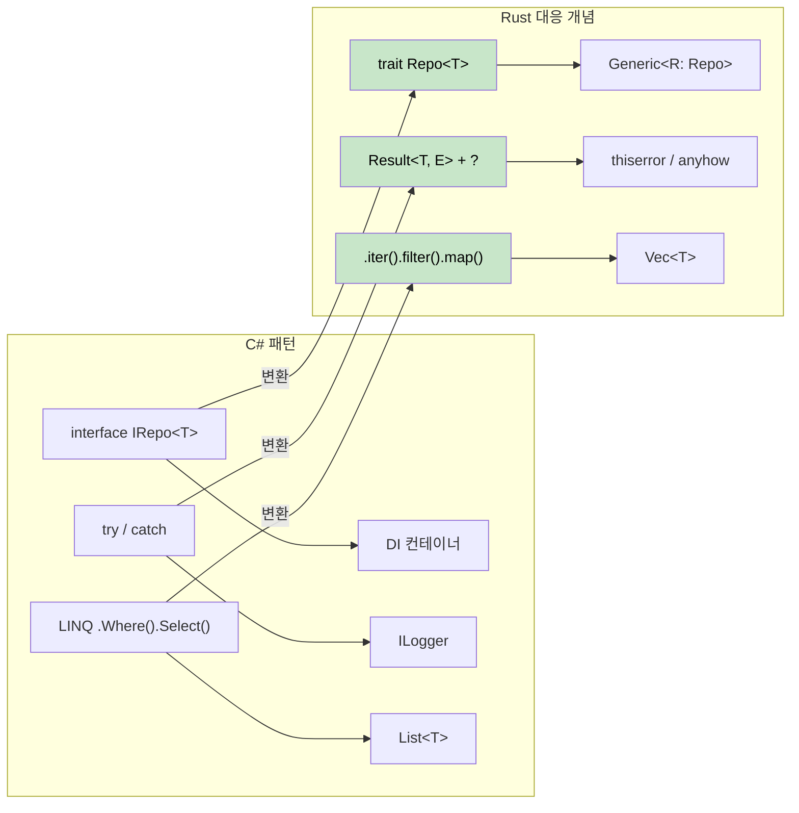

## C# 패턴의 Rust 구현 (Common C# Patterns in Rust)

> **학습 내용:** 저장소 패턴(Repository pattern), 빌더 패턴(Builder pattern), 의존성 주입(dependency injection),
> LINQ 체인, Entity Framework 쿼리, 그리고 설정 패턴을 C#에서 관용적인(idiomatic) Rust로 변환하는 방법.
>
> **난이도:** 🟡 중급



### 저장소 패턴 (Repository Pattern)
```csharp
// C# 저장소 패턴
public interface IRepository<T> where T : IEntity
{
    Task<T> GetByIdAsync(int id);
    Task<IEnumerable<T>> GetAllAsync();
    Task<T> AddAsync(T entity);
    Task UpdateAsync(T entity);
    Task DeleteAsync(int id);
}

public class UserRepository : IRepository<User>
{
    private readonly DbContext _context;
    
    public UserRepository(DbContext context)
    {
        _context = context;
    }
    
    public async Task<User> GetByIdAsync(int id)
    {
        return await _context.Users.FindAsync(id);
    }
    
    // ... 기타 구현 생략
}
```

```rust
// 트레이트와 제네릭을 사용한 Rust 저장소 패턴
use async_trait::async_trait;
use std::fmt::Debug;

#[async_trait]
pub trait Repository<T, E> 
where 
    T: Clone + Debug + Send + Sync,
    E: std::error::Error + Send + Sync,
{
    async fn get_by_id(&self, id: u64) -> Result<Option<T>, E>;
    async fn get_all(&self) -> Result<Vec<T>, E>;
    async fn add(&self, entity: T) -> Result<T, E>;
    async fn update(&self, entity: T) -> Result<T, E>;
    async fn delete(&self, id: u64) -> Result<(), E>;
}

#[derive(Debug, Clone)]
pub struct User {
    pub id: u64,
    pub name: String,
    pub email: String,
}

#[derive(Debug)]
pub enum RepositoryError {
    NotFound(u64),
    DatabaseError(String),
    ValidationError(String),
}

impl std::fmt::Display for RepositoryError {
    fn fmt(&self, f: &mut std::fmt::Formatter<'_>) -> std::fmt::Result {
        match self {
            RepositoryError::NotFound(id) => write!(f, "Entity with id {} not found", id),
            RepositoryError::DatabaseError(msg) => write!(f, "Database error: {}", msg),
            RepositoryError::ValidationError(msg) => write!(f, "Validation error: {}", msg),
        }
    }
}

impl std::error::Error for RepositoryError {}

pub struct UserRepository {
    // 데이터베이스 연결 풀 등
}

#[async_trait]
impl Repository<User, RepositoryError> for UserRepository {
    async fn get_by_id(&self, id: u64) -> Result<Option<User>, RepositoryError> {
        // 데이터베이스 조회 시뮬레이션
        if id == 0 {
            return Ok(None);
        }
        
        Ok(Some(User {
            id,
            name: format!("User {}", id),
            email: format!("user{}@example.com", id),
        }))
    }
    
    async fn get_all(&self) -> Result<Vec<User>, RepositoryError> {
        // 구현 내용
        Ok(vec![])
    }
    
    async fn add(&self, entity: User) -> Result<User, RepositoryError> {
        // 유효성 검사 및 데이터베이스 삽입
        if entity.name.is_empty() {
            return Err(RepositoryError::ValidationError("Name cannot be empty".to_string()));
        }
        Ok(entity)
    }
    
    async fn update(&self, entity: User) -> Result<User, RepositoryError> {
        // 구현 내용
        Ok(entity)
    }
    
    async fn delete(&self, id: u64) -> Result<(), RepositoryError> {
        // 구현 내용
        Ok(())
    }
}
```

### 빌더 패턴 (Builder Pattern)
```csharp
// C# 빌더 패턴 (Fluent 인터페이스)
public class HttpClientBuilder
{
    private TimeSpan? _timeout;
    private string _baseAddress;
    private Dictionary<string, string> _headers = new();
    
    public HttpClientBuilder WithTimeout(TimeSpan timeout)
    {
        _timeout = timeout;
        return this;
    }
    
    public HttpClientBuilder WithBaseAddress(string baseAddress)
    {
        _baseAddress = baseAddress;
        return this;
    }
    
    public HttpClientBuilder WithHeader(string name, string value)
    {
        _headers[name] = value;
        return this;
    }
    
    public HttpClient Build()
    {
        var client = new HttpClient();
        if (_timeout.HasValue)
            client.Timeout = _timeout.Value;
        if (!string.IsNullOrEmpty(_baseAddress))
            client.BaseAddress = new Uri(_baseAddress);
        foreach (var header in _headers)
            client.DefaultRequestHeaders.Add(header.Key, header.Value);
        return client;
    }
}

// 사용 예시
var client = new HttpClientBuilder()
    .WithTimeout(TimeSpan.FromSeconds(30))
    .WithBaseAddress("https://api.example.com")
    .WithHeader("Accept", "application/json")
    .Build();
```

```rust
// Rust 빌더 패턴 (Consuming 빌더)
use std::collections::HashMap;
use std::time::Duration;

#[derive(Debug)]
pub struct HttpClient {
    timeout: Duration,
    base_address: String,
    headers: HashMap<String, String>,
}

pub struct HttpClientBuilder {
    timeout: Option<Duration>,
    base_address: Option<String>,
    headers: HashMap<String, String>,
}

impl HttpClientBuilder {
    pub fn new() -> Self {
        HttpClientBuilder {
            timeout: None,
            base_address: None,
            headers: HashMap::new(),
        }
    }
    
    pub fn with_timeout(mut self, timeout: Duration) -> Self {
        self.timeout = Some(timeout);
        self
    }
    
    pub fn with_base_address<S: Into<String>>(mut self, base_address: S) -> Self {
        self.base_address = Some(base_address.into());
        self
    }
    
    pub fn with_header<K: Into<String>, V: Into<String>>(mut self, name: K, value: V) -> Self {
        self.headers.insert(name.into(), value.into());
        self
    }
    
    pub fn build(self) -> Result<HttpClient, String> {
        let base_address = self.base_address.ok_or("Base address is required")?;
        
        Ok(HttpClient {
            timeout: self.timeout.unwrap_or(Duration::from_secs(30)),
            base_address,
            headers: self.headers,
        })
    }
}

// 사용 예시
let client = HttpClientBuilder::new()
    .with_timeout(Duration::from_secs(30))
    .with_base_address("https://api.example.com")
    .with_header("Accept", "application/json")
    .build()?;

// 대안: 일반적인 경우를 위한 Default 트레이트 구현
impl Default for HttpClientBuilder {
    fn default() -> Self {
        Self::new()
    }
}
```

***

## C#과 Rust 개념 매핑 (C# to Rust Concept Mapping)

### 의존성 주입 (Dependency Injection) → 생성자 주입 + 트레이트
```csharp
// DI 컨테이너를 사용한 C#
services.AddScoped<IUserRepository, UserRepository>();
services.AddScoped<IUserService, UserService>();

public class UserService
{
    private readonly IUserRepository _repository;
    
    public UserService(IUserRepository repository)
    {
        _repository = repository;
    }
}
```

```rust
// Rust: 트레이트를 사용한 생성자 주입
pub trait UserRepository {
    async fn find_by_id(&self, id: Uuid) -> Result<Option<User>, Error>;
    async fn save(&self, user: &User) -> Result<(), Error>;
}

pub struct UserService<R> 
where 
    R: UserRepository,
{
    repository: R,
}

impl<R> UserService<R> 
where 
    R: UserRepository,
{
    pub fn new(repository: R) -> Self {
        Self { repository }
    }
    
    pub async fn get_user(&self, id: Uuid) -> Result<Option<User>, Error> {
        self.repository.find_by_id(id).await
    }
}

// 사용 예시
let repository = PostgresUserRepository::new(pool);
let service = UserService::new(repository);
```

### LINQ → 반복자 체인 (Iterator Chains)
```csharp
// C# LINQ
var result = users
    .Where(u => u.Age > 18)
    .Select(u => u.Name.ToUpper())
    .OrderBy(name => name)
    .Take(10)
    .ToList();
```

```rust
// Rust: 반복자 체인 (제로 코스트!)
let result: Vec<String> = users
    .iter()
    .filter(|u| u.age > 18)
    .map(|u| u.name.to_uppercase())
    .collect::<Vec<_>>()
    .into_iter()
    .sorted()
    .take(10)
    .collect();

// 또는 더 LINQ다운 연산을 위해 itertools 크레이트 사용
use itertools::Itertools;

let result: Vec<String> = users
    .iter()
    .filter(|u| u.age > 18)
    .map(|u| u.name.to_uppercase())
    .sorted()
    .take(10)
    .collect();
```

### Entity Framework → SQLx + 마이그레이션 (Migrations)
```csharp
// C# Entity Framework
public class ApplicationDbContext : DbContext
{
    public DbSet<User> Users { get; set; }
}

var user = await context.Users
    .Where(u => u.Email == email)
    .FirstOrDefaultAsync();
```

```rust
// Rust: 컴파일 타임 쿼리 검사를 지원하는 SQLx
use sqlx::{PgPool, FromRow};

#[derive(FromRow)]
struct User {
    id: Uuid,
    email: String,
    name: String,
}

// 컴파일 타임에 검사되는 쿼리
let user = sqlx::query_as!(
    User,
    "SELECT id, email, name FROM users WHERE email = $1",
    email
)
.fetch_optional(&pool)
.await?;

// 또는 동적 쿼리 사용
let user = sqlx::query_as::<_, User>(
    "SELECT id, email, name FROM users WHERE email = $1"
)
.bind(email)
.fetch_optional(&pool)
.await?;
```

### 설정 (Configuration) → Config 크레이트
```csharp
// C# 설정
public class AppSettings
{
    public string DatabaseUrl { get; set; }
    public int Port { get; set; }
}

var config = builder.Configuration.Get<AppSettings>();
```

```rust
// Rust: serde를 사용한 설정 관리
use config::{Config, ConfigError, Environment, File};
use serde::Deserialize;

#[derive(Debug, Deserialize)]
struct AppSettings {
    database_url: String,
    port: u16,
}

impl AppSettings {
    pub fn new() -> Result<Self, ConfigError> {
        let s = Config::builder()
            .add_source(File::with_name("config/default"))
            .add_source(Environment::with_prefix("APP"))
            .build()?;

        s.try_deserialize()
    }
}

// 사용 예시
let settings = AppSettings::new()?;
```

---

## 사례 연구 (Case Studies)

### 사례 연구 1: CLI 도구 마이그레이션 (csvtool)

**배경**: 한 팀이 대용량 CSV 파일을 읽고 변환하여 출력하는 C# 콘솔 앱(`CsvProcessor`)을 유지보수하고 있었습니다. 500 MB 파일 처리 시 메모리 사용량이 4 GB까지 치솟았고, 가비지 컬렉션(GC) 일시 중지로 인해 30초 동안 멈추는 현상이 발생했습니다.

**마이그레이션 방식**: 2주에 걸쳐 모듈별로 Rust로 재작성했습니다.

| 단계 | 변경 사항 | C# → Rust |
|------|-------------|-----------|
| 1 | CSV 파싱 | `CsvHelper` → `csv` 크레이트 (스트리밍 `Reader`) |
| 2 | 데이터 모델 | `class Record` → `struct Record` (스택 할당, `#[derive(Deserialize)]`) |
| 3 | 변환 | LINQ `.Select().Where()` → `.iter().map().filter()` |
| 4 | 파일 I/O | `StreamReader` → `?` 에러 전파를 포함한 `BufReader<File>` |
| 5 | CLI 인자 | `System.CommandLine` → derive 매크로를 사용하는 `clap` |
| 6 | 병렬 처리 | `Parallel.ForEach` → `rayon`의 `.par_iter()` |

**결과**:
- 메모리: 4 GB → 12 MB (파일 전체를 로드하는 대신 스트리밍 방식 사용)
- 속도: 500 MB 파일 기준 45초 → 3초
- 바이너리 크기: 런타임 의존성이 없는 단일 2 MB 실행 파일

**핵심 교훈**: 가장 큰 성과는 Rust 자체라기보다 Rust의 소유권 모델이 스트리밍 설계를 *강제*했다는 점입니다. C#에서는 모든 데이터를 `.ToList()`로 메모리에 올리기 쉬웠지만, Rust에서는 빌림 검사기(borrow checker)가 자연스럽게 `Iterator` 기반 처리를 유도했습니다.

### 사례 연구 2: 마이크로서비스 교체 (auth-gateway)

**배경**: 50개 이상의 백엔드 서비스에 대해 JWT 유효성 검사 및 속도 제한(rate limiting)을 처리하는 C# ASP.NET Core 인증 게이트웨이가 있었습니다. 초당 1만 건의 요청(10K req/s) 발생 시, GC 스파이크로 인해 p99 지연 시간이 200ms에 달했습니다.

**마이그레이션 방식**: API 계약(contract)을 동일하게 유지하면서 `axum` + `tower`를 사용하여 Rust 서비스로 교체했습니다.

```rust
// 이전 (C#):  services.AddAuthentication().AddJwtBearer(...)
// 이후 (Rust):  tower 미들웨어 레이어

use axum::{Router, middleware};
use tower::ServiceBuilder;

let app = Router::new()
    .route("/api/*path", any(proxy_handler))
    .layer(
        ServiceBuilder::new()
            .layer(middleware::from_fn(validate_jwt))
            .layer(middleware::from_fn(rate_limit))
    );
```

| 지표 | C# (ASP.NET Core) | Rust (axum) |
|--------|-------------------|-------------|
| p50 지연 시간 | 5ms | 0.8ms |
| p99 지연 시간 | 200ms (GC 스파이크) | 4ms |
| 메모리 | 300 MB | 8 MB |
| Docker 이미지 | 210 MB (.NET 런타임 포함) | 12 MB (정적 바이너리) |
| 콜드 스타트 | 2.1s | 0.05s |

**핵심 교훈**:
1. **동일한 API 계약 유지** — 클라이언트 측 변경이 필요 없었습니다. Rust 서비스는 그대로 교체 가능한(drop-in) 솔루션이었습니다.
2. **병목 지점부터 시작** — JWT 유효성 검사가 병목이었습니다. 이 미들웨어 하나만 마이그레이션했어도 성과의 80%를 달성했을 것입니다.
3. **`tower` 미들웨어 사용** — 이는 ASP.NET Core의 미들웨어 파이프라인 패턴과 유사하여 C# 개발자들이 Rust 아키텍처를 친숙하게 느꼈습니다.
4. **p99 지연 시간 개선**은 더 빠른 코드 덕분이 아니라 GC 일시 중지를 제거했기 때문입니다. Rust의 정상 상태(steady-state) 처리량은 2배 정도 빨랐지만, GC가 없으므로 꼬리 지연 시간(tail latency)을 예측 가능하게 관리할 수 있었습니다.

---

## 연습 문제

<details>
<summary><strong>🏋️ 연습 문제: C# 서비스 마이그레이션</strong> (클릭하여 펼치기)</summary>

다음 C# 서비스를 관용적인 Rust로 변환해 보세요:

```csharp
public interface IUserService
{
    Task<User?> GetByIdAsync(int id);
    Task<List<User>> SearchAsync(string query);
}

public class UserService : IUserService
{
    private readonly IDatabase _db;
    public UserService(IDatabase db) { _db = db; }

    public async Task<User?> GetByIdAsync(int id)
    {
        try { return await _db.QuerySingleAsync<User>(id); }
        catch (NotFoundException) { return null; }
    }

    public async Task<List<User>> SearchAsync(string query)
    {
        return await _db.QueryAsync<User>($"SELECT * WHERE name LIKE '%{query}%'");
    }
}
```

**힌트**: 트레이트 사용, null 대신 `Option<User>` 사용, try/catch 대신 `Result` 사용, 그리고 SQL 인젝션 취약점을 해결하세요.

<details>
<summary>🔑 정답</summary>

```rust
use async_trait::async_trait;

#[derive(Debug, Clone)]
struct User { id: i64, name: String }

#[async_trait]
trait Database: Send + Sync {
    async fn get_user(&self, id: i64) -> Result<Option<User>, sqlx::Error>;
    async fn search_users(&self, query: &str) -> Result<Vec<User>, sqlx::Error>;
}

#[async_trait]
trait UserService: Send + Sync {
    async fn get_by_id(&self, id: i64) -> Result<Option<User>, AppError>;
    async fn search(&self, query: &str) -> Result<Vec<User>, AppError>;
}

struct UserServiceImpl<D: Database> {
    db: D,  // Arc가 필요 없음 — Rust의 소유권 모델이 처리함
}

#[async_trait]
impl<D: Database> UserService for UserServiceImpl<D> {
    async fn get_by_id(&self, id: i64) -> Result<Option<User>, AppError> {
        // null 대신 Option 사용, try/catch 대신 Result + ? 사용
        Ok(self.db.get_user(id).await?)
    }

    async fn search(&self, query: &str) -> Result<Vec<User>, AppError> {
        // 매개변수화된 쿼리 사용 — SQL 인젝션 해결!
        // (sqlx는 문자열 보간 대신 $1 위치 홀더를 사용함)
        self.db.search_users(query).await.map_err(Into::into)
    }
}
```

**C# 대비 주요 변경 사항**:
- `null` → `Option<User>` (컴파일 타임 널 안전성)
- `try/catch` → `Result` + `?` (명시적 에러 전파)
- SQL 인젝션 해결: 문자열 보간이 아닌 매개변수화된 쿼리 사용
- `IDatabase _db` → 제네릭 `D: Database` (정적 디스패치 사용, 박싱 불필요)

</details>
</details>

***
