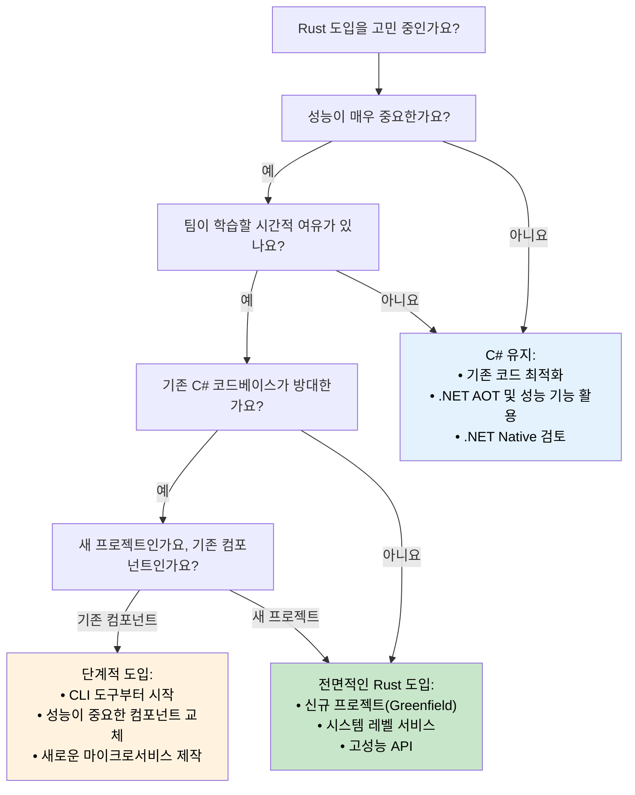

## 성능 비교: 관리되는 코드 vs 네이티브 코드 (Performance Comparison: Managed vs Native)

> **학습 내용:** C#과 Rust의 실제 성능 차이 — 시작 시간(startup time), 
> 메모리 사용량, 처리량(throughput) 벤치마크, CPU 집약적 작업 등을 살펴보고, 
> C#을 유지할지 Rust로 마이그레이션할지 결정하기 위한 판단 기준을 제공합니다.
>
> **난이도:** 🟡 중급

### 실전 성능 특성 비교

| **항목** | **C# (.NET)** | **Rust** | **성능 영향** |
|------------|---------------|----------|------------------------|
| **시작 시간** | 100-500ms (JIT); 5-30ms (.NET 8 AOT) | 1-10ms (네이티브 바이너리) | 🚀 **10~50배 빠름** (JIT 대비) |
| **메모리 사용량** | +30-100% (GC 오버헤드 + 메타데이터) | 베이스라인 (최소한의 런타임) | 💾 **RAM 30~50% 적게 사용** |
| **GC 일시 중지** | 1-100ms의 주기적 중지 | 없음 (GC가 없음) | ⚡ **일관된 지연 시간(latency)** |
| **CPU 사용량** | +10-20% (GC + JIT 오버헤드) | 베이스라인 (직접 실행) | 🔋 **10~20% 더 나은 효율성** |
| **바이너리 크기** | 30-200MB (런타임 포함); 10-30MB (AOT 트리밍) | 1-20MB (정적 바이너리) | 📦 **더 작은 배포 크기** |
| **메모리 안전성** | 런타임 검사 방식 | 컴파일 타임 증명 방식 | 🛡️ **오버헤드 없는 안전성** |
| **동시성 성능** | 좋음 (주의 깊은 동기화 필요) | 우수함 (두려움 없는 동기화) | 🏃 **탁월한 확장성(scalability)** |

> **.NET 8+ AOT에 대하여**: 네이티브 AOT 컴파일은 시작 시간의 격차를 크게 줄여줍니다(5~30ms). 하지만 처리량과 메모리 측면에서 GC 오버헤드와 일시 중지 문제는 여전히 존재합니다. 마이그레이션을 검토할 때는 일반적인 수치에 의존하기보다 *본인의 구체적인 작업 부하*를 직접 벤치마킹하는 것이 중요합니다.

### 벤치마크 예시 (Benchmark Examples)

```csharp
// C# - JSON 처리 벤치마크
public class JsonProcessor
{
    public async Task<List<User>> ProcessJsonFile(string path)
    {
        var json = await File.ReadAllTextAsync(path);
        var users = JsonSerializer.Deserialize<List<User>>(json);
        
        return users.Where(u => u.Age > 18)
                   .OrderBy(u => u.Name)
                   .Take(1000)
                   .ToList();
    }
}

// 일반적인 성능: 100MB 파일 기준 ~200ms
// 메모리 사용량: ~500MB 피크 (GC 오버헤드 포함)
// 바이너리 크기: ~80MB (Self-contained 방식)
```

```rust
// Rust - 대응하는 JSON 처리 코드
use serde::{Deserialize, Serialize};
use tokio::fs;

#[derive(Deserialize, Serialize)]
struct User {
    name: String,
    age: u32,
}

pub async fn process_json_file(path: &str) -> Result<Vec<User>, Box<dyn std::error::Error>> {
    let json = fs::read_to_string(path).await?;
    let mut users: Vec<User> = serde_json::from_str(&json)?;
    
    users.retain(|u| u.age > 18);
    users.sort_by(|a, b| a.name.cmp(&b.name));
    users.truncate(1000);
    
    Ok(users)
}

// 일반적인 성능: 동일 100MB 파일 기준 ~120ms
// 메모리 사용량: ~200MB 피크 (GC 오버헤드 없음)
// 바이너리 크기: ~8MB (정적 바이너리)
```

### CPU 집약적 작업 (CPU-Intensive Workloads)

```csharp
// C# - 수학 연산
public class Mandelbrot
{
    public static int[,] Generate(int width, int height, int maxIterations)
    {
        var result = new int[height, width];
        
        Parallel.For(0, height, y =>
        {
            for (int x = 0; x < width; x++)
            {
                var c = new Complex(
                    (x - width / 2.0) * 4.0 / width,
                    (y - height / 2.0) * 4.0 / height);
                
                result[y, x] = CalculateIterations(c, maxIterations);
            }
        });
        
        return result;
    }
}

// 성능: ~2.3초 (8코어 머신 기준)
// 메모리: ~500MB
```

```rust
// Rust - Rayon을 사용한 동일한 연산
use rayon::prelude::*;
use num_complex::Complex;

pub fn generate_mandelbrot(width: usize, height: usize, max_iterations: u32) -> Vec<Vec<u32>> {
    (0..height)
        .into_par_iter()
        .map(|y| {
            (0..width)
                .map(|x| {
                    let c = Complex::new(
                        (x as f64 - width as f64 / 2.0) * 4.0 / width as f64,
                        (y as f64 - height as f64 / 2.0) * 4.0 / height as f64,
                    );
                    calculate_iterations(c, max_iterations)
                })
                .collect()
        })
        .collect()
}

// 성능: ~1.1초 (동일한 8코어 머신 기준)
// 메모리: ~200MB
// 메모리 사용량을 60% 줄이면서 2배 더 빠름
```

### 각 언어를 선택해야 하는 상황 (When to Choose Each Language)

**C#을 선택해야 하는 경우:**
- **빠른 개발 속도가 핵심일 때** - 풍부한 도구 및 에코시스템 활용 가능
- **팀의 .NET 숙련도가 높을 때** - 기존 지식과 기술 활용
- **엔터프라이즈 통합** - Microsoft 에코시스템을 주로 사용하는 환경
- **적당한 수준의 성능 요구사항** - 현재 성능으로도 충분한 경우
- **풍부한 UI 애플리케이션** - WPF, WinUI, Blazor 애플리케이션 제작
- **프로토타이핑 및 MVP 제작** - 빠른 시장 출시가 목표일 때

**Rust를 선택해야 하는 경우:**
- **성능이 핵심일 때** - CPU 또는 메모리 집약적인 애플리케이션
- **자원 제약이 중요한 환경** - 임베디드, 에지 컴퓨팅, 서버리스(Serverless)
- **장기간 실행되는 서비스** - 웹 서버, 데이터베이스, 시스템 서비스
- **시스템 레벨 프로그래밍** - OS 구성 요소, 드라이버, 네트워크 도구
- **높은 안정성이 요구될 때** - 금융 시스템, 안전이 필수적인(safety-critical) 애플리케이션
- **동시성/병렬 처리 부하가 클 때** - 고성능 데이터 처리

### 마이그레이션 전략 결정 트리 (Migration Strategy Decision Tree)



***
