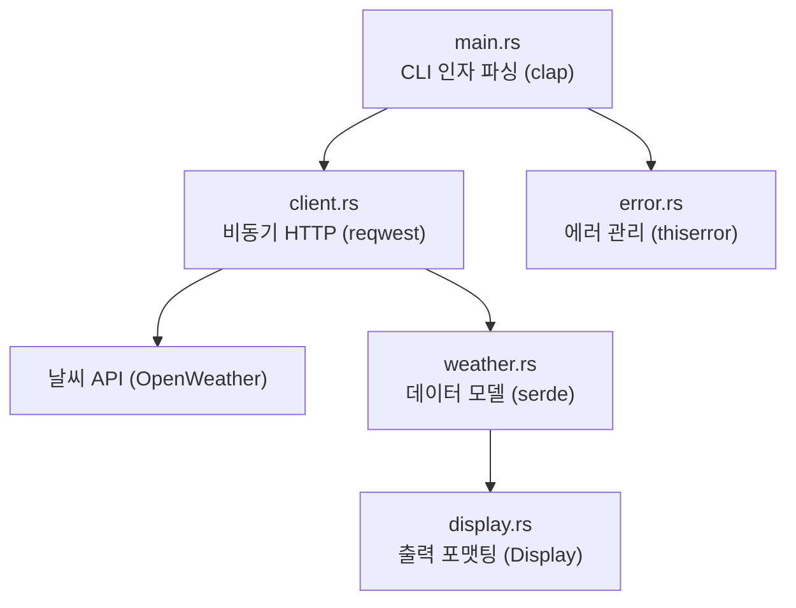

# 캡스톤 프로젝트: CLI 날씨 도구 만들기

> **학습 목표:** 지금까지 배운 모든 개념(구조체, 트레이트, 에러 처리, 비동기, 모듈, Serde, CLI 파싱)을 총동원하여 실제 작동하는 애플리케이션을 밑바닥부터 구축합니다. C#에서 `HttpClient`와 `System.CommandLine`을 사용해 만들던 도구를 Rust로는 어떻게 구현하는지 체감해 봅니다.

---

### 1. 프로젝트 설계: `weather-cli`
API를 통해 특정 도시의 날씨 정보를 가져와 터미널에 예쁘게 출력하는 도구입니다.

#### 시스템 구조 (Mermaid)

---

### 2. 핵심 구현 포인트

#### 데이터 모델과 매핑
API에서 내려오는 복잡한 JSON과 우리가 앱 내부에서 쓸 깔끔한 구조체를 분리합니다. C#의 AutoMapper 대신 Rust의 **`From` 트레이트**를 사용해 안전하게 변환합니다.

#### 비동기 클라이언트
`reqwest`를 사용하여 비동기로 데이터를 가져옵니다. C#의 `Task`와 유사하지만, Rust에서는 **`Future`**와 **`tokio`** 런타임을 사용합니다.

#### 유연한 에러 처리
`thiserror`를 사용하여 HTTP 에러, 파싱 에러, 로직 에러를 하나로 묶어 관리합니다. `?` 연산자를 활용해 코드를 평평하게 유지합니다.

---

### 3. 실습 단계
1. **의존성 설정**: `Cargo.toml`에 `tokio`, `reqwest`, `serde`, `clap`, `thiserror` 추가.
2. **모델 정의**: API 응답 구조체와 라이브러리용 내부 구조체 선언.
3. **클라이언트 구현**: 비동기 함수로 API 호출 및 결과 반환 로직 작성.
4. **포맷팅 히기**: `Display` 트레이트를 구현해 날씨 아이콘과 함께 정보 출력.
5. **메인 함수**: CLI 인자를 받아 클라이언트를 호출하고 에러를 처리하는 진입점 완성.

---

### 💡 실무 팁: '문서 테스트' 활용하기
이 프로젝트의 주요 함수 위에 `///` 주석과 함께 예제 코드를 작성해 보세요. `cargo test`를 실행하면 문서 안의 코드까지 실제로 작동하는지 검증해 줍니다. 살아있는 문서를 만드는 Rust만의 강력한 기능입니다.

