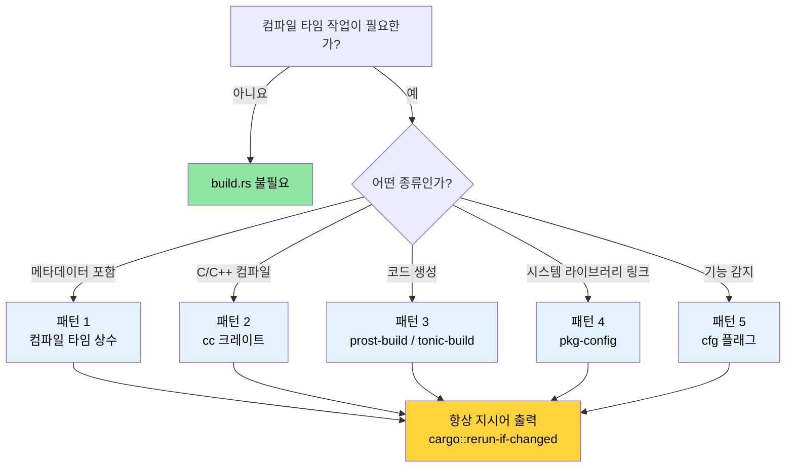

# 빌드 스크립트 — `build.rs` 심층 분석 🟢

> **학습 내용:**
> - `build.rs`가 Cargo 빌드 파이프라인의 어디에 위치하며 언제 실행되는지
> - 5가지 실전 패턴: 컴파일 타임 상수, C/C++ 컴파일, Protobuf 코드 생성, `pkg-config` 링크, 기능 감지
> - 빌드 속도를 늦추거나 교차 컴파일을 망가뜨리는 안티 패턴
> - 추적 가능성(traceability)과 재현 가능한 빌드(reproducible builds) 사이의 균형 잡기
>
> **참조:** [교차 컴파일](ch02-cross-compilation-one-source-many-target.md)에서는 타겟 인식 빌드를 위해 빌드 스크립트를 사용합니다 · [`no_std` 및 기능](ch09-no-std-and-feature-verification.md)은 여기서 설정된 `cfg` 플래그를 확장합니다 · [CI/CD 파이프라인](ch11-putting-it-all-together-a-production-cic.md)은 자동화 과정에서 빌드 스크립트를 조율합니다.

모든 Cargo 패키지는 크레이트 루트에 `build.rs`라는 파일을 포함할 수 있습니다.
Cargo는 크레이트를 컴파일하기 *전*에 이 파일을 컴파일하고 실행합니다. 빌드 스크립트는 표준 출력(stdout)에 `println!` 지시어를 출력하여 Cargo와 통신합니다.

### build.rs란 무엇이며 언제 실행되는가

```text
┌─────────────────────────────────────────────────────────┐
│                    Cargo 빌드 파이프라인                  │
│                                                         │
│  1. 의존성 해결 (Resolve dependencies)                   │
│  2. 크레이트 다운로드                                     │
│  3. build.rs 컴파일  ← 일반적인 Rust 코드, 호스트에서 실행   │
│  4. build.rs 실행    ← stdout → Cargo 지시어 전달         │
│  5. 크레이트 컴파일  (4단계의 지시어 사용)                 │
│  6. 링크 (Link)                                         │
└─────────────────────────────────────────────────────────┘
```

주요 특징:
- `build.rs`는 타겟이 아닌 **호스트(host)** 머신에서 실행됩니다. 교차 컴파일 시에도 최종 바이너리가 다른 아키텍처를 타겟으로 하더라도 빌드 스크립트는 개발 머신에서 실행됩니다.
- 빌드 스크립트의 범위는 해당 패키지로 제한됩니다. 다른 크레이트의 컴파일 방식에는 영향을 줄 수 없습니다. 단, 패키지가 `Cargo.toml`에 `links` 키를 선언한 경우 `cargo::metadata=KEY=VALUE`를 통해 의존하는 크레이트에 메타데이터를 전달할 수 있습니다.
- Cargo가 변경 사항을 감지할 때마다 **매번** 실행됩니다. 실행 횟수를 제한하려면 `cargo::rerun-if-changed` 지시어를 사용해야 합니다.

> **참고 (Rust 1.71+)**: Rust 1.71부터 Cargo는 컴파일된 `build.rs` 바이너리의 지문을 기록합니다. 바이너리가 동일하면 소스 타임스탬프가 변경되었더라도 다시 실행하지 않습니다. 하지만 `cargo::rerun-if-changed=build.rs`는 여전히 유용합니다. 지시어가 *전혀* 없으면 Cargo는 패키지의 **어떤 파일이라도** 변경될 때마다(단순히 `build.rs`뿐만 아니라) `build.rs`를 다시 실행하기 때문입니다. `cargo::rerun-if-changed=build.rs`를 명시하면 `build.rs` 자체가 변경될 때만 다시 실행하도록 제한하여 대규모 크레이트에서 컴파일 시간을 크게 단축할 수 있습니다.
- 메인 크레이트에서 사용할 수 있는 *cfg 플래그*, *환경 변수*, *링커 인자*, *파일 경로* 등을 내보낼 수 있습니다.

가장 기본적인 `Cargo.toml` 설정:

```toml
[package]
name = "my-crate"
version = "0.1.0"
edition = "2021"
build = "build.rs"       # 기본값 — Cargo는 자동으로 build.rs를 찾습니다.
# build = "src/build.rs" # 다른 위치에 둘 수도 있습니다.
```

### Cargo 지시어 프로토콜 (The Cargo Instruction Protocol)

빌드 스크립트는 표준 출력에 지시어를 출력하여 Cargo와 통신합니다. Rust 1.77부터는 `cargo::` 접두사를 사용하는 것이 권장됩니다 (기존의 `cargo:` 방식 대체).

| 지시어 | 목적 |
|-------------|---------|
| `cargo::rerun-if-changed=PATH` | PATH가 변경될 때만 build.rs 재실행 |
| `cargo::rerun-if-env-changed=VAR` | 환경 변수 VAR이 변경될 때만 재실행 |
| `cargo::rustc-link-lib=NAME` | 네이티브 라이브러리 NAME과 링크 |
| `cargo::rustc-link-search=PATH` | 라이브러리 검색 경로에 PATH 추가 |
| `cargo::rustc-cfg=KEY` | 조건부 컴파일을 위한 `#[cfg(KEY)]` 플래그 설정 |
| `cargo::rustc-cfg=KEY="VALUE"` | `#[cfg(KEY = "VALUE")]` 플래그 설정 |
| `cargo::rustc-env=KEY=VALUE` | `env!()`로 접근 가능한 환경 변수 설정 |
| `cargo::rustc-cdylib-link-arg=FLAG` | cdylib 타겟의 링커에 FLAG 전달 |
| `cargo::warning=MESSAGE` | 컴파일 중 경고 메시지 표시 |
| `cargo::metadata=KEY=VALUE` | 의존 크레이트에서 읽을 수 있는 메타데이터 저장 |

```rust
// build.rs — 최소 예제
fn main() {
    // build.rs 자체가 변경될 때만 재실행
    println!("cargo::rerun-if-changed=build.rs");

    // 컴파일 타임 환경 변수 설정
    let timestamp = std::time::SystemTime::now()
        .duration_since(std::time::UNIX_EPOCH)
        .map(|d| d.as_secs().to_string())
        .unwrap_or_else(|_| "0".into());
    println!("cargo::rustc-env=BUILD_TIMESTAMP={timestamp}");
}
```

### 패턴 1: 컴파일 타임 상수 (Compile-Time Constants)

가장 일반적인 사용 사례는 바이너리에 빌드 메타데이터(git 해시, 빌드 날짜, CI 작업 ID 등)를 포함하여 런타임에 보고할 수 있게 하는 것입니다.

```rust
// build.rs
use std::process::Command;

fn main() {
    println!("cargo::rerun-if-changed=.git/HEAD");
    println!("cargo::rerun-if-changed=.git/refs");

    // Git 커밋 해시
    let output = Command::new("git")
        .args(["rev-parse", "--short", "HEAD"])
        .output()
        .expect("git을 찾을 수 없습니다");
    let git_hash = String::from_utf8_lossy(&output.stdout).trim().to_string();
    println!("cargo::rustc-env=GIT_HASH={git_hash}");

    // 빌드 프로필 (debug 또는 release)
    let profile = std::env::var("PROFILE").unwrap_or_else(|_| "unknown".into());
    println!("cargo::rustc-env=BUILD_PROFILE={profile}");

    // 타겟 트리플 (Target triple)
    let target = std::env::var("TARGET").unwrap_or_else(|_| "unknown".into());
    println!("cargo::rustc-env=BUILD_TARGET={target}");
}
```

```rust
// src/main.rs — 빌드 타임 값 사용하기
fn print_version() {
    println!(
        "{} {} (git:{} target:{} profile:{})",
        env!("CARGO_PKG_NAME"),
        env!("CARGO_PKG_VERSION"),
        env!("GIT_HASH"),
        env!("BUILD_TARGET"),
        env!("BUILD_PROFILE"),
    );
}
```

> **Cargo 기본 환경 변수**: 별도의 build.rs 없이도 사용할 수 있는 환경 변수들이 있습니다:
> `CARGO_PKG_NAME`, `CARGO_PKG_VERSION`, `CARGO_PKG_AUTHORS`,
> `CARGO_PKG_DESCRIPTION`, `CARGO_MANIFEST_DIR`.
> [전체 목록](https://doc.rust-lang.org/cargo/reference/environment-variables.html#environment-variables-cargo-sets-for-crates)을 확인해 보세요.

### 패턴 2: `cc` 크레이트를 이용한 C/C++ 코드 컴파일

Rust 크레이트가 C 라이브러리를 래핑하거나 작은 C 헬퍼 함수가 필요한 경우(하드웨어 인터페이스에서 흔함), [`cc`](https://docs.rs/cc) 크레이트를 사용하면 build.rs 내에서 컴파일을 간편하게 처리할 수 있습니다.

```toml
# Cargo.toml
[build-dependencies]
cc = "1.0"
```

```rust
// build.rs
fn main() {
    println!("cargo::rerun-if-changed=csrc/");

    cc::Build::new()
        .file("csrc/ipmi_raw.c")
        .file("csrc/smbios_parser.c")
        .include("csrc/include")
        .flag("-Wall")
        .flag("-Wextra")
        .opt_level(2)
        .compile("diag_helpers");
    // 이 과정에서 libdiag_helpers.a가 생성되며, 적절한
    // cargo::rustc-link-lib 및 cargo::rustc-link-search 지시어가 출력됩니다.
}
```

```rust
// src/lib.rs — 컴파일된 C 코드에 대한 FFI 바인딩
extern "C" {
    fn ipmi_raw_command(
        netfn: u8,
        cmd: u8,
        data: *const u8,
        data_len: usize,
        response: *mut u8,
        response_len: *mut usize,
    ) -> i32;
}

/// 로우(raw) IPMI 커맨드 인터페이스에 대한 안전한 래퍼 함수.
/// 가정: enum IpmiError { CommandFailed(i32), ... }
pub fn send_ipmi_command(netfn: u8, cmd: u8, data: &[u8]) -> Result<Vec<u8>, IpmiError> {
    let mut response = vec![0u8; 256];
    let mut response_len: usize = response.len();

    // SAFETY: response 버퍼가 충분히 크고 response_len이 올바르게 초기화되었습니다.
    let rc = unsafe {
        ipmi_raw_command(
            netfn,
            cmd,
            data.as_ptr(),
            data.len(),
            response.as_mut_ptr(),
            &mut response_len,
        )
    };

    if rc != 0 {
        return Err(IpmiError::CommandFailed(rc));
    }
    response.truncate(response_len);
    Ok(response)
}
```

C++ 코드의 경우 `.cpp(true)`와 `.flag("-std=c++17")`을 사용합니다:

```rust
// build.rs — C++ 버전
fn main() {
    println!("cargo::rerun-if-changed=cppsrc/");

    cc::Build::new()
        .cpp(true)
        .file("cppsrc/vendor_parser.cpp")
        .flag("-std=c++17")
        .flag("-fno-exceptions")    // Rust의 무예외(no-exception) 모델과 일치시킴
        .compile("vendor_helpers");
}
```

### 패턴 3: 프로토콜 버퍼 및 코드 생성 (Codegen)

빌드 스크립트는 `.proto`, `.fbs`, `.json` 스키마 파일을 컴파일 타임에 Rust 소스 코드로 변환하는 코드 생성 작업에 탁월합니다. 다음은 [`prost-build`](https://docs.rs/prost-build)를 사용한 Protobuf 패턴입니다:

```toml
# Cargo.toml
[build-dependencies]
prost-build = "0.13"
```

```rust
// build.rs
fn main() {
    println!("cargo::rerun-if-changed=proto/");

    prost_build::compile_protos(
        &["proto/diagnostics.proto", "proto/telemetry.proto"],
        &["proto/"],
    )
    .expect("Protobuf 정의 컴파일 실패");
}
```

```rust
// src/lib.rs — 생성된 코드 포함시키기
pub mod diagnostics {
    include!(concat!(env!("OUT_DIR"), "/diagnostics.rs"));
}

pub mod telemetry {
    include!(concat!(env!("OUT_DIR"), "/telemetry.rs"));
}
```

> **`OUT_DIR`**: 빌드 스크립트가 생성된 파일을 저장해야 하는 Cargo 제공 디렉토리입니다. 각 크레이트는 `target/` 아래에 자신만의 `OUT_DIR`을 가집니다.

### 패턴 4: `pkg-config`를 이용한 시스템 라이브러리 링크

`.pc` 파일을 제공하는 시스템 라이브러리(systemd, OpenSSL, libpci 등)의 경우, [`pkg-config`](https://docs.rs/pkg-config) 크레이트를 사용하여 시스템을 탐색하고 적절한 링크 지시어를 내보낼 수 있습니다.

```toml
# Cargo.toml
[build-dependencies]
pkg-config = "0.3"
```

```rust
// build.rs
fn main() {
    // libpci 탐색 (PCIe 장치 열거에 사용됨)
    pkg_config::Config::new()
        .atleast_version("3.6.0")
        .probe("libpci")
        .expect("libpci >= 3.6.0을 찾을 수 없습니다 — pciutils-dev를 설치하세요");

    // libsystemd 탐색 (선택 사항 — sd_notify 통합용)
    if pkg_config::probe_library("libsystemd").is_ok() {
        println!("cargo::rustc-cfg=has_systemd");
    }
}
```

```rust
// src/lib.rs — pkg-config 탐색 결과에 따른 조건부 컴파일
#[cfg(has_systemd)]
mod systemd_notify {
    extern "C" {
        fn sd_notify(unset_environment: i32, state: *const std::ffi::c_char) -> i32;
    }

    pub fn notify_ready() {
        let state = std::ffi::CString::new("READY=1").unwrap();
        // SAFETY: state는 유효한 널 종료 C 문자열입니다.
        unsafe { sd_notify(0, state.as_ptr()) };
    }
}

#[cfg(not(has_systemd))]
mod systemd_notify {
    pub fn notify_ready() {
        // systemd가 없는 시스템에서는 아무 작업도 하지 않음
    }
}
```

### 패턴 5: 기능 감지 및 조건부 컴파일 (Feature Detection)

빌드 스크립트는 컴파일 환경을 탐색하고 메인 크레이트에서 조건부 코드 경로를 결정하는 데 사용할 cfg 플래그를 설정할 수 있습니다.

**CPU 아키텍처 및 OS 감지** (컴파일 타임 상수이므로 안전함):

```rust
// build.rs — CPU 기능 및 OS 역량 감지
fn main() {
    println!("cargo::rerun-if-changed=build.rs");

    let target = std::env::var("TARGET").unwrap();
    let target_os = std::env::var("CARGO_CFG_TARGET_OS").unwrap();

    // x86_64에서 AVX2 최적화 경로 활성화
    if target.starts_with("x86_64") {
        println!("cargo::rustc-cfg=has_x86_64");
    }

    // aarch64에서 ARM NEON 경로 활성화
    if target.starts_with("aarch64") {
        println!("cargo::rustc-cfg=has_aarch64");
    }

    // /dev/ipmi0 사용 가능 여부 확인 (빌드 타임 확인)
    if target_os == "linux" && std::path::Path::new("/dev/ipmi0").exists() {
        println!("cargo::rustc-cfg=has_ipmi_device");
    }
}
```

> ⚠️ **안티 패턴 사례** — 아래 코드는 유혹적이지만 문제가 있는 접근 방식입니다. **실제 운영 환경에서는 사용하지 마세요.**

```rust
// build.rs — 나쁨: 빌드 타임에 실행 중인 머신의 하드웨어 감지
fn main() {
    // 안티 패턴: 바이너리가 '빌드' 머신의 하드웨어에 고착됩니다.
    // GPU가 있는 머신에서 빌드하고 GPU가 없는 머신에 배포하면,
    // 바이너리는 GPU가 있다고 잘못 가정하게 됩니다.
    if std::process::Command::new("accel-query")
        .arg("--query-gpu=name")
        .arg("--format=csv,noheader")
        .output()
        .is_ok()
    {
        println!("cargo::rustc-cfg=has_accel_device");
    }
}
```

```rust
// src/gpu.rs — 빌드 타임 감지 결과에 따라 동작하는 코드
pub fn query_gpu_info() -> GpuResult {
    #[cfg(has_accel_device)]
    {
        run_accel_query()
    }

    #[cfg(not(has_accel_device))]
    {
        GpuResult::NotAvailable("빌드 타임에 accel-query를 찾을 수 없습니다".into())
    }
}
```

> ⚠️ **이것이 잘못된 이유**: 선택적인 하드웨어의 경우 빌드 타임 감지보다는 런타임 장치 감지가 거의 항상 더 낫습니다. 위 방식으로 생성된 바이너리는 *빌드 머신의 하드웨어 구성에 종속*되어 배포 타겟에서 다르게 동작할 수 있습니다. 빌드 타임 감지는 아키텍처, OS, 라이브러리 가용성 등 컴파일 타임에 확실히 고정된 요소에만 사용하세요. GPU와 같은 하드웨어는 런타임에 `which accel-query`나 `accel-mgmt` 등으로 감지하십시오.

### 안티 패턴 및 주의사항 (Anti-Patterns and Pitfalls)

| 안티 패턴 | 문제점 | 해결책 |
|-------------|-------------|-----|
| `rerun-if-changed` 부재 | 빌드할 때마다 build.rs가 실행되어 반복 작업 속도 저하 | 최소한 `cargo::rerun-if-changed=build.rs`라도 명시 |
| build.rs 내 네트워크 호출 | 오프라인 빌드 실패, 재현성 저하 | 파일을 벤더링(vendoring)하거나 별도의 fetch 단계 사용 |
| `src/`에 파일 쓰기 | Cargo는 빌드 중 소스가 변경되는 것을 예상하지 않음 | `OUT_DIR`에 쓰고 `include!()` 사용 |
| 과도한 계산 작업 | 모든 `cargo build` 속도를 늦춤 | 결과를 `OUT_DIR`에 캐싱하고 `rerun-if-changed`로 제어 |
| 교차 컴파일 무시 | `$CC`를 존중하지 않고 `Command::new("gcc")` 직접 사용 | 교차 컴파일 툴체인을 올바르게 처리하는 `cc` 크레이트 사용 |
| 맥락 없는 패닉 (`unwrap`) | `unwrap()`은 원인을 알 수 없는 "build script failed" 오류만 발생시킴 | `.expect("상세 메시지")`를 사용하거나 `cargo::warning=` 출력 |

### 적용 사례: 빌드 메타데이터 포함하기

현재 프로젝트는 버전 보고를 위해 `env!("CARGO_PKG_VERSION")`를 사용하고 있습니다. 빌드 스크립트를 사용하면 더 풍부한 메타데이터를 추가할 수 있습니다:

```rust
// build.rs — 추가 제안
fn main() {
    println!("cargo::rerun-if-changed=.git/HEAD");
    println!("cargo::rerun-if-changed=.git/refs");
    println!("cargo::rerun-if-changed=build.rs");

    // 진단 보고서의 추적성을 위해 git 해시 포함
    if let Ok(output) = std::process::Command::new("git")
        .args(["rev-parse", "--short=10", "HEAD"])
        .output()
    {
        let hash = String::from_utf8_lossy(&output.stdout).trim().to_string();
        println!("cargo::rustc-env=APP_GIT_HASH={hash}");
    } else {
        println!("cargo::rustc-env=APP_GIT_HASH=unknown");
    }

    // 보고서 상관 관계 분석을 위해 빌드 타임스탬프 포함
    let timestamp = std::time::SystemTime::now()
        .duration_since(std::time::UNIX_EPOCH)
        .map(|d| d.as_secs().to_string())
        .unwrap_or_else(|_| "0".into());
    println!("cargo::rustc-env=APP_BUILD_EPOCH={timestamp}");

    // 타겟 트리플 출력 — 다중 아키텍처 배포 시 유용
    let target = std::env::var("TARGET").unwrap_or_else(|_| "unknown".into());
    println!("cargo::rustc-env=APP_TARGET={target}");
}
```

```rust
// src/version.rs — 메타데이터 사용하기
pub struct BuildInfo {
    pub version: &'static str,
    pub git_hash: &'static str,
    pub build_epoch: &'static str,
    pub target: &'static str,
}

pub const BUILD_INFO: BuildInfo = BuildInfo {
    version: env!("CARGO_PKG_VERSION"),
    git_hash: env!("APP_GIT_HASH"),
    build_epoch: env!("APP_BUILD_EPOCH"),
    target: env!("APP_TARGET"),
};

impl BuildInfo {
    /// 필요한 경우 런타임에 에포크(epoch) 파싱 (안정 버전 Rust에서는
    /// const &str를 u64로 파싱하는 const fn이 없습니다).
    pub fn build_epoch_secs(&self) -> u64 {
        self.build_epoch.parse().unwrap_or(0)
    }
}

impl std::fmt::Display for BuildInfo {
    fn fmt(&self, f: &mut std::fmt::Formatter<'_>) -> std::fmt::Result {
        write!(
            f,
            "DiagTool v{} (git:{} target:{})",
            self.version, self.git_hash, self.target
        )
    }
}
```

> **프로젝트의 핵심 통찰**: 이 프로젝트의 수많은 크레이트 전반에 `build.rs` 파일이 하나도 없는 이유는 C 의존성, 코드 생성, 시스템 라이브러리 링크가 필요 없는 순수 Rust로 작성되었기 때문입니다. 이러한 것들이 필요할 때 `build.rs`가 훌륭한 도구가 되지만, "그냥" 추가하지는 마세요. 대규모 코드베이스에서 빌드 스크립트가 없다는 것은 결핍이 아니라 깨끗한 아키텍처의 **긍정적인** 신호입니다. 프로젝트가 커스텀 빌드 로직 없이 공급망을 관리하는 방법은 [의존성 관리](ch06-dependency-management-and-supply-chain-s.md)를 참조하세요.

### 직접 해보기

1. **Git 메타데이터 포함**: `APP_GIT_HASH`와 `APP_BUILD_EPOCH`를 환경 변수로 내보내는 `build.rs`를 만들어 보세요. `main.rs`에서 `env!()`로 이를 사용해 빌드 정보를 출력하고, 커밋 후 해시가 변경되는지 확인하세요.

2. **시스템 라이브러리 탐색**: `pkg-config`를 사용하여 `libz` (zlib)를 찾는 `build.rs`를 작성해 보세요. 찾았을 경우 `cargo::rustc-cfg=has_zlib`를 내보내고, `main.rs`에서 cfg 플래그에 따라 "zlib 가용" 또는 "zlib 없음"을 출력해 보세요.

3. **의도적인 빌드 실패 유도**: `build.rs`에서 `rerun-if-changed` 라인을 제거하고 `cargo build` 및 `cargo test` 중에 얼마나 자주 재실행되는지 관찰해 보세요. 그 후 다시 라인을 추가하고 비교해 보세요.

### 재현 가능한 빌드 (Reproducible Builds)

1장에서 가르치는 타임스탬프와 git 해시를 바이너리에 포함하는 것은 추적성에는 좋지만, **재현 가능한 빌드**와 충돌합니다. 재현 가능한 빌드란 동일한 소스에서 빌드하면 항상 동일한 바이너리가 생성되는 성질을 말합니다.

**딜레마:**

| 목표 | 성과 | 비용 |
|------|-------------|------|
| 추적 가능성 | 바이너리에 `APP_BUILD_EPOCH` 포함 | 모든 빌드가 고유해짐 — 무결성 검증 불가 |
| 재현성 | `cargo build --locked`가 항상 동일 결과 생성 | 빌드 타임 메타데이터 부재 |

**실용적인 해결책:**

```bash
# 1. CI에서는 항상 --locked 사용 (Cargo.lock 준수 보장)
cargo build --release --locked
# Cargo.lock이 없거나 최신이 아니면 실패 — "내 컴퓨터에선 되는데" 상황 방지

# 2. 재현성이 중요한 빌드에서는 SOURCE_DATE_EPOCH 설정
SOURCE_DATE_EPOCH=$(git log -1 --format=%ct) cargo build --release --locked
# "현재" 대신 마지막 커밋 타임스탬프 사용 — 동일 커밋 = 동일 바이너리
```

```rust
// build.rs 내에서: 재현성을 위해 SOURCE_DATE_EPOCH 준수
let timestamp = std::env::var("SOURCE_DATE_EPOCH")
    .unwrap_or_else(|_| {
        std::time::SystemTime::now()
            .duration_since(std::time::UNIX_EPOCH)
            .map(|d| d.as_secs().to_string())
            .unwrap_or_else(|_| "0".into())
    });
println!("cargo::rustc-env=APP_BUILD_EPOCH={timestamp}");
```

> **모범 사례**: 빌드 스크립트에서 `SOURCE_DATE_EPOCH`를 사용하면 릴리스 빌드의 재현성을 유지하면서(`git-hash + locked 의존성 + 결정적 타임스탬프 = 동일 바이너리`), 개발 빌드에서는 편의를 위해 실제 타임스탬프를 얻을 수 있습니다.

### 빌드 파이프라인 의사결정 다이어그램



### 🏋️ 실습

#### 🟢 실습 1: 버전 스탬프

현재 git 해시와 빌드 프로필을 환경 변수로 포함하는 `build.rs`를 가진 최소 크레이트를 만들어 보세요. `main()`에서 이를 출력하고, 디버그 빌드와 릴리스 빌드 사이에서 출력이 변경되는지 확인하세요.

<details>
<summary>솔루션</summary>

```rust
// build.rs
fn main() {
    println!("cargo::rerun-if-changed=.git/HEAD");
    println!("cargo::rerun-if-changed=build.rs");

    let hash = std::process::Command::new("git")
        .args(["rev-parse", "--short", "HEAD"])
        .output()
        .map(|o| String::from_utf8_lossy(&o.stdout).trim().to_string())
        .unwrap_or_else(|_| "unknown".into());
    println!("cargo::rustc-env=GIT_HASH={hash}");
    println!("cargo::rustc-env=BUILD_PROFILE={}", std::env::var("PROFILE").unwrap_or_default());
}
```

```rust,ignore
// src/main.rs
fn main() {
    println!("{} v{} (git:{} profile:{})",
        env!("CARGO_PKG_NAME"),
        env!("CARGO_PKG_VERSION"),
        env!("GIT_HASH"),
        env!("BUILD_PROFILE"),
    );
}
```

```bash
cargo run          # profile:debug 표시
cargo run --release # profile:release 표시
```
</details>

#### 🟡 실습 2: 조건부 시스템 라이브러리

`pkg-config`를 사용하여 `libz`와 `libpci`를 모두 탐색하는 `build.rs`를 작성하세요. 각 라이브러리를 찾았을 때 `cfg` 플래그를 내보내고, `main.rs`에서 빌드 타임에 어떤 라이브러리가 감지되었는지 출력하세요.

<details>
<summary>솔루션</summary>

```toml
# Cargo.toml
[build-dependencies]
pkg-config = "0.3"
```

```rust,ignore
// build.rs
fn main() {
    println!("cargo::rerun-if-changed=build.rs");
    if pkg_config::probe_library("zlib").is_ok() {
        println!("cargo::rustc-cfg=has_zlib");
    }
    if pkg_config::probe_library("libpci").is_ok() {
        println!("cargo::rustc-cfg=has_libpci");
    }
}
```

```rust
// src/main.rs
fn main() {
    #[cfg(has_zlib)]
    println!("✅ zlib 감지됨");
    #[cfg(not(has_zlib))]
    println!("❌ zlib 찾을 수 없음");

    #[cfg(has_libpci)]
    println!("✅ libpci 감지됨");
    #[cfg(not(has_libpci))]
    println!("❌ libpci 찾을 수 없음");
}
```
</details>

### 핵심 요약

- `build.rs`는 컴파일 타임에 **호스트**에서 실행됩니다. 불필요한 재빌드를 방지하기 위해 항상 `cargo::rerun-if-changed`를 출력하세요.
- C/C++ 컴파일 시에는 직접 `gcc` 명령을 실행하지 말고 `cc` 크레이트를 사용하세요. 교차 컴파일 툴체인을 올바르게 처리해 줍니다.
- 생성된 파일은 `OUT_DIR`에 작성하고 `src/`에는 절대 작성하지 마세요. Cargo는 빌드 중 소스 변경을 원치 않습니다.
- 선택적인 하드웨어의 경우 빌드 타임보다는 런타임 감지를 선호하세요.
- 타임스탬프를 포함할 때는 재현 가능한 빌드를 위해 `SOURCE_DATE_EPOCH`를 활용하세요.
