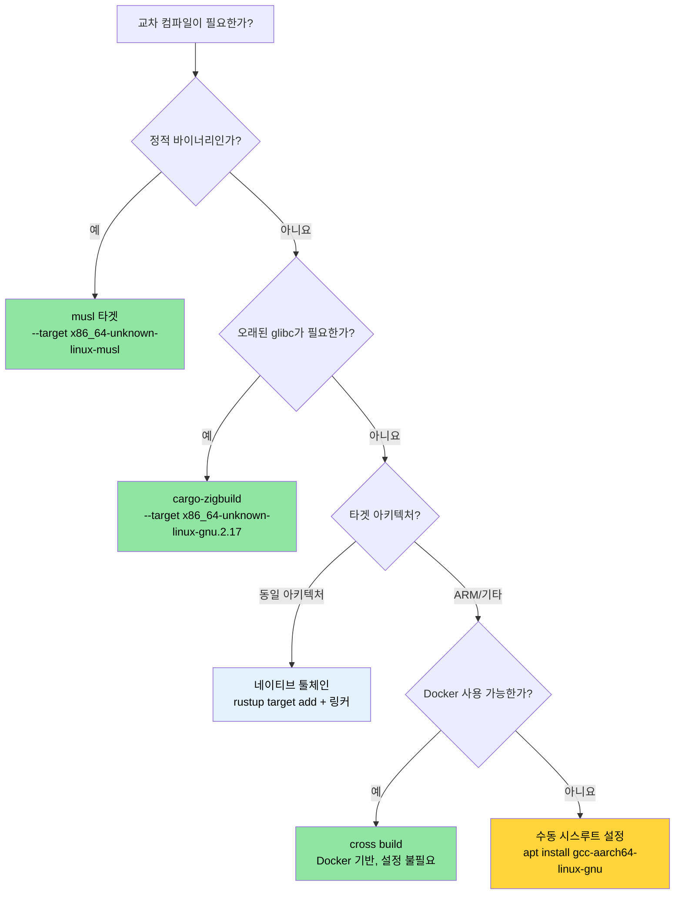

# 교차 컴파일 — 하나의 소스, 다양한 타겟 🟡

> **학습 내용:**
> - Rust 타겟 트리플(target triples)의 작동 원리와 `rustup`으로 추가하는 방법
> - 컨테이너/클라우드 배포를 위한 정적 musl 바이너리 빌드
> - 네이티브 툴체인, `cross`, `cargo-zigbuild`를 이용한 ARM(aarch64) 교차 컴파일
> - 다중 아키텍처 CI를 위한 GitHub Actions 매트릭스 빌드 설정
>
> **참조:** [빌드 스크립트](ch01-build-scripts-buildrs-in-depth.md) — 교차 컴파일 중 build.rs는 호스트(HOST)에서 실행됩니다 · [릴리스 프로필](ch07-release-profiles-and-binary-size.md) — 교차 컴파일된 릴리스 바이너리를 위한 LTO 및 strip 설정 · [Windows](ch10-windows-and-conditional-compilation.md) — Windows 교차 컴파일 및 `no_std` 타겟

교차 컴파일(Cross-compilation)이란 한 머신(**호스트**)에서 다른 머신(**타겟**)에서 실행될 실행 파일을 빌드하는 것을 의미합니다. 호스트는 여러분의 x86_64 노트북일 수 있고, 타겟은 ARM 서버, musl 기반 컨테이너, 또는 Windows 머신일 수 있습니다. Rust는 `rustc` 자체가 이미 교차 컴파일러로 설계되었기 때문에 이 과정이 매우 수월합니다. 적절한 타겟 라이브러리와 호환되는 링커만 있으면 됩니다.

### 타겟 트리플의 구조 (The Target Triple Anatomy)

모든 Rust 컴파일 타겟은 **타겟 트리플**(이름과 달리 보통 4개 부분으로 구성됨)로 식별됩니다:

```text
<아키텍처>-<벤더>-<운영체제>-<환경>

예시:
  x86_64  - unknown - linux  - gnu      ← 표준 Linux (glibc)
  x86_64  - unknown - linux  - musl     ← 정적 Linux (musl libc)
  aarch64 - unknown - linux  - gnu      ← ARM 64비트 Linux
  x86_64  - pc      - windows- msvc     ← MSVC를 사용하는 Windows
  aarch64 - apple   - darwin             ← Apple 실리콘 기반 macOS
  x86_64  - unknown - none              ← 베어 메탈 (OS 없음)
```

사용 가능한 모든 타겟 목록 확인:

```bash
# rustc가 컴파일할 수 있는 모든 타겟 표시 (~250개)
rustc --print target-list | wc -l

# 시스템에 설치된 타겟 표시
rustup target list --installed

# 현재 기본 타겟 표시
rustc -vV | grep host
```

### rustup을 이용한 툴체인 설치

```bash
# 타겟 라이브러리 추가 (해당 타겟용 Rust std)
rustup target add x86_64-unknown-linux-musl
rustup target add aarch64-unknown-linux-gnu

# 이제 교차 컴파일이 가능합니다:
cargo build --target x86_64-unknown-linux-musl
cargo build --target aarch64-unknown-linux-gnu  # 링커가 필요함 — 아래 내용 참조
```

**`rustup target add`가 제공하는 것**: 해당 타겟용으로 미리 컴파일된 `std`, `core`, `alloc` 라이브러리입니다. C 링커나 C 라이브러리는 제공하지 *않습니다*. C 툴체인이 필요한 타겟(대부분의 `gnu` 타겟)의 경우 별도로 설치해야 합니다.

```bash
# Ubuntu/Debian — aarch64용 교차 링커 설치
sudo apt install gcc-aarch64-linux-gnu

# Ubuntu/Debian — 정적 빌드를 위한 musl 툴체인 설치
sudo apt install musl-tools

# Fedora
sudo dnf install gcc-aarch64-linux-gnu
```

### `.cargo/config.toml` — 타겟별 설정

매번 명령을 내릴 때마다 `--target`을 전달하는 대신, 프로젝트 루트나 홈 디렉토리의 `.cargo/config.toml`에서 기본값을 설정할 수 있습니다.

```toml
# .cargo/config.toml

# 이 프로젝트의 기본 타겟 (선택 사항 — 네이티브 기본값을 유지하려면 생략)
# [build]
# target = "x86_64-unknown-linux-musl"

# aarch64 교차 컴파일을 위한 링커
[target.aarch64-unknown-linux-gnu]
linker = "aarch64-linux-gnu-gcc"
rustflags = ["-C", "target-feature=+crc"]

# musl 정적 빌드를 위한 링커 (보통 시스템 gcc가 작동함)
[target.x86_64-unknown-linux-musl]
linker = "musl-gcc"
rustflags = ["-C", "target-feature=+crc,+aes"]

# ARM 32비트 (라즈베리 파이, 임베디드)
[target.armv7-unknown-linux-gnueabihf]
linker = "arm-linux-gnueabihf-gcc"

# 모든 타겟에 대한 환경 변수
[env]
# 예: 커스텀 시스루트(sysroot) 설정
# SYSROOT = "/opt/cross/sysroot"
```

**설정 파일 검색 순서** (가장 먼저 발견되는 파일 적용):
1. `<project>/.cargo/config.toml`
2. `<project>/../.cargo/config.toml` (상위 디렉토리로 올라가며 검색)
3. `$CARGO_HOME/config.toml` (보통 `~/.cargo/config.toml`)

### musl을 이용한 정적 바이너리 (Static Binaries with musl)

최소한의 컨테이너(Alpine, scratch Docker 이미지)나 glibc 버전을 제어할 수 없는 시스템에 배포할 때는 musl을 사용하여 빌드하세요:

```bash
# musl 타겟 설치
rustup target add x86_64-unknown-linux-musl
sudo apt install musl-tools  # musl-gcc 제공

# 완전한 정적 바이너리 빌드
cargo build --release --target x86_64-unknown-linux-musl

# 정적 빌드 여부 확인
file target/x86_64-unknown-linux-musl/release/diag_tool
# → ELF 64-bit LSB executable, x86-64, statically linked

ldd target/x86_64-unknown-linux-musl/release/diag_tool
# → not a dynamic executable (동적 실행 파일이 아님)
```

**정적 빌드 vs 동적 빌드 트레이드오프:**

| 특성 | glibc (동적) | musl (정적) |
|--------|-----------------|---------------|
| 바이너리 크기 | 작음 (공유 라이브러리 사용) | 큼 (~5-15 MB 증가) |
| 이식성 | 일치하는 glibc 버전 필요 | 모든 Linux에서 실행 가능 |
| DNS 해결 | `nsswitch` 완전 지원 | 기본 리졸버 (mDNS 미지원) |
| 배포 | 시스루트나 컨테이너 필요 | 의존성 없는 단일 바이너리 |
| 성능 | malloc이 약간 더 빠름 | malloc이 약간 더 느림 |
| `dlopen()` 지원 | 지원함 | 지원 안 함 |

> **프로젝트 적용**: 호스트 OS 버전을 보장할 수 없는 다양한 서버 하드웨어에 배포할 때 정적 musl 빌드가 이상적입니다. 단일 바이너리 배포 모델은 "내 컴퓨터에선 되는데" 문제를 제거합니다.

### ARM (aarch64) 교차 컴파일

데이터 센터에서 ARM 서버(AWS Graviton, Ampere Altra, Grace 등) 사용이 점점 늘고 있습니다. x86_64 호스트에서 aarch64용으로 교차 컴파일하는 방법은 다음과 같습니다:

```bash
# 1단계: 타겟 및 교차 링커 설치
rustup target add aarch64-unknown-linux-gnu
sudo apt install gcc-aarch64-linux-gnu

# 2단계: .cargo/config.toml에 링커 설정 (위 내용 참조)

# 3단계: 빌드
cargo build --release --target aarch64-unknown-linux-gnu

# 4단계: 바이너리 확인
file target/aarch64-unknown-linux-gnu/release/diag_tool
# → ELF 64-bit LSB executable, ARM aarch64
```

**타겟 아키텍처용 테스트 실행**을 위해서는 다음 중 하나가 필요합니다:
- 실제 ARM 머신
- QEMU 유저 모드 에뮬레이션

```bash
# QEMU 유저 모드 설치 (x86_64에서 ARM 바이너리 실행)
sudo apt install qemu-user qemu-user-static binfmt-support

# 이제 cargo test가 QEMU를 통해 교차 컴파일된 테스트를 실행할 수 있습니다.
cargo test --target aarch64-unknown-linux-gnu
# (속도가 느림 — 각 테스트 바이너리가 에뮬레이션됨. 매일 하는 개발용이 아닌 CI 검증용으로 사용하세요.)
```

`.cargo/config.toml`에서 QEMU를 테스트 러너로 설정:

```toml
[target.aarch64-unknown-linux-gnu]
linker = "aarch64-linux-gnu-gcc"
runner = "qemu-aarch64-static -L /usr/aarch64-linux-gnu"
```

### `cross` 도구 — Docker 기반 교차 컴파일

[`cross`](https://github.com/cross-rs/cross) 도구는 미리 설정된 Docker 이미지를 사용하여 설정 과정이 필요 없는 교차 컴파일 경험을 제공합니다.

```bash
# cross 설치 (crates.io의 안정 버전)
cargo install cross
# 또는 최신 기능을 위해 git에서 설치:
# cargo install cross --git https://github.com/cross-rs/cross

# 교차 컴파일 — 툴체인 설정이 필요 없습니다!
cross build --release --target aarch64-unknown-linux-gnu
cross build --release --target x86_64-unknown-linux-musl
cross build --release --target armv7-unknown-linux-gnueabihf

# 교차 테스트 — Docker 이미지에 QEMU가 포함되어 있음
cross test --target aarch64-unknown-linux-gnu
```

**작동 원리**: `cross`는 `cargo`를 대신하여 올바른 교차 컴파일 툴체인이 미리 설치된 Docker 컨테이너 내에서 빌드를 실행합니다. 여러분의 소스 코드가 컨테이너에 마운트되고, 결과물은 평소와 같이 `target/` 디렉토리에 저장됩니다.

`Cross.toml`을 이용한 **Docker 이미지 커스터마이징**:

```toml
# Cross.toml
[target.aarch64-unknown-linux-gnu]
# 추가 시스템 라이브러리가 포함된 커스텀 Docker 이미지 사용
image = "my-registry/cross-aarch64:latest"

# 빌드 전 시스템 패키지 설치
pre-build = [
    "dpkg --add-architecture arm64",
    "apt-get update && apt-get install -y libpci-dev:arm64"
]

[target.aarch64-unknown-linux-gnu.env]
# 컨테이너에 환경 변수 전달
passthrough = ["CI", "GITHUB_TOKEN"]
```

`cross`는 Docker(또는 Podman)가 필요하지만, 교차 컴파일러, 시스루트, QEMU를 수동으로 설치할 필요를 없애줍니다. CI 환경에서 권장되는 방식입니다.

### Zig를 교차 컴파일 링커로 사용하기

[Zig](https://ziglang.org/)는 C 컴파일러와 약 40개 타겟에 대한 교차 컴파일 시스루트를 약 40MB 용량의 단일 다운로드 파일에 포함하고 있습니다. 덕분에 Rust를 위한 매우 편리한 교차 링커로 활용될 수 있습니다.

```bash
# Zig 설치 (단일 바이너리, 패키지 매니저 불필요)
# https://ziglang.org/download/ 에서 다운로드
# 또는 패키지 매니저 이용:
sudo snap install zig --classic --beta  # Ubuntu
brew install zig                          # macOS

# cargo-zigbuild 설치
cargo install cargo-zigbuild
```

**왜 Zig인가?** 핵심 장점은 **glibc 버전 타겟팅**입니다. Zig를 사용하면 링크할 glibc 버전을 정확히 지정할 수 있어, 오래된 Linux 배포판에서도 바이너리가 실행되도록 보장할 수 있습니다.

```bash
# glibc 2.17 타겟 빌드 (CentOS 7 / RHEL 7 호환성)
cargo zigbuild --release --target x86_64-unknown-linux-gnu.2.17

# glibc 2.28을 사용하는 aarch64 빌드 (Ubuntu 18.04+)
cargo zigbuild --release --target aarch64-unknown-linux-gnu.2.28

# musl 빌드 (완전 정적)
cargo zigbuild --release --target x86_64-unknown-linux-musl
```

`.2.17` 접미사는 Zig의 확장 기능입니다. Zig 링커에 glibc 2.17 심볼 버전을 사용하도록 지시하여, 결과 바이너리가 CentOS 7 이상에서 실행될 수 있게 합니다. Docker, 시스루트 관리, 교차 컴파일러 설치가 모두 필요 없습니다.

**비교: cross vs cargo-zigbuild vs 수동 방식**

| 기능 | 수동 방식 | cross | cargo-zigbuild |
|---------|--------|-------|----------------|
| 설정 노력 | 높음 (타겟별 툴체인 설치) | 낮음 (Docker 필요) | 낮음 (단일 바이너리) |
| Docker 필요 여부 | 아니요 | 예 | 아니요 |
| glibc 버전 타겟팅 | 불가 (호스트 glibc 사용) | 불가 (컨테이너 glibc 사용) | 가능 (정확한 버전 지정) |
| 테스트 실행 | QEMU 필요 | 포함되어 있음 | QEMU 필요 |
| macOS → Linux | 어려움 | 쉬움 | 쉬움 |
| Linux → macOS | 매우 어려움 | 지원 안 함 | 제한적 지원 |
| 바이너리 크기 오버헤드 | 없음 | 없음 | 없음 |

### CI 파이프라인: GitHub Actions 매트릭스

여러 타겟을 빌드하는 운영 환경 수준의 CI 워크플로 예시입니다:

```yaml
# .github/workflows/cross-build.yml
name: Cross-Platform Build

on: [push, pull_request]

env:
  CARGO_TERM_COLOR: always

jobs:
  build:
    strategy:
      matrix:
        include:
          - target: x86_64-unknown-linux-gnu
            os: ubuntu-latest
            name: linux-x86_64
          - target: x86_64-unknown-linux-musl
            os: ubuntu-latest
            name: linux-x86_64-static
          - target: aarch64-unknown-linux-gnu
            os: ubuntu-latest
            name: linux-aarch64
            use_cross: true
          - target: x86_64-pc-windows-msvc
            os: windows-latest
            name: windows-x86_64

    runs-on: ${{ matrix.os }}
    name: Build (${{ matrix.name }})

    steps:
      - uses: actions/checkout@v4

      - uses: dtolnay/rust-toolchain@stable
        with:
          targets: ${{ matrix.target }}

      - name: musl 도구 설치
        if: matrix.target == 'x86_64-unknown-linux-musl'
        run: sudo apt-get install -y musl-tools

      - name: cross 설치
        if: matrix.use_cross
        run: cargo install cross

      - name: 빌드 (네이티브)
        if: "!matrix.use_cross"
        run: cargo build --release --target ${{ matrix.target }}

      - name: 빌드 (cross)
        if: matrix.use_cross
        run: cross build --release --target ${{ matrix.target }}

      - name: 테스트 실행
        if: "!matrix.use_cross"
        run: cargo test --target ${{ matrix.target }}

      - name: 아티팩트 업로드
        uses: actions/upload-artifact@v4
        with:
          name: diag_tool-${{ matrix.name }}
          path: target/${{ matrix.target }}/release/diag_tool*
```

### 적용 사례: 다중 아키텍처 서버 빌드

현재 바이너리에는 교차 컴파일 설정이 없습니다. 다양한 서버 집합에 배포되는 하드웨어 진단 도구의 경우, 다음을 추가하는 것이 권장됩니다:

```text
my_workspace/
├── .cargo/
│   └── config.toml          ← 타겟별 링커 설정
├── Cross.toml                ← cross 도구 설정
└── .github/workflows/
    └── cross-build.yml       ← 3개 타겟을 위한 CI 매트릭스
```

**권장 `.cargo/config.toml`:**

```toml
# 프로젝트를 위한 .cargo/config.toml

# 릴리스 프로필 최적화 (이미 Cargo.toml에 있음, 참조용)
# [profile.release]
# lto = true
# codegen-units = 1
# panic = "abort"
# strip = true

# ARM 서버용 aarch64 (Graviton, Ampere, Grace)
[target.aarch64-unknown-linux-gnu]
linker = "aarch64-linux-gnu-gcc"

# 이식성 있는 정적 바이너리를 위한 musl
[target.x86_64-unknown-linux-musl]
linker = "musl-gcc"
```

**권장 빌드 타겟:**

| 타겟 | 사용 사례 | 배포 대상 |
|--------|----------|-----------|
| `x86_64-unknown-linux-gnu` | 기본 네이티브 빌드 | 표준 x86 서버 |
| `x86_64-unknown-linux-musl` | 정적 바이너리, 모든 배포판 | 컨테이너, 최소 설치 호스트 |
| `aarch64-unknown-linux-gnu` | ARM 서버 | Graviton, Ampere, Grace |

> **핵심 통찰**: 워크스페이스 루트의 `Cargo.toml`에 있는 `[profile.release]`에는 이미 `lto = true`, `codegen-units = 1`, `panic = "abort"`, `strip = true`가 설정되어 있습니다. 이는 교차 컴파일된 배포용 바이너리에 이상적인 릴리스 프로필입니다([릴리스 프로필](ch07-release-profiles-and-binary-size.md) 장의 영향도 표 참조). musl과 결합하면 런타임 의존성이 없는 약 10MB 크기의 단일 정적 바이너리가 생성됩니다.

### 교차 컴파일 문제 해결 (Troubleshooting)

| 증상 | 원인 | 해결책 |
|---------|-------|-----|
| `linker 'aarch64-linux-gnu-gcc' not found` | 교차 링커 툴체인 누락 | `sudo apt install gcc-aarch64-linux-gnu` |
| `cannot find -lssl` (musl 타겟) | 시스템 OpenSSL이 glibc에 링크됨 | `vendored` 기능 사용: `openssl = { version = "0.10", features = ["vendored"] }` |
| `build.rs`가 잘못된 바이너리 실행 | build.rs는 타겟이 아닌 호스트에서 실행됨 | build.rs 내에서 `cfg!(target_os)` 대신 `CARGO_CFG_TARGET_OS` 확인 |
| 로컬 테스트는 통과하나 `cross`에서 실패 | Docker 이미지에 테스트 파일 누락 | `Cross.toml`을 통해 테스트 데이터 마운트: `[build.env] volumes = ["./TestArea:/TestArea"]` |
| `undefined reference to __cxa_thread_atexit_impl` | 타겟의 glibc 버전이 너무 낮음 | `cargo-zigbuild`로 명시적 glibc 버전 사용: `--target x86_64-unknown-linux-gnu.2.17` |
| ARM에서 바이너리 세그폴트 발생 | 잘못된 ARM 변종으로 컴파일됨 | 타겟 트리플이 하드웨어와 일치하는지 확인: 64비트 ARM은 `aarch64-unknown-linux-gnu` |
| 런타임에 `GLIBC_2.XX not found` 발생 | 빌드 머신의 glibc가 더 최신임 | 정적 빌드를 위해 musl을 사용하거나, `cargo-zigbuild`로 glibc 버전 고정 |

### 교차 컴파일 의사결정 트리



### 🏋️ 실습

#### 🟢 실습 1: 정적 musl 바이너리

아무 Rust 바이너리나 `x86_64-unknown-linux-musl`용으로 빌드해 보세요. `file`과 `ldd`를 사용하여 정적으로 링크되었는지 확인하세요.

<details>
<summary>솔루션</summary>

```bash
rustup target add x86_64-unknown-linux-musl
cargo new hello-static && cd hello-static
cargo build --release --target x86_64-unknown-linux-musl

# 확인
file target/x86_64-unknown-linux-musl/release/hello-static
# 출력: ... statically linked ...

ldd target/x86_64-unknown-linux-musl/release/hello-static
# 출력: not a dynamic executable (동적 실행 파일이 아님)
```
</details>

#### 🟡 실습 2: GitHub Actions 교차 빌드 매트릭스

`x86_64-unknown-linux-gnu`, `x86_64-unknown-linux-musl`, `aarch64-unknown-linux-gnu` 세 가지 타겟을 빌드하는 GitHub Actions 워크플로를 매트릭스 전략을 사용하여 작성해 보세요.

<details>
<summary>솔루션</summary>

```yaml
name: Cross-build
on: [push]
jobs:
  build:
    runs-on: ubuntu-latest
    strategy:
      matrix:
        target:
          - x86_64-unknown-linux-gnu
          - x86_64-unknown-linux-musl
          - aarch64-unknown-linux-gnu
    steps:
      - uses: actions/checkout@v4
      - uses: dtolnay/rust-toolchain@stable
        with:
          targets: ${{ matrix.target }}
      - name: cross 설치
        run: cargo install cross --locked
      - name: 빌드
        run: cross build --release --target ${{ matrix.target }}
      - uses: actions/upload-artifact@v4
        with:
          name: binary-${{ matrix.target }}
          path: target/${{ matrix.target }}/release/my-binary
```
</details>

### 핵심 요약

- Rust의 `rustc`는 이미 교차 컴파일러입니다. 적절한 타겟과 링커만 준비하면 됩니다.
- **musl**은 런타임 의존성이 전혀 없는 완전한 정적 바이너리를 생성하며, 컨테이너 환경에 이상적입니다.
- **`cargo-zigbuild`**는 기업용 Linux 타겟을 위한 "glibc 버전" 문제를 해결해 줍니다.
- **`cross`**는 ARM이나 기타 특이한 타겟을 위한 가장 쉬운 방법입니다. Docker가 시스루트를 알아서 처리합니다.
- 항상 `file`과 `ldd`를 사용하여 바이너리가 배포 타겟과 일치하는지 테스트하세요.
