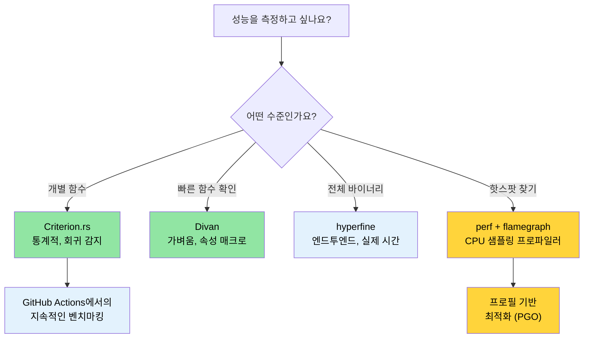

# 벤치마킹 — 중요한 지표 측정하기 🟡

> **학습 내용:**
> - `Instant::now()`를 이용한 단순한 시간 측정이 신뢰할 수 없는 이유
> - Criterion.rs와 더 가벼운 대안인 Divan을 이용한 통계적 벤치마킹
> - `perf`, 플레임그래프(flamegraphs), PGO를 이용한 핫스팟(hot spots) 프로파일링
> - 성능 저하를 자동으로 감지하기 위한 CI에서의 지속적인 벤치마킹 설정
>
> **참조:** [릴리스 프로필](ch07-release-profiles-and-binary-size.md) — 핫스팟을 찾았다면 바이너리를 최적화하세요 · [CI/CD 파이프라인](ch11-putting-it-all-together-a-production-cic.md) — 파이프라인 내의 벤치마크 작업 · [코드 커버리지](ch04-code-coverage-seeing-what-tests-miss.md) — 커버리지는 무엇이 테스트되었는지 알려주고, 벤치마크는 무엇이 빠른지 알려줍니다.

"우리는 약 97%의 시간에 대해 사소한 효율성에 대해서는 잊어야 합니다. 섣부른 최적화(premature optimization)는 모든 악의 뿌리입니다. 하지만 우리는 결정적인 3%의 기회를 놓쳐서는 안 됩니다." — 도널드 커누스(Donald Knuth)

어려운 것은 벤치마크를 *작성하는 것*이 아니라, **의미 있고 재현 가능하며 실행 가능한** 수치를 산출하는 벤치마크를 작성하는 것입니다. 이 장에서는 "빠른 것 같다"는 느낌에서 벗어나 "PR #347이 파싱 처리량을 4.2% 저하시켰다는 통계적 증거가 있다"고 말할 수 있게 해주는 도구와 기술을 다룹니다.

### 왜 `std::time::Instant`를 사용하면 안 될까요?

흔히 하는 실수:

```rust
// ❌ 단순한 벤치마킹 — 신뢰할 수 없는 결과
use std::time::Instant;

fn main() {
    let start = Instant::now();
    let result = parse_device_query_output(&sample_data);
    let elapsed = start.elapsed();
    println!("파싱 소요 시간: {:?}", elapsed);
    // 문제 1: 컴파일러가 `result`를 최적화로 제거할 수 있음 (데드 코드 제거)
    // 문제 2: 단일 샘플 — 통계적 유의성 없음
    // 문제 3: CPU 주파수 스케일링, 서멀 쓰로틀링, 다른 프로세스의 영향
    // 문제 4: 콜드 캐시(cold cache) vs 웜 캐시(warm cache) 제어 불가
}
```

수동 시간 측정의 문제점:
1. **데드 코드 제거 (Dead code elimination)** — 결과값이 사용되지 않으면 컴파일러가 계산 전체를 건너뛸 수 있습니다.
2. **워밍업 부재 (No warm-up)** — 첫 번째 실행에는 캐시 미스, OS 페이지 폴트, 지연 초기화(lazy initialization) 등이 포함됩니다.
3. **통계 분석 부재** — 단 한 번의 측정으로는 분산, 이상치(outliers) 또는 신뢰 구간에 대해 아무것도 알 수 없습니다.
4. **회귀 감지 불가** — 이전 실행 결과와 정밀하게 비교할 수 없습니다.

### Criterion.rs — 통계적 벤치마킹

[Criterion.rs](https://bheisler.github.io/criterion.rs/book/)는 Rust 마이크로 벤치마크의 표준 도구입니다. 통계적 방법을 사용하여 신뢰할 수 있는 측정값을 생성하고 성능 회귀(performance regressions)를 자동으로 감지합니다.

**설정:**

```toml
# Cargo.toml
[dev-dependencies]
criterion = { version = "0.5", features = ["html_reports", "cargo_bench_support"] }

[[bench]]
name = "parsing_bench"
harness = false  # 내장 테스트 하네스 대신 Criterion의 하네스 사용
```

**전체 벤치마크 예제:**

```rust
// benches/parsing_bench.rs
use criterion::{black_box, criterion_group, criterion_main, Criterion, BenchmarkId};

/// 파싱된 GPU 정보를 담는 데이터 타입
#[derive(Debug, Clone)]
struct GpuInfo {
    index: u32,
    name: String,
    temp_c: u32,
    power_w: f64,
}

/// 테스트 대상 함수 — 장치 쿼리 CSV 출력을 파싱하는 시뮬레이션
fn parse_gpu_csv(input: &str) -> Vec<GpuInfo> {
    input
        .lines()
        .filter(|line| !line.starts_with('#'))
        .filter_map(|line| {
            let fields: Vec<&str> = line.split(", ").collect();
            if fields.len() >= 4 {
                Some(GpuInfo {
                    index: fields[0].parse().ok()?,
                    name: fields[1].to_string(),
                    temp_c: fields[2].parse().ok()?,
                    power_w: fields[3].parse().ok()?,
                })
            } else {
                None
            }
        })
        .collect()
}

fn bench_parse_gpu_csv(c: &mut Criterion) {
    // 대표 테스트 데이터
    let small_input = "0, Acme Accel-V1-80GB, 32, 65.5\n\
                       1, Acme Accel-V1-80GB, 34, 67.2\n";

    let large_input = (0..64)
        .map(|i| format!("{i}, Acme Accel-X1-80GB, {}, {:.1}\n", 30 + i % 20, 60.0 + i as f64))
        .collect::<String>();

    c.bench_function("parse_2_gpus", |b| {
        b.iter(|| parse_gpu_csv(black_box(small_input)))
    });

    c.bench_function("parse_64_gpus", |b| {
        b.iter(|| parse_gpu_csv(black_box(&large_input)))
    });
}

criterion_group!(benches, bench_parse_gpu_csv);
criterion_main!(benches);
```

**실행 및 결과 읽기:**

```bash
# 모든 벤치마크 실행
cargo bench

# 특정 벤치마크 이름으로 실행
cargo bench -- parse_64

# 출력 결과:
# parse_2_gpus        time:   [1.2345 µs  1.2456 µs  1.2578 µs]
#                      ▲            ▲           ▲
#                      │          신뢰 구간
#                   하위 95%      중앙값      상위 95%
#
# parse_64_gpus       time:   [38.123 µs  38.456 µs  38.812 µs]
#                     change: [-1.2345% -0.5678% +0.1234%] (p = 0.12 > 0.05)
#                     성능 변화가 감지되지 않았습니다. (No change in performance detected.)
```

**`black_box()`의 역할**: 컴파일러가 벤치마크 대상을 최적화로 제거하거나 과도하게 상수를 폴딩(folding)하는 것을 방지하는 힌트입니다. 컴파일러는 `black_box` 내부를 들여다볼 수 없으므로 실제로 계산을 수행해야만 합니다.

### 매개변수화된 벤치마크 및 벤치마크 그룹

여러 구현 방식이나 입력 크기를 비교할 때 유용합니다:

```rust
// benches/comparison_bench.rs
use criterion::{criterion_group, criterion_main, Criterion, BenchmarkId, Throughput};

fn bench_parsing_strategies(c: &mut Criterion) {
    let mut group = c.benchmark_group("csv_parsing");

    // 다양한 입력 크기에 대해 테스트
    for num_gpus in [1, 8, 32, 64, 128] {
        let input = generate_gpu_csv(num_gpus);

        // 초당 바이트 수 보고를 위한 처리량 설정
        group.throughput(Throughput::Bytes(input.len() as u64));

        group.bench_with_input(
            BenchmarkId::new("split_based", num_gpus),
            &input,
            |b, input| b.iter(|| parse_split(input)),
        );

        group.bench_with_input(
            BenchmarkId::new("regex_based", num_gpus),
            &input,
            |b, input| b.iter(|| parse_regex(input)),
        );

        group.bench_with_input(
            BenchmarkId::new("nom_based", num_gpus),
            &input,
            |b, input| b.iter(|| parse_nom(input)),
        );
    }
    group.finish();
}

criterion_group!(benches, bench_parsing_strategies);
criterion_main!(benches);
```

**결과 확인**: Criterion은 `target/criterion/report/index.html`에 바이올린 플롯(violin plots), 비교 차트, 회귀 분석 결과가 포함된 HTML 보고서를 생성합니다. 브라우저에서 열어보세요.

### Divan — 더 가벼운 대안

[Divan](https://github.com/nvzqz/divan)은 Criterion의 복잡한 매크로 DSL 대신 속성(attribute) 매크로를 사용하는 최신 벤치마킹 프레임워크입니다.

```toml
# Cargo.toml
[dev-dependencies]
divan = "0.1"

[[bench]]
name = "parsing_bench"
harness = false
```

```rust
// benches/parsing_bench.rs
use divan::black_box;

const SMALL_INPUT: &str = "0, Acme Accel-V1-80GB, 32, 65.5\n\
                          1, Acme Accel-V1-80GB, 34, 67.2\n";

fn generate_gpu_csv(n: usize) -> String {
    (0..n)
        .map(|i| format!("{i}, Acme Accel-X1-80GB, {}, {:.1}\n", 30 + i % 20, 60.0 + i as f64))
        .collect()
}

fn main() {
    divan::main();
}

#[divan::bench]
fn parse_2_gpus() -> Vec<GpuInfo> {
    parse_gpu_csv(black_box(SMALL_INPUT))
}

#[divan::bench(args = [1, 8, 32, 64, 128])]
fn parse_n_gpus(n: usize) -> Vec<GpuInfo> {
    let input = generate_gpu_csv(n);
    parse_gpu_csv(black_box(&input))
}

// Divan 출력 결과는 깔끔한 표 형식입니다:
// ╰─ parse_2_gpus   fastest  │ slowest  │ median   │ mean     │ samples │ iters
//                   1.234 µs │ 1.567 µs │ 1.345 µs │ 1.350 µs │ 100     │ 1600
```

**Criterion 대신 Divan을 선택하는 경우:**
- 더 단순한 API (속성 매크로 사용, 보일러플레이트 적음)
- 더 빠른 컴파일 속도 (의존성 적음)
- 개발 중 빠른 성능 확인에 적합

**Criterion을 선택하는 경우:**
- 실행 간의 통계적 회귀 감지 필요
- 차트가 포함된 HTML 보고서 필요
- 확립된 에코시스템 및 더 많은 CI 통합 사례

### `perf`와 플레임그래프(Flamegraph)를 이용한 프로파일링

벤치마크가 *얼마나 빠른지* 알려준다면, 프로파일링은 *시간이 어디에 쓰이는지* 알려줍니다.

```bash
# 1단계: 디버그 정보와 함께 빌드 (릴리스 속도 유지, 디버그 심볼 포함)
cargo build --release
# 디버그 정보가 포함되도록 일시적으로 설정:
# [profile.release]
# debug = true          # 프로파일링을 위해 임시로 추가

# 2단계: perf로 기록
perf record --call-graph=dwarf ./target/release/diag_tool --run-diagnostics

# 3단계: 플레임그래프 생성
# 설치: cargo install flamegraph
# 설치: cargo install addr2line --features=bin (선택 사항, 속도 향상용)
cargo flamegraph --root -- --run-diagnostics
# 대화형 SVG 플레임그래프가 생성됩니다.
```

**플레임그래프 읽는 법:**
- **너비(Width)** = 해당 함수에서 소비된 시간 (넓을수록 느림)
- **높이(Height)** = 콜 스택 깊이 (높다고 느린 것이 아니라 호출 단계가 깊은 것임)
- **하단(Bottom)** = 엔트리 포인트(시작점), **상단(Top)** = 실제 작업을 수행하는 리프(leaf) 함수
- 상단에서 넓게 퍼진 평평한 부분(plateaus)을 찾으세요 — 그곳이 바로 핫스팟입니다.

**프로필 기반 최적화 (Profile-Guided Optimization, PGO):**

```bash
# 1단계: 계측(instrumentation)과 함께 빌드
RUSTFLAGS="-Cprofile-generate=/tmp/pgo-data" cargo build --release

# 2단계: 대표적인 워크로드 실행
./target/release/diag_tool --run-full   # 프로파일링 데이터 생성

# 3단계: 프로파일링 데이터 병합
# rustc의 LLVM 버전과 일치하는 llvm-profdata 사용:
# $(rustc --print sysroot)/lib/rustlib/x86_64-unknown-linux-gnu/bin/llvm-profdata
# 또는 llvm-tools 설치: rustup component add llvm-tools
llvm-profdata merge -o /tmp/pgo-data/merged.profdata /tmp/pgo-data/

# 4단계: 프로파일링 피드백과 함께 재빌드
RUSTFLAGS="-Cprofile-use=/tmp/pgo-data/merged.profdata" cargo build --release
# 연산 집약적인 코드(파싱, 암호화, 코드 생성 등)에서 보통 5-20% 성능 향상을 보입니다.
# I/O 위주나 시스템 콜이 많은 코드에서는 큰 효과를 보기 어려울 수 있습니다.
```

> **팁**: PGO에 시간을 들이기 전에, [릴리스 프로필](ch07-release-profiles-and-binary-size.md)에서 LTO가 활성화되어 있는지 먼저 확인하세요. 보통 LTO가 노력 대비 더 큰 성능 향상을 제공합니다.

### `hyperfine` — 빠른 전체 실행 시간 측정

[`hyperfine`](https://github.com/sharkdp/hyperfine)은 개별 함수가 아닌 전체 명령의 실행 시간을 벤치마킹합니다. 바이너리의 전체적인 성능을 측정할 때 완벽합니다.

```bash
# 설치
cargo install hyperfine

# 기본 벤치마크
hyperfine './target/release/diag_tool --run-diagnostics'

# 두 가지 구현 비교
hyperfine './target/release/diag_tool_v1 --run-diagnostics' \
          './target/release/diag_tool_v2 --run-diagnostics'

# 워밍업 실행 + 최소 반복 횟수 지정
hyperfine --warmup 3 --min-runs 10 './target/release/diag_tool --run-all'

# CI 비교를 위해 결과를 JSON으로 내보내기
hyperfine --export-json bench.json './target/release/diag_tool --run-all'
```

**Criterion vs `hyperfine` 사용 시점:**
- `hyperfine`: 전체 바이너리 실행 시간, 리팩토링 전후 비교, I/O 위주 워크로드
- Criterion: 개별 함수의 마이크로 벤치마킹, 통계적 회귀 감지

### CI에서의 지속적인 벤치마킹

배포 전에 성능 저하를 자동으로 감지하세요:

```yaml
# .github/workflows/bench.yml
name: Benchmarks

on:
  pull_request:
    paths: ['**/*.rs', 'Cargo.toml', 'Cargo.lock']

jobs:
  benchmark:
    runs-on: ubuntu-latest
    steps:
      - uses: actions/checkout@v4

      - uses: dtolnay/rust-toolchain@stable

      - name: Run benchmarks
        run: cargo bench -- --output-format bencher | tee bench_output.txt

      - name: Store benchmark result
        uses: benchmark-action/github-action-benchmark@v1
        with:
          tool: 'cargo'
          output-file-path: bench_output.txt
          github-token: ${{ secrets.GITHUB_TOKEN }}
          auto-push: true
          alert-threshold: '120%'    # 20% 느려지면 알림
          comment-on-alert: true
          fail-on-alert: true        # 회귀 감지 시 PR 차단
```

**CI 설정 시 주의사항:**
- 일관된 결과를 위해 공유 CI가 아닌 **전용 벤치마크 러너**를 사용하세요.
- 클라우드 CI를 사용한다면 특정 머신 타입을 고정하세요.
- 과거 데이터를 저장하여 점진적인 성능 저하를 감지하세요.
- 워크로드의 허용 오차에 따라 임계값(threshold)을 설정하세요 (실행 경로에 따라 5~20%).

### 적용 사례: 파싱 성능

이 프로젝트에는 벤치마킹을 통해 성능을 개선할 수 있는 여러 파싱 경로가 있습니다:

| 파싱 핫스팟 | 크레이트 | 중요 이유 |
|------------------|-------|----------------|
| 가속기 쿼리 CSV/XML 출력 | `device_diag` | GPU당 호출됨, 실행당 최대 8회 |
| 센서 이벤트 파싱 | `event_log` | 바쁜 서버에서 수천 개의 레코드 처리 |
| PCIe 토폴로지 JSON | `topology_lib` | 복잡한 중첩 구조, 골든 파일(golden-file)로 검증됨 |
| 보고서 JSON 직렬화 | `diag_framework` | 최종 보고서 출력, 크기에 민감함 |
| 설정 JSON 로딩 | `config_loader` | 시작 지연 시간(startup latency) |

**첫 번째 권장 벤치마크** — 이미 골든 파일 테스트 데이터가 있는 토폴로지 파서:

```rust
// topology_lib/benches/parse_bench.rs (제안)
use criterion::{criterion_group, criterion_main, Criterion, Throughput};
use std::fs;

fn bench_topology_parse(c: &mut Criterion) {
    let mut group = c.benchmark_group("topology_parse");

    for golden_file in ["S2001", "S1015", "S1035", "S1080"] {
        let path = format!("tests/test_data/{golden_file}.json");
        let data = fs::read_to_string(&path).expect("골든 파일을 찾을 수 없습니다");
        group.throughput(Throughput::Bytes(data.len() as u64));

        group.bench_function(golden_file, |b| {
            b.iter(|| {
                topology_lib::TopologyProfile::from_json_str(
                    criterion::black_box(&data)
                )
            });
        });
    }
    group.finish();
}

criterion_group!(benches, bench_topology_parse);
criterion_main!(benches);
```

### 직접 해보기

1. **Criterion 벤치마크 작성**: 코드베이스에서 파싱 함수를 하나 골라 `benches/` 디렉토리를 만들고, 초당 바이트 수 처리량을 측정하는 Criterion 벤치마크를 설정해 보세요. `cargo bench`를 실행하고 HTML 보고서를 확인해 보세요.

2. **플레임그래프 생성**: `[profile.release]`에 `debug = true`를 추가하고 프로젝트를 빌드한 후, `cargo flamegraph -- <인자>`를 실행해 보세요. 플레임그래프 상단에서 가장 넓은 스택 3개를 찾아보세요. 그곳이 바로 여러분의 핫스팟입니다.

3. **`hyperfine`으로 비교**: `hyperfine`을 설치하고 바이너리의 전체 실행 시간을 다양한 플래그와 함께 측정해 보세요. 이를 Criterion의 함수 단위 시간과 비교해 보세요. Criterion이 보지 못하는 시간(I/O, 시스템 콜, 프로세스 시작 등)은 어디서 소모되나요?

### 벤치마킹 도구 선택 가이드



### 🏋️ 실습

#### 🟢 실습 1: 첫 번째 Criterion 벤치마크

10,000개의 무작위 요소를 가진 `Vec<u64>`를 정렬하는 함수를 가진 크레이트를 만드세요. 이에 대한 Criterion 벤치마크를 작성한 후, `.sort_unstable()`로 바꾸고 HTML 보고서에서 성능 차이를 관찰해 보세요.

<details>
<summary>솔루션</summary>

```toml
# Cargo.toml
[[bench]]
name = "sort_bench"
harness = false

[dev-dependencies]
criterion = { version = "0.5", features = ["html_reports"] }
rand = "0.8"
```

```rust
// benches/sort_bench.rs
use criterion::{black_box, criterion_group, criterion_main, Criterion};
use rand::Rng;

fn generate_data(n: usize) -> Vec<u64> {
    let mut rng = rand::thread_rng();
    (0..n).map(|_| rng.gen()).collect()
}

fn bench_sort(c: &mut Criterion) {
    let mut group = c.benchmark_group("sort-10k");

    group.bench_function("stable", |b| {
        b.iter_batched(
            || generate_data(10_000),
            |mut data| { data.sort(); black_box(&data); },
            criterion::BatchSize::SmallInput,
        )
    });

    group.bench_function("unstable", |b| {
        b.iter_batched(
            || generate_data(10_000),
            |mut data| { data.sort_unstable(); black_box(&data); },
            criterion::BatchSize::SmallInput,
        )
    });

    group.finish();
}

criterion_group!(benches, bench_sort);
criterion_main!(benches);
```

```bash
cargo bench
open target/criterion/sort-10k/report/index.html
```
</details>

#### 🟡 실습 2: 플레임그래프 핫스팟

`[profile.release]`에 `debug = true`를 설정하고 빌드한 후 플레임그래프를 생성하세요. 가장 너비가 넓은 스택 3개를 식별해 보세요.

<details>
<summary>솔루션</summary>

```toml
# Cargo.toml
[profile.release]
debug = true  # 플레임그래프를 위해 심볼 유지
```

```bash
cargo install flamegraph
cargo flamegraph --release -- <인자>
# 브라우저에서 flamegraph.svg가 열립니다.
# 상단에서 가장 넓은 스택들이 바로 핫스팟입니다.
```
</details>

### 핵심 요약

- 절대로 `Instant::now()`로 벤치마킹하지 마세요. 통계적 엄밀함과 회귀 감지를 위해 Criterion.rs를 사용하세요.
- `black_box()`는 컴파일러가 벤치마크 대상을 최적화로 제거하는 것을 방지합니다.
- `hyperfine`은 전체 바이너리의 실행 시간을 측정하고, Criterion은 개별 함수를 측정합니다. 두 도구를 적절히 병용하세요.
- 플레임그래프는 시간이 *어디서* 쓰이는지 보여주고, 벤치마크는 시간이 *얼마나* 쓰이는지 보여줍니다.
- CI에서의 지속적인 벤치마킹은 성능 저하가 배포되기 전에 잡아낼 수 있게 해줍니다.
