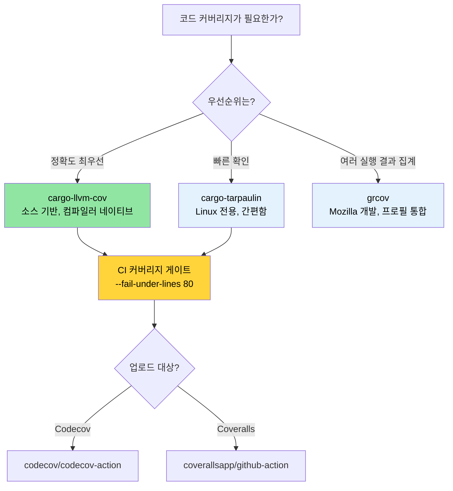

# 코드 커버리지 — 테스트가 놓치는 부분 확인하기 🟢

> **학습 내용:**
> - `cargo-llvm-cov`를 이용한 소스 기반 커버리지 (가장 정확한 Rust 커버리지 도구)
> - `cargo-tarpaulin` 및 Mozilla의 `grcov`를 이용한 빠른 커버리지 확인
> - Codecov 및 Coveralls를 이용한 CI 커버리지 게이트(coverage gates) 설정
> - 고위험 사각지대를 우선시하는 커버리지 기반 테스트 전략
>
> **참조:** [Miri 및 새니타이저](ch05-miri-valgrind-and-sanitizers-verifying-u.md) — 커버리지는 테스트되지 않은 코드를 찾고, Miri는 테스트된 코드 내의 미정의 동작(UB)을 찾습니다 · [벤치마킹](ch03-benchmarking-measuring-what-matters.md) — 커버리지는 *무엇이 테스트되었는지* 보여주고, 벤치마크는 *무엇이 빠른지* 보여줍니다 · [CI/CD 파이프라인](ch11-putting-it-all-together-a-production-cic.md) — 파이프라인 내의 커버리지 게이트

코드 커버리지는 테스트가 실제로 어떤 라인, 브랜치 또는 함수를 실행하는지 측정합니다. 커버리지가 높다고 해서 코드의 정답률이 보장되는 것은 아니지만(실행된 라인에도 버그는 있을 수 있음), 테스트가 전혀 닿지 않는 **사각지대(blind spots)**를 확실하게 드러내 줍니다.

수많은 크레이트에 걸쳐 1,000개가 넘는 테스트가 있는 이 프로젝트에서 커버리지 분석은 다음 질문에 답해줍니다: "테스트에 대한 투자가 정말 중요한 코드에 도달하고 있는가?"

### `llvm-cov`를 이용한 소스 기반 커버리지

Rust는 LLVM을 사용하며, LLVM은 가장 정확한 커버리지 측정 방식인 소스 기반 커버리지 계측(instrumentation)을 지원합니다. 권장되는 도구는 [`cargo-llvm-cov`](https://github.com/taiki-e/cargo-llvm-cov)입니다.

```bash
# 설치
cargo install cargo-llvm-cov

# 또는 rustup 컴포넌트를 통해 (로우 LLVM 도구용)
rustup component add llvm-tools-preview
```

**기본 사용법:**

```bash
# 테스트를 실행하고 파일별 커버리지 요약 표시
cargo llvm-cov

# HTML 보고서 생성 (라인별 하이라이트가 포함된 브라우저용 보고서)
cargo llvm-cov --html
# 결과물 위치: target/llvm-cov/html/index.html

# LCOV 형식 생성 (CI 통합용)
cargo llvm-cov --lcov --output-path lcov.info

# 워크스페이스 전체 커버리지 (모든 크레이트)
cargo llvm-cov --workspace

# 특정 패키지만 포함
cargo llvm-cov --package accel_diag --package topology_lib

# 문서 테스트(doc tests) 포함 커버리지
cargo llvm-cov --doctests
```

**HTML 보고서 읽기:**

```text
target/llvm-cov/html/index.html
├── 파일명             │ 함수     │ 라인     │ 브랜치   │ 영역
├─ accel_diag/src/lib.rs │  78.5%  │  82.3%  │  61.2%  │  74.1%
├─ sel_mgr/src/parse.rs│  95.2%  │  96.8%  │  88.0%  │  93.5%
├─ topology_lib/src/.. │  91.0%  │  93.4%  │  79.5%  │  89.2%
└─ ...

초록색 = 커버됨    빨간색 = 커버 안 됨    노란색 = 부분적으로 커버됨 (브랜치)
```

**커버리지 유형 설명:**

| 유형 | 측정 대상 | 의미 |
|------|------------------|-------------|
| **라인 커버리지** | 어떤 소스 라인이 실행되었는가 | "이 코드에 도달했는가?"라는 기본 측정 |
| **브랜치 커버리지** | `if`/`match`의 어떤 분기가 실행되었는가 | 테스트되지 않은 조건문을 찾아냄 |
| **함수 커버리지** | 어떤 함수가 호출되었는가 | 데드 코드(사용되지 않는 코드) 식별 |
| **영역 커버리지** | 어떤 코드 영역(하위 표현식)이 실행되었는가 | 가장 세밀한 단위의 측정 |

### cargo-tarpaulin — 빠른 확인을 위한 대안

[`cargo-tarpaulin`](https://github.com/xd009642/tarpaulin)은 설정이 더 간단한(LLVM 컴포넌트 불필요) Linux 전용 커버리지 도구입니다.

```bash
# 설치
cargo install cargo-tarpaulin

# 기본 커버리지 보고서
cargo tarpaulin

# HTML 출력
cargo tarpaulin --out Html

# 상세 옵션 사용
cargo tarpaulin \
    --workspace \
    --timeout 120 \
    --out Xml Html \
    --output-dir coverage/ \
    --exclude-files "*/tests/*" "*/benches/*" \
    --ignore-panics

# 특정 크레이트 제외
cargo tarpaulin --workspace --exclude diag_tool  # 바이너리 크레이트 제외
```

**tarpaulin vs llvm-cov 비교:**

| 기능 | cargo-llvm-cov | cargo-tarpaulin |
|---------|----------------|-----------------|
| 정확도 | 소스 기반 (가장 정확함) | Ptrace 기반 (때때로 과다 측정) |
| 플랫폼 | 모든 플랫폼 (LLVM 기반) | Linux 전용 |
| 브랜치 커버리지 | 지원함 | 제한적 지원 |
| 문서 테스트 | 지원함 | 지원 안 함 |
| 설정 | `llvm-tools-preview` 필요 | 단독 실행 가능 |
| 속도 | 빠름 (컴파일 타임 계측) | 느림 (ptrace 오버헤드) |
| 안정성 | 매우 안정적임 | 때때로 가양성(false positives) 발생 |

**권장 사항**: 정확도가 중요하다면 `cargo-llvm-cov`를 사용하세요. LLVM 도구 설치 없이 빠르게 확인하고 싶을 때는 `cargo-tarpaulin`을 사용하세요.

### grcov — Mozilla의 커버리지 도구

[`grcov`](https://github.com/mozilla/grcov)는 Mozilla에서 만든 커버리지 집계 도구입니다. 로우(raw) LLVM 프로파일링 데이터를 읽어 다양한 형식의 보고서를 생성합니다.

```bash
# 설치
cargo install grcov

# 1단계: 커버리지 계측과 함께 빌드
export RUSTFLAGS="-Cinstrument-coverage"
export LLVM_PROFILE_FILE="target/coverage/%p-%m.profraw"
cargo build --tests

# 2단계: 테스트 실행 (.profraw 파일 생성됨)
cargo test

# 3단계: grcov로 집계
grcov target/coverage/ \
    --binary-path target/debug/ \
    --source-dir . \
    --output-types html,lcov \
    --output-path target/coverage/report \
    --branch \
    --ignore-not-existing \
    --ignore "*/tests/*" \
    --ignore "*/.cargo/*"

# 4단계: 보고서 확인
open target/coverage/report/html/index.html
```

**grcov를 사용하는 경우**: 유닛 테스트, 통합 테스트, 퍼즈(fuzz) 테스트 등 **여러 테스트 실행 결과를 하나의 보고서로 합쳐야 할 때** 가장 유용합니다.

### CI 환경의 커버리지: Codecov 및 Coveralls

커버리지 데이터를 추적 서비스에 업로드하여 이력 관리 및 PR 주석 기능을 활용해 보세요.

```yaml
# .github/workflows/coverage.yml
name: Code Coverage

on: [push, pull_request]

jobs:
  coverage:
    runs-on: ubuntu-latest
    steps:
      - uses: actions/checkout@v4
      - uses: dtolnay/rust-toolchain@stable
        with:
          components: llvm-tools-preview

      - name: cargo-llvm-cov 설치
        uses: taiki-e/install-action@cargo-llvm-cov

      - name: 커버리지 생성
        run: cargo llvm-cov --workspace --lcov --output-path lcov.info

      - name: Codecov에 업로드
        uses: codecov/codecov-action@v4
        with:
          files: lcov.info
          token: ${{ secrets.CODECOV_TOKEN }}
          fail_ci_if_error: true

      # 선택 사항: 최소 커버리지 강제
      - name: 커버리지 임계값 확인
        run: |
          cargo llvm-cov --workspace --fail-under-lines 80
          # 라인 커버리지가 80% 미만이면 빌드 실패 처리
```

**커버리지 게이트 (Coverage gates)** — JSON 출력을 읽어 크레이트별 최소치를 강제할 수 있습니다.

```bash
# 크레이트별 커버리지를 JSON으로 가져오기
cargo llvm-cov --workspace --json | jq '.data[0].totals.lines.percent'

# 임계값 미달 시 실패 처리
cargo llvm-cov --workspace --fail-under-lines 80
cargo llvm-cov --workspace --fail-under-functions 70
cargo llvm-cov --workspace --fail-under-regions 60
```

### 커버리지 기반 테스트 전략 (Coverage-Guided Testing Strategy)

전략 없는 커버리지 수치는 무의미합니다. 커버리지 데이터를 효과적으로 활용하는 방법은 다음과 같습니다:

**1단계: 위험도에 따른 분류**

```text
높은 커버리지, 높은 위험도   → ✅ 양호 — 상태 유지
높은 커버리지, 낮은 위험도   → 🔄 과잉 테스트 가능성 — 느리다면 테스트 축소 고려
낮은 커버리지, 높은 위험도   → 🔴 즉시 테스트 작성 — 버그가 숨어있을 확률 높음
낮은 커버리지, 낮은 위험도   → 🟡 추적은 하되 당장 조급해할 필요 없음
```

**2단계: 라인이 아닌 브랜치 커버리지에 집중하기**

```rust
// 라인 커버리지 100%, 브랜치 커버리지 50% — 여전히 위험합니다!
pub fn classify_temperature(temp_c: i32) -> ThermalState {
    if temp_c > 105 {       // ← temp=110으로 테스트됨 → Critical
        ThermalState::Critical
    } else if temp_c > 85 { // ← temp=90으로 테스트됨 → Warning
        ThermalState::Warning
    } else if temp_c < -10 { // ← 테스트된 적 없음 → 센서 오류 케이스 누락
        ThermalState::SensorError
    } else {
        ThermalState::Normal  // ← temp=25로 테스트됨 → Normal
    }
}
```

**3단계: 노이즈 제거**

```bash
# 테스트 코드를 커버리지에서 제외 (테스트 코드는 항상 "커버"되므로)
cargo llvm-cov --workspace --ignore-filename-regex 'tests?\.rs$|benches/'

# 생성된 코드 제외
cargo llvm-cov --workspace --ignore-filename-regex 'target/'
```

코드 내에서 테스트 불가능한 섹션 표시하기:

```rust
// 커버리지 도구가 이 패턴을 인식합니다.
#[cfg(not(tarpaulin_include))]  // tarpaulin용
fn unreachable_hardware_path() {
    // 이 경로는 실제 GPU 하드웨어가 있어야만 실행 가능합니다.
}

// llvm-cov의 경우 더 정교한 접근 방식을 사용하세요:
// 일부 경로는 유닛 테스트가 아닌 통합/하드웨어 테스트가 필요함을 인정하고,
// 커버리지 예외 목록으로 관리하십시오.
```

### 상호 보완적인 테스트 도구

**`proptest` — 속성 기반 테스트 (Property-Based Testing)** 는 수동으로 작성한 테스트가 놓치기 쉬운 에지 케이스를 찾아줍니다.

```toml
[dev-dependencies]
proptest = "1"
```

```rust
use proptest::prelude::*;

proptest! {
    #[test]
    fn parse_never_panics(input in "\\PC*") {
        // proptest가 수천 개의 무작위 문자열을 생성합니다.
        // 어떤 입력에 대해서라도 parse_gpu_csv가 패닉을 일으키면 테스트는 실패하며,
        // proptest는 실패 원인이 된 최소한의 입력을 찾아줍니다.
        let _ = parse_gpu_csv(&input);
    }

    #[test]
    fn temperature_roundtrip(raw in 0u16..4096) {
        let temp = Temperature::from_raw(raw);
        let md = temp.millidegrees_c();
        // 속성: 밀리섭씨 온도는 항상 raw 값으로부터 유도 가능해야 함
        assert_eq!(md, (raw as i32) * 625 / 10);
    }
}
```

**`insta` — 스냅샷 테스트 (Snapshot Testing)** 는 대규모 구조화된 출력(JSON, 텍스트 보고서 등)을 테스트할 때 유용합니다.

```toml
[dev-dependencies]
insta = { version = "1", features = ["json"] }
```

```rust
#[test]
fn test_der_report_format() {
    let report = generate_der_report(&test_results);
    // 첫 실행 시 스냅샷 파일을 생성하고, 이후 실행 시 결과와 비교합니다.
    // 변경 사항은 `cargo insta review`를 통해 대화형으로 승인할 수 있습니다.
    insta::assert_json_snapshot!(report);
}
```

> **proptest/insta 도입 시기**: 유닛 테스트가 모두 "정상적인 상황"만 다루고 있다면 proptest가 놓친 에지 케이스를 찾아줄 것입니다. JSON 보고서와 같이 큰 출력 형식을 테스트한다면, 직접 단언문(assertion)을 작성하는 것보다 insta 스냅샷이 작성과 유지보수가 훨씬 빠릅니다.

### 적용 사례: 1,000개 이상의 테스트 커버리지 맵

이 프로젝트에는 1,000개 이상의 테스트가 있지만 커버리지 추적은 이루어지지 않고 있습니다. 커버리지를 추가하면 테스트 투자가 어디에 집중되어 있는지 알 수 있습니다. 커버되지 않은 경로는 [Miri 및 새니타이저](ch05-miri-valgrind-and-sanitizers-verifying-u.md) 검증의 주요 대상이 됩니다.

**권장 커버리지 설정:**

```bash
# 워크스페이스 빠른 커버리지 확인 (제안된 CI 명령어)
cargo llvm-cov --workspace \
    --ignore-filename-regex 'tests?\.rs$' \
    --fail-under-lines 75 \
    --html

# 특정 크레이트의 집중 개선을 위한 커버리지 확인
for crate in accel_diag event_log topology_lib network_diag compute_diag fan_diag; do
    echo "=== $crate ==="
    cargo llvm-cov --package "$crate" --json 2>/dev/null | \
        jq -r '.data[0].totals | "라인: \(.lines.percent | round)%  브랜치: \(.branches.percent | round)%"'
done
```

**커버리지가 높을 것으로 예상되는 크레이트** (테스트 밀도 기반):
- `topology_lib` — 922라인의 골든 파일(golden-file) 테스트 스위트 보유
- `event_log` — `create_test_record()` 헬퍼를 활용한 레지스트리 테스트
- `cable_diag` — `make_test_event()` / `make_test_context()` 패턴 활용

**커버리지 사각지대로 예상되는 부분** (코드 검토 기반):
- IPMI 통신 경로의 오류 처리 분기
- 특정 GPU 하드웨어 전용 브랜치 (실제 GPU 필요)
- `dmesg` 파싱의 에지 케이스 (플랫폼별 출력 차이)

> **커버리지의 80/20 법칙**: 0%에서 80%까지 커버리지를 올리는 것은 직관적입니다. 하지만 80%에서 95%로 올리려면 점점 더 작위적인 테스트 시나리오가 필요해집니다. 95%에서 100%를 달성하는 것은 `#[cfg(not(...))]` 제외 처리가 필요하며, 그 노력만큼의 가치를 얻기 힘듭니다. 실무적으로는 **라인 커버리지 80%, 브랜치 커버리지 70%**를 최소 기준으로 삼는 것이 적절합니다.

### 커버리지 문제 해결 (Troubleshooting)

| 증상 | 원인 | 해결책 |
|---------|-------|-----|
| `llvm-cov` 결과가 모든 파일에서 0%로 나옴 | 계측이 적용되지 않음 | `cargo test` 후에 `llvm-cov`를 따로 실행하지 말고 `cargo llvm-cov` 명령어를 사용하세요. |
| `unreachable!()`이 커버되지 않은 것으로 나옴 | 컴파일된 코드에는 해당 분기가 존재함 | `#[cfg(not(tarpaulin_include))]`를 사용하거나 제외 정규표현식에 추가하세요. |
| 커버리지 측정 중 테스트 바이너리가 충돌함 | 계측과 새니타이저의 충돌 | `cargo llvm-cov`와 `-Zsanitizer=address`를 동시에 실행하지 말고 따로 실행하세요. |
| `llvm-cov`와 `tarpaulin`의 결과가 다름 | 계측 기술의 차이 | 컴파일러 네이티브 방식인 `llvm-cov`를 기준으로 삼으세요. 차이가 크다면 이슈를 보고하세요. |
| `error: profraw file is malformed` 오류 | 테스트 바이너리가 실행 도중 예기치 않게 종료됨 | 먼저 테스트 실패를 해결하세요. 프로세스가 비정상 종료되면 프로파일링 데이터가 손상됩니다. |
| 브랜치 커버리지가 비정상적으로 낮게 나옴 | 최적화 과정에서 매치 팔, unwrap 등에 브랜치가 생성됨 | 실무적인 지표로는 라인 커버리지에 집중하세요. 브랜치 커버리지는 구조상 낮게 측정되는 경향이 있습니다. |

### 직접 해보기

1. **내 프로젝트 커버리지 측정**: `cargo llvm-cov --workspace --html`을 실행하고 보고서를 열어보세요. 커버리지가 가장 낮은 파일 3개를 찾아보세요. 단순히 테스트가 없는 것인가요, 아니면 하드웨어 의존성 때문에 테스트하기 어려운 코드인가요?

2. **커버리지 게이트 설정**: CI에 `cargo llvm-cov --workspace --fail-under-lines 60`을 추가해 보세요. 의도적으로 테스트 하나를 주석 처리하고 CI가 실패하는지 확인해 보세요. 그 후 임계값을 실제 커버리지보다 2% 낮은 수준으로 높여보세요.

3. **브랜치 vs 라인 커버리지**: 3개의 분기가 있는 `match` 함수를 작성하고 2개 분기만 테스트해 보세요. 라인 커버리지(약 66% 예상)와 브랜치 커버리지(약 50% 예상)를 비교해 보세요. 프로젝트에 어떤 지표가 더 유용한가요?

### 커버리지 도구 선택 가이드



### 🏋️ 실습

#### 🟢 실습 1: 첫 번째 커버리지 보고서

`cargo-llvm-cov`를 설치하고 아무 Rust 프로젝트에서나 실행한 후 HTML 보고서를 열어보세요. 라인 커버리지가 가장 낮은 파일 3개를 찾아보세요.

<details>
<summary>솔루션</summary>

```bash
cargo install cargo-llvm-cov
cargo llvm-cov --workspace --html --open
# 보고서는 커버리지 순으로 정렬됩니다 — 낮은 것이 아래쪽에 위치합니다.
# 50% 미만인 파일들을 살펴보세요 — 그곳이 여러분의 사각지대입니다.
```
</details>

#### 🟡 실습 2: CI 커버리지 게이트

라인 커버리지가 60% 미만으로 떨어지면 실패하는 커버리지 게이트를 GitHub Actions 워크플로에 추가해 보세요. 테스트 하나를 주석 처리하여 제대로 작동하는지 확인하세요.

<details>
<summary>솔루션</summary>

```yaml
# .github/workflows/coverage.yml
name: Coverage
on: [push, pull_request]
jobs:
  coverage:
    runs-on: ubuntu-latest
    steps:
      - uses: actions/checkout@v4
      - uses: dtolnay/rust-toolchain@stable
        with:
          components: llvm-tools-preview
      - run: cargo install cargo-llvm-cov
      - run: cargo llvm-cov --workspace --fail-under-lines 60
```

테스트를 주석 처리하고 푸시한 뒤 워크플로가 실패하는지 확인하세요.
</details>

### 핵심 요약

- `cargo-llvm-cov`는 컴파일러 고유의 계측 기능을 사용하는 가장 정확한 Rust 커버리지 도구입니다.
- 커버리지가 높다고 정답을 보장하지는 않지만, **커버리지가 0%라는 것은 테스트가 전혀 안 되었다는 증거**입니다. 사각지대를 찾는 데 활용하세요.
- CI에 커버리지 게이트(예: `--fail-under-lines 80`)를 설정하여 성능 저하를 방지하세요.
- 100% 커버리지에 집착하지 마세요. 고위험 코드 경로(오류 처리, unsafe, 파싱)에 집중하세요.
- 커버리지 계측과 새니타이저를 같은 실행 주기에서 혼용하지 마세요.
