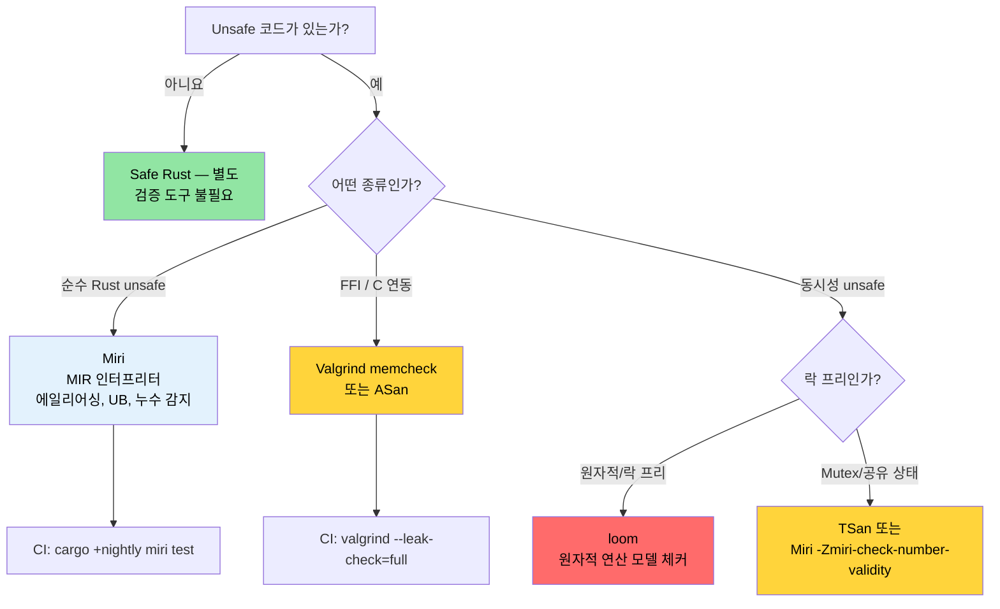

# Miri, Valgrind 및 새니타이저 — Unsafe 코드 검증 🔴

> **학습 내용:**
> - MIR 인터프리터로서의 Miri — 감지 가능한 항목(에일리어싱, UB, 누수)과 한계(FFI, 시스템 콜)
> - Valgrind memcheck, Helgrind(데이터 레이스), Callgrind(프로파일링), Massif(힙 메모리)
> - LLVM 새니타이저: 나이틀리(nightly) `-Zbuild-std`를 이용한 ASan, MSan, TSan, LSan
> - 크래시 발견을 위한 `cargo-fuzz`와 동시성 모델 체킹을 위한 `loom`
> - 올바른 검증 도구 선택을 위한 의사결정 트리
>
> **참조:** [코드 커버리지](ch04-code-coverage-seeing-what-tests-miss.md) — 커버리지는 테스트되지 않은 경로를 찾고, Miri는 테스트된 경로를 검증합니다 · [`no_std` 및 기능](ch09-no-std-and-feature-verification.md) — `no_std` 코드는 종종 Miri로 검증 가능한 `unsafe`를 필요로 합니다 · [CI/CD 파이프라인](ch11-putting-it-all-together-a-production-cic.md) — 파이프라인 내의 Miri 작업

안전한 Rust(Safe Rust)는 컴파일 타임에 메모리 안전성과 데이터 레이스(data-race) 부재를 보장합니다. 하지만 FFI, 직접 구현한 데이터 구조 또는 성능 최적화를 위해 `unsafe` 블록을 작성하는 순간, 이러한 보장은 온전히 **개발자의 책임**이 됩니다. 이 장에서는 여러분의 `unsafe` 코드가 주장하는 안전성 계약(safety contracts)을 실제로 준수하는지 검증하는 도구들을 다룹니다.

### Miri — Unsafe Rust를 위한 인터프리터

[Miri](https://github.com/rust-lang/miri)는 Rust의 중간 표현인 MIR(Mid-level Intermediate Representation)을 위한 **인터프리터**입니다. 프로그램을 기계어로 컴파일하는 대신, Miri는 모든 작업에서 미정의 동작(undefined behavior)을 철저히 검사하며 프로그램을 단계별로 *실행*합니다.

```bash
# Miri 설치 (나이틀리 전용 컴포넌트)
rustup +nightly component add miri

# Miri 환경에서 테스트 스위트 실행
cargo +nightly miri test

# Miri 환경에서 특정 바이너리 실행
cargo +nightly miri run

# 특정 테스트 실행
cargo +nightly miri test -- 테스트_이름
```

**Miri의 작동 원리:**

```text
소스 코드 → rustc → MIR → Miri가 MIR을 해석 및 실행
                           │
                           ├─ 모든 포인터의 프로버넌스(provenance, 출처) 추적
                           ├─ 모든 메모리 접근 유효성 검사
                           ├─ 모든 역참조 시 정렬(alignment) 상태 확인
                           ├─ Use-after-free(해제 후 사용) 감지
                           ├─ Double free(이중 해제) 감지
                           ├─ 데이터 레이스 감지 (스레드 사용 시)
                           └─ Stacked Borrows / Tree Borrows 규칙 강제
```

### Miri가 감지하는 것 (그리고 감지하지 못하는 것)

**Miri가 감지하는 항목:**

| 카테고리 | 예시 | 런타임에 크래시가 발생하는가? |
|----------|---------|------------------------|
| 범위를 벗어난 접근 | 할당 범위를 넘어 `ptr.add(100).read()` 실행 | 때에 따라 다름 (페이지 레이아웃에 의존) |
| 해제 후 사용 (UAF) | 드롭된 `Box`를 생포인터(raw pointer)로 읽기 | 때에 따라 다름 (할당기에 의존) |
| 이중 해제 | `drop_in_place`를 두 번 호출 | 보통 발생함 |
| 정렬되지 않은 접근 | 홀수 주소에서 `(ptr as *const u32).read()` 실행 | 일부 아키텍처에서 발생함 |
| 잘못된 값 | `transmute::<u8, bool>(2)` 실행 | 조용히 잘못된 결과 산출 |
| 댕글링 참조 | 해제된 위치를 가리키는 `&*ptr` 생성 | 아니요 (조용한 데이터 오염 발생) |
| 데이터 레이스 | 동기화 없이 두 스레드가 동일 위치에 쓰기 | 간헐적 발생, 재현하기 어려움 |
| Stacked Borrows 위반 | `&mut` 참조의 에일리어싱(중복 참조) | 아니요 (조용한 데이터 오염 발생) |

**Miri가 감지하지 못하는 한계:**

| 한계점 | 이유 |
|-----------|-----|
| 로직 버그 | Miri는 메모리 안전성을 검사하며, 논리적 정확성은 검사하지 않음 |
| 동시성 데드락 | Miri는 데이터 레이스를 검사하며, 라이브락(livelocks)은 검사하지 않음 |
| 성능 문제 | 인터프리터 방식은 네이티브 실행보다 10~100배 느림 |
| OS/하드웨어 상호작용 | Miri는 시스템 콜이나 장치 I/O를 에뮬레이션할 수 없음 |
| 모든 FFI 호출 | C 코드를 해석할 수 없음 (Rust MIR만 가능) |
| 모든 경로 커버 | 테스트 스위트가 도달하는 경로만 테스트함 |

**구체적인 예시 — 실무에서는 "작동"하지만 불건전한(unsound) 코드 잡아내기:**

```rust
#[cfg(test)]
mod tests {
    #[test]
    fn test_miri_catches_ub() {
        // 이 코드는 릴리스 빌드에서 "작동"할 수 있지만 미정의 동작입니다.
        let mut v = vec![1, 2, 3];
        let ptr = v.as_ptr();

        // push 작업은 재할당을 유발하여 ptr을 무효화할 수 있습니다.
        v.push(4);

        // ❌ UB: 재할당 후 ptr은 댕글링 포인터가 될 수 있습니다.
        // 할당기가 운 좋게 버퍼를 이동시키지 않았더라도 Miri는 이를 잡아냅니다.
        // let _val = unsafe { *ptr };
        // 에러: Miri는 다음과 같이 보고합니다:
        //   "pointer to alloc1234 was dereferenced after this
        //    allocation got freed"
        
        // ✅ 올바른 방법: 변경 작업 후 새 포인터를 가져옵니다.
        let ptr = v.as_ptr();
        let val = unsafe { *ptr };
        assert_eq!(val, 1);
    }
}
```

### 실제 크레이트에서 Miri 실행하기

**`unsafe`가 포함된 크레이트를 위한 실무 Miri 워크플로:**

```bash
# 1단계: 모든 테스트를 Miri 환경에서 실행
cargo +nightly miri test 2>&1 | tee miri_output.txt

# 2단계: 에러가 발생하면 해당 테스트만 격리해서 실행
cargo +nightly miri test -- 실패한_테스트_이름

# 3단계: 진단을 위해 Miri의 백트레이스 활용
MIRIFLAGS="-Zmiri-backtrace=full" cargo +nightly miri test

# 4단계: 빌림(borrow) 모델 선택
# Stacked Borrows (기본값, 더 엄격함):
cargo +nightly miri test

# Tree Borrows (실험적, 더 관대함):
MIRIFLAGS="-Zmiri-tree-borrows" cargo +nightly miri test
```

**일반적인 상황을 위한 Miri 플래그:**

```bash
# 격리 해제 (파일 시스템 접근, 환경 변수 허용)
MIRIFLAGS="-Zmiri-disable-isolation" cargo +nightly miri test

# Miri에서는 메모리 누수 감지가 기본으로 켜져 있습니다.
# 의도적인 누수 등에 대해 이를 무시하려면:
# MIRIFLAGS="-Zmiri-ignore-leaks" cargo +nightly miri test

# 무작위 테스트의 재현성을 위해 RNG 시드 고정
MIRIFLAGS="-Zmiri-seed=42" cargo +nightly miri test

# 엄격한 프로버넌스(provenance) 검사 활성화
MIRIFLAGS="-Zmiri-strict-provenance" cargo +nightly miri test

# 여러 플래그 동시에 사용
MIRIFLAGS="-Zmiri-disable-isolation -Zmiri-backtrace=full -Zmiri-strict-provenance" \
    cargo +nightly miri test
```

**CI 환경의 Miri:**

```yaml
# .github/workflows/miri.yml
name: Miri
on: [push, pull_request]

jobs:
  miri:
    runs-on: ubuntu-latest
    steps:
      - uses: actions/checkout@v4
      - uses: dtolnay/rust-toolchain@nightly
        with:
          components: miri

      - name: Miri 실행
        run: cargo miri test --workspace
        env:
          MIRIFLAGS: "-Zmiri-backtrace=full"
          # 누수 검사는 기본적으로 활성화되어 있습니다.
          # Miri가 처리할 수 없는 시스템 콜(파일 I/O, 네트워크 등)을
          # 사용하는 테스트는 건너뛰도록 설정하세요.
```

> **성능 참고**: Miri는 네이티브 실행보다 10~100배 느립니다. 네이티브에서 5초 걸리는 테스트가 Miri에서는 5분 이상 걸릴 수 있습니다. CI에서는 `unsafe` 코드가 포함된 크레이트에 집중해서 실행하세요.

### Valgrind와 Rust 통합

[Valgrind](https://valgrind.org/)는 고전적인 C/C++ 메모리 검사 도구입니다. 컴파일된 Rust 바이너리에서도 작동하며 기계어 수준에서 메모리 오류를 검사합니다.

```bash
# Valgrind 설치
sudo apt install valgrind  # Debian/Ubuntu
sudo dnf install valgrind  # Fedora

# 디버그 정보와 함께 빌드 (Valgrind는 심볼이 필요함)
cargo build --tests
# 또는 디버그 정보를 포함한 릴리스 빌드:
# cargo build --release
# [profile.release]
# debug = true

# Valgrind 환경에서 특정 테스트 바이너리 실행
valgrind --tool=memcheck \
    --leak-check=full \
    --show-leak-kinds=all \
    --track-origins=yes \
    ./target/debug/deps/my_crate-abc123 --test-threads=1

# 메인 바이너리 실행
valgrind --tool=memcheck \
    --leak-check=full \
    --error-exitcode=1 \
    ./target/debug/diag_tool --run-diagnostics
```

**memcheck 이외의 Valgrind 도구들:**

| 도구 | 명령어 | 감지 대상 |
|------|---------|----------------|
| **Memcheck** | `--tool=memcheck` | 메모리 누수, 해제 후 사용, 버퍼 오버플로 |
| **Helgrind** | `--tool=helgrind` | 데이터 레이스 및 락 순서 위반(데드락 위험) |
| **DRD** | `--tool=drd` | 데이터 레이스 (다른 감지 알고리즘 사용) |
| **Callgrind** | `--tool=callgrind` | CPU 명령 단위 프로파일링 (경로 수준) |
| **Massif** | `--tool=massif` | 시간에 따른 힙 메모리 사용량 프로파일링 |
| **Cachegrind** | `--tool=cachegrind` | 캐시 미스 분석 |

**명령어 수준 프로파일링을 위한 Callgrind 사용:**

```bash
# 명령 횟수 기록 (실제 시간보다 결과가 안정적임)
valgrind --tool=callgrind \
    --callgrind-out-file=callgrind.out \
    ./target/release/diag_tool --run-diagnostics

# KCachegrind로 시각화
kcachegrind callgrind.out
# 또는 텍스트 기반 대안:
callgrind_annotate callgrind.out | head -100
```

**Miri vs Valgrind — 어떤 도구를 사용할까?**

| 비교 항목 | Miri | Valgrind |
|--------|------|----------|
| Rust 고유 UB 검사 | ✅ Stacked/Tree Borrows | ❌ Rust 규칙 인지 못 함 |
| C FFI 코드 검사 | ❌ C 코드 해석 불가 | ✅ 모든 기계어 검사 |
| 나이틀리 필요 여부 | ✅ 필요함 | ❌ 필요 없음 |
| 속도 | 10~100배 느림 | 10~50배 느림 |
| 플랫폼 | 모든 플랫폼 (MIR 해석) | Linux, macOS (네이티브 실행) |
| 데이터 레이스 감지 | ✅ 가능 | ✅ 가능 (Helgrind/DRD) |
| 누수 감지 | ✅ 가능 | ✅ 가능 (더 철저함) |
| 가양성(False Positives) | 매우 드묾 | 가끔 발생 (특히 할당기 관련) |

**둘 다 활용하세요**:
- **Miri**는 순수 Rust `unsafe` 코드(Stacked Borrows, 프로버넌스) 검증에 사용합니다.
- **Valgrind**는 FFI 비중이 높은 코드와 전체 프로그램의 누수 분석에 사용합니다.

### AddressSanitizer, MemorySanitizer, ThreadSanitizer

LLVM 새니타이저(sanitizers)는 컴파일 타임에 런타임 검사 코드를 삽입하는 방식입니다. Valgrind보다 빠르며(2~5배 오버헤드 vs 10~50배) 서로 다른 클래스의 버그를 잡아냅니다.

```bash
# 필수: 새니타이저 계측을 포함해 std를 재빌드하기 위해 Rust 소스 설치
rustup component add rust-src --toolchain nightly

# AddressSanitizer (ASan) — 버퍼 오버플로, 해제 후 사용, 스택 오버플로
RUSTFLAGS="-Zsanitizer=address" \
    cargo +nightly test -Zbuild-std --target x86_64-unknown-linux-gnu

# MemorySanitizer (MSan) — 초기화되지 않은 메모리 읽기
RUSTFLAGS="-Zsanitizer=memory" \
    cargo +nightly test -Zbuild-std --target x86_64-unknown-linux-gnu

# ThreadSanitizer (TSan) — 데이터 레이스
RUSTFLAGS="-Zsanitizer=thread" \
    cargo +nightly test -Zbuild-std --target x86_64-unknown-linux-gnu

# LeakSanitizer (LSan) — 메모리 누수 (ASan에 기본 포함됨)
RUSTFLAGS="-Zsanitizer=leak" \
    cargo +nightly test --target x86_64-unknown-linux-gnu
```

> **참고**: ASan, MSan, TSan은 `-Zbuild-std`를 통해 표준 라이브러리를 새니타이저 계측과 함께 재빌드해야 합니다. LSan은 필요하지 않습니다.

**새니타이저 비교:**

| 새니타이저 | 오버헤드 | 감지 대상 | 나이틀리 필요? | `-Zbuild-std` 필요? |
|-----------|----------|---------|----------|----------------|
| **ASan** | 메모리 2배, CPU 2배 | 버퍼 오버플로, 해제 후 사용, 스택 오버플로 | 예 | 예 |
| **MSan** | 메모리 3배, CPU 3배 | 초기화되지 않은 읽기 | 예 | 예 |
| **TSan** | 메모리 5~10배, CPU 5배 | 데이터 레이스 | 예 | 예 |
| **LSan** | 매우 적음 | 메모리 누수 | 예 | 아니요 |

**실전 예제 — TSan으로 데이터 레이스 잡아내기:**

```rust
use std::sync::Arc;
use std::thread;

fn racy_counter() -> u64 {
    // ❌ UB: 동기화되지 않은 공유 가변 상태
    let data = Arc::new(std::cell::UnsafeCell::new(0u64));
    let mut handles = vec![];

    for _ in 0..4 {
        let data = Arc::clone(&data);
        handles.push(thread::spawn(move || {
            for _ in 0..1000 {
                // SAFETY: 불건전함(UNSOUND) — 데이터 레이스 발생!
                unsafe {
                    *data.get() += 1;
                }
            }
        }));
    }

    for h in handles {
        h.join().unwrap();
    }

    // 값은 4000이어야 하지만 레이스로 인해 어떤 값이라도 나올 수 있음
    unsafe { *data.get() }
}

// Miri와 TSan 모두 이를 잡아냅니다:
// Miri:  "Data race detected between (1) write and (2) write"
// TSan:  "WARNING: ThreadSanitizer: data race"
//
// 해결책: AtomicU64 또는 Mutex<u64> 사용
```

### 관련 도구: 퍼징(Fuzzing) 및 동시성 검증

**`cargo-fuzz` — 커버리지 기반 퍼징** (파서 및 디코더의 크래시 발견):

```bash
# 설치
cargo install cargo-fuzz

# 퍼즈 타겟 초기화
cargo fuzz init
cargo fuzz add parse_gpu_csv
```

```rust
// fuzz/fuzz_targets/parse_gpu_csv.rs
#![no_main]
use libfuzzer_sys::fuzz_target;

fuzz_target!(|data: &[u8]| {
    if let Ok(s) = std::str::from_utf8(data) {
        // 퍼저가 수백만 개의 입력을 생성하며 패닉이나 크래시를 찾습니다.
        let _ = diag_tool::parse_gpu_csv(s);
    }
});
```

```bash
# 퍼저 실행 (중단되거나 크래시를 찾을 때까지 실행)
cargo +nightly fuzz run parse_gpu_csv -- -max_total_time=300  # 5분 동안 실행

# 크래시 유발 사례 최소화(minimize)
cargo +nightly fuzz tmin parse_gpu_csv artifacts/parse_gpu_csv/crash-...
```

> **퍼징 도입 시기**: 신뢰할 수 없는 입력(센서 출력, 설정 파일, 네트워크 데이터, JSON/CSV 등)을 파싱하는 모든 함수에 도입하세요. 퍼징은 serde, regex, image 등 거의 모든 주요 Rust 파서 크레이트에서 실제 버그를 찾아낸 바 있습니다.

**`loom` — 동시성 모델 체커** (원자적 연산 순서를 철저히 테스트):

```toml
[dev-dependencies]
loom = "0.7"
```

```rust
#[cfg(loom)]
mod tests {
    use loom::sync::atomic::{AtomicUsize, Ordering};
    use loom::thread;

    #[test]
    fn test_counter_is_atomic() {
        loom::model(|| {
            let counter = loom::sync::Arc::new(AtomicUsize::new(0));
            let c1 = counter.clone();
            let c2 = counter.clone();

            let t1 = thread::spawn(move || { c1.fetch_add(1, Ordering::SeqCst); });
            let t2 = thread::spawn(move || { c2.fetch_add(1, Ordering::SeqCst); });

            t1.join().unwrap();
            t2.join().unwrap();

            // loom은 가능한 모든 스레드 인터리빙(interleaving)을 탐색합니다.
            assert_eq!(counter.load(Ordering::SeqCst), 2);
        });
    }
}
```

> **loom 도입 시기**: 락 프리(lock-free) 데이터 구조나 커스텀 동기화 프리미티브를 구현할 때 사용하세요. loom은 모든 스레드 실행 경로를 샅샅이 뒤지는 모델 체커이지, 단순한 스트레스 테스트 도구가 아닙니다. `Mutex`나 `RwLock` 위주의 코드에는 필요하지 않습니다.

### 상황별 도구 선택 가이드

```text
Unsafe 검증을 위한 의사결정 트리:

FFI 호출이 없는 순수 Rust 코드인가?
├─ 예 → Miri 사용 (Rust 고유 UB, Stacked Borrows 감지)
│      심층 방어를 위해 CI에서 ASan도 함께 실행
└─ 아니오 (FFI를 통해 C/C++ 코드 호출)
   ├─ 메모리 안전성이 걱정되는가?
   │  └─ 예 → Valgrind memcheck 및 ASan 병행 사용
   ├─ 동시성 문제가 걱정되는가?
   │  └─ 예 → TSan(빠름) 또는 Helgrind(더 철저함) 사용
   └─ 메모리 누수가 걱정되는가?
      └─ 예 → Valgrind --leak-check=full 사용
```

**권장 CI 매트릭스:**

```yaml
# 빠른 피드백을 위해 모든 도구를 병렬로 실행
jobs:
  miri:
    runs-on: ubuntu-latest
    steps:
      - uses: dtolnay/rust-toolchain@nightly
        with: { components: miri }
      - run: cargo miri test --workspace

  asan:
    runs-on: ubuntu-latest
    steps:
      - uses: dtolnay/rust-toolchain@nightly
      - run: |
          RUSTFLAGS="-Zsanitizer=address" \
          cargo test -Zbuild-std --target x86_64-unknown-linux-gnu

  valgrind:
    runs-on: ubuntu-latest
    steps:
      - run: sudo apt-get install -y valgrind
      - uses: dtolnay/rust-toolchain@stable
      - run: cargo build --tests
      - run: |
          for test_bin in $(find target/debug/deps -maxdepth 1 -executable -type f ! -name '*.d'); do
            valgrind --error-exitcode=1 --leak-check=full "$test_bin" --test-threads=1
          done
```

### 적용 사례: Unsafe 제로와 도입 시점

이 프로젝트는 9만 라인이 넘는 Rust 코드 전반에 걸쳐 **`unsafe` 블록이 단 하나도 없습니다**. 이는 시스템 수준의 진단 도구로서 놀라운 성과이며, 다음과 같은 작업에 Safe Rust만으로 충분함을 보여줍니다:
- IPMI 통신 (`ipmitool` 서브프로세스를 통한 `std::process::Command` 사용)
- GPU 쿼리 (`accel-query` 서브프로세스 사용)
- PCIe 토폴로지 파싱 (순수 JSON/텍스트 파싱)
- SEL 레코드 관리 (순수 데이터 구조)
- DER 보고서 생성 (JSON 직렬화)

**그렇다면 언제 `unsafe`가 필요할까요?**

도입이 예상되는 시나리오는 다음과 같습니다:

| 시나리오 | `unsafe` 도입 이유 | 권장 검증 도구 |
|----------|-------------|-------------------------|
| ioctl 기반 직접 IPMI | `ipmitool` 우회, `libc::ioctl()` 직접 호출 | Miri + Valgrind |
| 직접적인 GPU 드라이버 쿼리 | 서브프로세스 대신 accel-mgmt FFI 사용 | Valgrind (C 라이브러리 검사) |
| 메모리 맵 기반 PCIe 설정 | 직접적인 설정 공간 읽기를 위한 `mmap` | ASan + Valgrind |
| 락 프리 SEL 버퍼 | 동시 이벤트 수집을 위한 `AtomicPtr` 활용 | Miri + TSan |
| 임베디드/no_std 변종 | 베어 메탈을 위한 생포인터 조작 | Miri |

**준비 사항**: `unsafe`를 도입하기 전에 CI에 검증 도구를 추가하세요.

```toml
# Cargo.toml — unsafe 최적화를 위한 기능 플래그 추가
[features]
default = []
direct-ipmi = []     # ipmitool 대신 ioctl 기반 직접 IPMI 활성화
direct-accel-api = []     # 서브프로세스 대신 accel-mgmt FFI 활성화
```

```rust
// src/ipmi.rs — 기능 플래그로 보호
#[cfg(feature = "direct-ipmi")]
mod direct {
    //! /dev/ipmi0 ioctl을 이용한 직접 IPMI 장치 접근.
    //!
    //! # 안전성 (Safety)
    //! 이 모듈은 ioctl 시스템 콜을 위해 `unsafe`를 사용합니다.
    //! 검증 도구: Miri(가능한 경우), Valgrind memcheck, ASan.

    use std::os::unix::io::RawFd;

    // ... unsafe ioctl 구현 ...
}

#[cfg(not(feature = "direct-ipmi"))]
mod subprocess {
    //! ipmitool 서브프로세스를 통한 IPMI (기본값, 완전 안전).
    // ... 현재 구현 내용 ...
}
```

> **핵심 통찰**: `unsafe` 코드는 [기능 플래그](ch09-no-std-and-feature-verification.md) 뒤에 숨겨서 독립적으로 검증할 수 있게 하세요. [CI](ch11-putting-it-all-together-a-production-cic.md)에서 `cargo +nightly miri test --features direct-ipmi`를 실행하여 안전한 기본 빌드에 영향을 주지 않고 지속적으로 unsafe 경로를 검증하십시오.

### `cargo-careful` — 안정 버전에서의 추가 UB 검사

[`cargo-careful`](https://github.com/RalfJung/cargo-careful)은 표준 라이브러리의 추가 검사 기능을 활성화하여 코드를 실행합니다. 나이틀리나 Miri의 극심한 속도 저하 없이 일반 빌드에서 놓치는 일부 미정의 동작을 잡아낼 수 있습니다.

```bash
# 설치 (나이틀리가 필요하지만 실행 속도는 네이티브에 가까움)
cargo install cargo-careful

# 추가 UB 검사와 함께 테스트 실행 (초기화되지 않은 메모리, 잘못된 값 감지)
cargo +nightly careful test

# 추가 검사와 함께 바이너리 실행
cargo +nightly careful run -- --run-diagnostics
```

**`cargo-careful`이 잡아내는 항목:**
- `MaybeUninit` 및 `zeroed()`에서의 초기화되지 않은 메모리 읽기
- transmute를 통한 잘못된 `bool`, `char`, 열거형 값 생성
- 정렬되지 않은 포인터 읽기/쓰기
- 겹치는 범위에서의 `copy_nonoverlapping` 실행

**검증 단계에서의 위치:**

```text
낮은 오버헤드                                              철저한 검증
├─ cargo test ──► cargo careful test ──► Miri ──► ASan ──► Valgrind ─┤
│  (오버헤드 0)   (~1.5배 오버헤드)      (10~100배) (2배)    (10~50배)  │
│  Safe Rust만    일부 UB 감지            순수 Rust  FFI+Rust FFI+Rust  │
```

> **권장 사항**: CI에 `cargo +nightly careful test`를 빠른 안전 검사 단계로 추가하세요. Miri와 달리 네이티브에 가까운 속도로 실행되면서 Safe Rust 추상화가 가리고 있는 실제 버그들을 찾아낼 수 있습니다.

### Miri 및 새니타이저 문제 해결 (Troubleshooting)

| 증상 | 원인 | 해결책 |
|---------|-------|-----|
| `Miri does not support FFI` | Miri는 Rust 인터프리터이며 C 코드를 실행할 수 없음 | FFI 코드에는 대신 Valgrind나 ASan을 사용하세요. |
| `error: unsupported operation: can't call foreign function` | Miri가 `extern "C"` 호출을 만남 | FFI 경계를 모킹(mock)하거나 `#[cfg(miri)]`로 보호하세요. |
| `Stacked Borrows violation` | 에일리어싱 규칙 위반 — 코드가 "작동"하더라도 발생함 | Miri가 옳습니다. `&mut`와 `&`가 겹치지 않게 리팩토링하세요. |
| 새니타이저가 `DEADLYSIGNAL` 보고 | ASan이 버퍼 오버플로 감지 | 배열 인덱싱, 슬라이스 작업, 포인터 연산을 점검하세요. |
| `LeakSanitizer: detected memory leaks` | `Box::leak()`, `forget()` 또는 `drop()` 누락 | 의도적이라면 `__lsan_disable()`로 억제하고, 아니라면 누수를 수정하세요. |
| Miri가 너무 느림 | 컴파일이 아닌 해석 방식의 한계 (10~100배 느림) | `--lib` 테스트만 실행하거나, 무거운 테스트에 `#[cfg_attr(miri, ignore)]`를 사용하세요. |
| 원자적 연산에서 TSan 가양성 발생 | TSan이 Rust의 원자적 순서 모델을 완벽히 이해하지 못함 | 특정 억제 규칙을 담은 `tsan.supp` 파일을 만들어 `TSAN_OPTIONS`로 지정하세요. |

### 직접 해보기

1. **Miri UB 감지 유도**: 동일한 `i32` 값에 대해 두 개의 `&mut` 참조를 만드는 `unsafe` 함수를 작성해 보세요(에일리어싱 위반). `cargo +nightly miri test`를 실행하고 "Stacked Borrows" 에러를 관찰해 보세요. 이를 `UnsafeCell`을 사용하거나 할당을 분리하여 수정해 보세요.

2. **ASan으로 버그 확인**: 배열 범위를 벗어난 `unsafe` 접근을 시도하는 테스트를 만드세요. `RUSTFLAGS="-Zsanitizer=address"`로 빌드하고 ASan의 보고서를 확인해 보세요. 정확히 어떤 라인을 지목하는지 확인하세요.

3. **Miri 오버헤드 측정**: 동일한 테스트 스위트에 대해 `cargo test --lib`와 `cargo +nightly miri test --lib`의 실행 시간을 비교해 보세요. 감속 비율을 계산하고, 이를 바탕으로 CI에서 어떤 테스트를 Miri로 돌리고 어떤 테스트를 `#[cfg_attr(miri, ignore)]`로 건너뛸지 결정해 보세요.

### 안전성 검증 의사결정 트리



### 🏋️ 실습

#### 🟡 실습 1: Miri UB 감지 유도

동일한 `i32` 값에 대해 두 개의 `&mut` 참조를 만드는 `unsafe` 함수를 작성하세요(에일리어싱 위반). `cargo +nightly miri test`를 실행하고 Stacked Borrows 에러를 확인한 후 수정하세요.

<details>
<summary>솔루션</summary>

```rust
#[cfg(test)]
mod tests {
    #[test]
    fn aliasing_ub() {
        let mut x: i32 = 42;
        let ptr = &mut x as *mut i32;
        unsafe {
            // 버그: 동일한 위치에 두 개의 &mut 참조 생성
            let _a = &mut *ptr;
            let _b = &mut *ptr; // Miri: Stacked Borrows 위반 감지!
        }
    }
}
```

수정 방법: 별도의 할당을 사용하거나 `UnsafeCell`을 활용합니다.

```rust
use std::cell::UnsafeCell;

#[test]
fn no_aliasing_ub() {
    let x = UnsafeCell::new(42);
    unsafe {
        let a = &mut *x.get();
        *a = 100;
    }
}
```
</details>

#### 🔴 실습 2: ASan 범위 초과 감지

`unsafe`를 사용하여 배열 범위를 벗어나는 접근을 시도하는 테스트를 작성하세요. 나이틀리에서 `RUSTFLAGS="-Zsanitizer=address"`로 빌드하고 ASan의 보고서를 관찰하세요.

<details>
<summary>솔루션</summary>

```rust
#[test]
fn oob_access() {
    let arr = [1u8, 2, 3, 4, 5];
    let ptr = arr.as_ptr();
    unsafe {
        let _val = *ptr.add(10); // 범위를 벗어남!
    }
}
```

```bash
RUSTFLAGS="-Zsanitizer=address" cargo +nightly test -Zbuild-std \
  --target x86_64-unknown-linux-gnu -- oob_access
# ASan 보고서: <정확한 주소>에서 stack-buffer-overflow 발생 지적
```
</details>

### 핵심 요약

- **Miri**는 순수 Rust `unsafe`를 위한 필수 도구입니다. 에일리어싱 위반, 해제 후 사용, 그리고 테스트를 통과하더라도 숨어있는 누수를 잡아냅니다.
- **Valgrind**는 FFI/C 연동을 위한 도구입니다. 재컴파일 없이 최종 바이너리에서 작동합니다.
- **새니타이저**(ASan, TSan, MSan)는 나이틀리가 필요하지만 네이티브에 가까운 속도로 실행되므로 대규모 테스트 스위트에 적합합니다.
- **`loom`**은 락 프리 동시성 데이터 구조의 원자적 연산 순서를 검증하기 위해 특화된 도구입니다.
- CI에서 매 푸시마다 Miri를 실행하고, 메인 파이프라인의 속도 저하를 막기 위해 새니타이저는 야간 빌드(nightly schedule) 등에 배치하세요.
