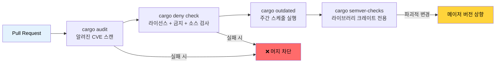

# 의존성 관리 및 공급망 보안 🟢

> **학습 내용:**
> - `cargo-audit`을 이용한 알려진 취약점 스캔
> - `cargo-deny`를 이용한 라이선스, 어드바이저리, 소스 정책 강제
> - Mozilla의 `cargo-vet`을 이용한 공급망 신뢰 검증
> - 오래된 의존성 추적 및 API의 파괴적 변경(breaking changes) 감지
> - 의존성 그래프 시각화 및 중복 버전 제거
>
> **참조:** [릴리스 프로필](ch07-release-profiles-and-binary-size.md) — 여기서 찾은 미사용 의존성을 `cargo-udeps`로 제거합니다 · [CI/CD 파이프라인](ch11-putting-it-all-together-a-production-cic.md) — 파이프라인 내의 audit 및 deny 작업 · [빌드 스크립트](ch01-build-scripts-buildrs-in-depth.md) — `build-dependencies` 또한 공급망의 일부입니다.

Rust 바이너리는 여러분이 작성한 코드만 포함하는 것이 아니라, `Cargo.lock`에 명시된 모든 전이 의존성(transitive dependency)을 포함합니다. 이 의존성 트리 어디에라도 취약점, 라이선스 위반 또는 악의적인 크레이트가 있다면 그것은 곧 **여러분의 문제**가 됩니다. 이 장에서는 의존성 관리를 자동화하고 감사 가능하게 만드는 도구와 기술을 다룹니다.

### cargo-audit — 알려진 취약점 스캔

[`cargo-audit`](https://github.com/rustsec/rustsec/tree/main/cargo-audit)은 공개된 크레이트의 취약점을 추적하는 [RustSec Advisory Database](https://rustsec.org/)를 바탕으로 여러분의 `Cargo.lock`을 검사합니다.

```bash
# 설치
cargo install cargo-audit

# 알려진 취약점 스캔
cargo audit

# 출력 예시:
# Crate:     chrono
# Version:   0.4.19
# Title:     Potential segfault in localtime_r invocations
# Date:      2020-11-10
# ID:        RUSTSEC-2020-0159
# URL:       https://rustsec.org/advisories/RUSTSEC-2020-0159
# Solution:  Upgrade to >= 0.4.20

# 취약점이 발견되면 CI를 실패하게 설정
cargo audit --deny warnings

# 자동화 처리를 위해 JSON 형식으로 출력
cargo audit --json

# Cargo.lock 업데이트를 통해 취약점 수정
cargo audit fix
```

**CI 통합:**

```yaml
# .github/workflows/audit.yml
name: Security Audit
on:
  schedule:
    - cron: '0 0 * * *'  # 매일 확인 — 새로운 취약점 정보는 수시로 업데이트됨
  push:
    paths: ['Cargo.lock']

jobs:
  audit:
    runs-on: ubuntu-latest
    steps:
      - uses: actions/checkout@v4
      - uses: rustsec/audit-check@v2
        with:
          token: ${{ secrets.GITHUB_TOKEN }}
```

### cargo-deny — 종합 정책 강제

[`cargo-deny`](https://github.com/EmbarkStudios/cargo-deny)는 단순한 취약점 스캔을 넘어 다음 네 가지 차원에서 정책을 강제합니다:

1. **Advisories (어드바이저리)** — 알려진 취약점 (cargo-audit과 유사)
2. **Licenses (라이선스)** — 허용되거나 금지된 라이선스 목록 관리
3. **Bans (금지)** — 특정 크레이트 사용 금지 또는 중복 버전 방지
4. **Sources (소스)** — 허용된 레지스트리 및 git 소스 관리

```bash
# 설치
cargo install cargo-deny

# 설정 초기화
cargo deny init
# 기본값이 설명된 deny.toml 파일이 생성됨

# 모든 검사 실행
cargo deny check

# 특정 항목만 검사
cargo deny check advisories
cargo deny check licenses
cargo deny check bans
cargo deny check sources
```

**`deny.toml` 설정 예시:**

```toml
# deny.toml

[advisories]
vulnerability = "deny"        # 알려진 취약점 발견 시 실패 처리
unmaintained = "warn"         # 유지보수되지 않는 크레이트 경고
yanked = "deny"               # 배포 취소(yanked)된 크레이트 실패 처리
notice = "warn"               # 정보성 어드바이저리 경고

[licenses]
unlicensed = "deny"           # 라이선스가 없는 크레이트 불허
allow = [
    "MIT",
    "Apache-2.0",
    "BSD-2-Clause",
    "BSD-3-Clause",
    "ISC",
    "Unicode-DFS-2016",
]
copyleft = "deny"             # 이 프로젝트에서는 GPL/LGPL/AGPL 불허
default = "deny"              # 명시적으로 허용되지 않은 모든 라이선스 불허

[bans]
multiple-versions = "warn"    # 동일 크레이트가 두 버전 이상 존재할 경우 경고
wildcards = "deny"            # 의존성에 path = "*" 사용 불허
highlight = "all"             # 첫 번째가 아닌 모든 중복 항목 표시

# 특정 문제 크레이트 금지
deny = [
    # openssl-sys는 C 기반 OpenSSL을 끌어옴 — rustls 권장
    { name = "openssl-sys", wrappers = ["native-tls"] },
]

# 피할 수 없는 특정 중복 버전 허용
[[bans.skip]]
name = "syn"
version = "1.0"               # syn 1.x와 2.x는 흔히 공존함

[sources]
unknown-registry = "deny"     # crates.io만 허용
unknown-git = "deny"          # 임의의 git 의존성 불허
allow-registry = ["https://github.com/rust-lang/crates.io-index"]
```

**라이선스 강제** 기능은 상업용 프로젝트에서 특히 가치가 높습니다:

```bash
# 의존성 트리에 포함된 라이선스 목록 확인
cargo deny list

# 출력 결과 예시:
# MIT          — 127 crates
# Apache-2.0   — 89 crates
# BSD-3-Clause — 12 crates
# MPL-2.0      — 3 crates   ← 법무 검토가 필요할 수 있음
# Unicode-DFS  — 1 crate
```

### cargo-vet — 공급망 신뢰 검증

Mozilla에서 개발한 [`cargo-vet`](https://github.com/mozilla/cargo-vet)은 "이 크레이트에 알려진 버그가 있는가?"가 아니라 **"신뢰할 수 있는 사람이 이 코드를 실제로 검토했는가?"**라는 다른 관점의 질문을 다룹니다.

```bash
# 설치
cargo install cargo-vet

# 초기화 (supply-chain/ 디렉토리 생성)
cargo vet init

# 검토가 필요한 크레이트 확인
cargo vet

# 크레이트 검토 후 인증(certify) 처리:
cargo vet certify serde 1.0.203
# serde 1.0.203 버전을 우리 팀의 기준에 따라 감사했음을 기록함

# 신뢰할 수 있는 기관의 감사 결과 가져오기
cargo vet import mozilla
cargo vet import google
cargo vet import bytecode-alliance
```

**작동 구조:**

```text
supply-chain/
├── audits.toml       ← 우리 팀의 감사 인증 기록
├── config.toml       ← 신뢰 설정 및 기준
└── imports.lock      ← 타 기관에서 가져온 인증 데이터
```

`cargo-vet`은 정부, 금융, 인프라 등 공급망 요구사항이 매우 엄격한 조직에 가장 유용합니다. 대부분의 팀에게는 `cargo-deny`만으로도 충분한 보호가 가능합니다.

### cargo-outdated 및 cargo-semver-checks

**`cargo-outdated`** — 더 최신 버전이 있는 의존성 찾기:

```bash
cargo install cargo-outdated

cargo outdated --workspace
# 출력 결과:
# Name        Project  Compat  Latest   Kind
# serde       1.0.193  1.0.203 1.0.203  Normal
# regex       1.9.6    1.10.4  1.10.4   Normal
# thiserror   1.0.50   1.0.61  2.0.3    Normal  ← 메이저 버전 업데이트 가능
```

**`cargo-semver-checks`** — 배포 전 API의 파괴적 변경 감지. 라이브러리 크레이트 제작 시 필수 도구입니다:

```bash
cargo install cargo-semver-checks

# 변경 사항이 유의적 버전(semver)을 준수하는지 확인
cargo semver-checks

# 출력 결과 예시:
# ✗ Function `parse_gpu_csv` is now private (was public)
#   → 이것은 파괴적 변경(BREAKING change)입니다. MAJOR 버전을 올리세요.
#
# ✗ Struct `GpuInfo` has a new required field `power_limit_w`
#   → 이것은 파괴적 변경(BREAKING change)입니다. MAJOR 버전을 올리세요.
#
# ✓ Function `parse_gpu_csv_v2` was added (non-breaking)
```

### cargo-tree — 의존성 시각화 및 중복 제거

`cargo tree`는 Cargo에 내장된 도구(별도 설치 불필요)로, 의존성 그래프를 파악하는 데 매우 유용합니다.

```bash
# 전체 의존성 트리 표시
cargo tree

# 특정 크레이트가 포함된 이유 찾기
cargo tree --invert --package openssl-sys
# 우리 크레이트에서 openssl-sys에 이르는 모든 경로 표시

# 중복 버전 찾기
cargo tree --duplicates
# 출력 예시:
# syn v1.0.109
# └── serde_derive v1.0.193
#
# syn v2.0.48
# ├── thiserror-impl v1.0.56
# └── tokio-macros v2.2.0

# 직접적인 의존성만 표시
cargo tree --depth 1

# 의존성 기능(features) 표시
cargo tree --format "{p} {f}"

# 전체 의존성 개수 확인
cargo tree | wc -l
```

**중복 제거 전략**: `cargo tree --duplicates`가 동일한 크레이트의 두 가지 메이저 버전을 보여준다면, 의존성 체인을 업데이트하여 하나로 합칠 수 있는지 확인하세요. 모든 중복 항목은 컴파일 시간과 바이너리 크기를 증가시킵니다.

### 적용 사례: 멀티 크레이트 의존성 관리

이 워크스페이스는 버전 관리를 중앙에서 수행하기 위해 `[workspace.dependencies]`를 사용하고 있으며, 이는 매우 훌륭한 관행입니다. 크기 분석을 위한 [`cargo tree --duplicates`](ch07-release-profiles-and-binary-size.md)와 결합하면 버전 파편화를 방지하고 바이너리 비대화를 줄일 수 있습니다.

```toml
# 루트 Cargo.toml — 모든 버전을 한 곳에서 고정 관리
[workspace.dependencies]
serde = { version = "1.0", features = ["derive"] }
serde_json = { version = "1.0", features = ["preserve_order"] }
regex = "1.10"
thiserror = "1.0"
anyhow = "1.0"
rayon = "1.8"
```

**프로젝트 권장 추가 사항:**

```bash
# CI 파이프라인에 추가:
cargo deny init              # 최초 1회 설정
cargo deny check             # 모든 PR 시 실행 — 라이선스, 어드바이저리, 금지 항목 검사
cargo audit --deny warnings  # 모든 푸시 시 실행 — 취약점 스캔
cargo outdated --workspace   # 매주 실행 — 업데이트 가능한 항목 추적
```

**프로젝트 권장 `deny.toml` 설정:**

```toml
[advisories]
vulnerability = "deny"
yanked = "deny"

[licenses]
allow = ["MIT", "Apache-2.0", "BSD-2-Clause", "BSD-3-Clause", "ISC", "Unicode-DFS-2016"]
copyleft = "deny"     # 하드웨어 진단 도구 — copyleft 라이선스 불허

[bans]
multiple-versions = "warn"   # 중복 추적은 하되, 아직 차단은 하지 않음
wildcards = "deny"

[sources]
unknown-registry = "deny"
unknown-git = "deny"
```

### 공급망 감사 파이프라인



### 🏋️ 실습

#### 🟢 실습 1: 의존성 감사해보기

아무 Rust 프로젝트에서 `cargo audit`과 `cargo deny init && cargo deny check`를 실행해 보세요. 몇 개의 어드바이저리가 발견되나요? 의존성 트리에 몇 개의 라이선스 카테고리가 있나요?

<details>
<summary>솔루션</summary>

```bash
cargo audit
# 어드바이저리 확인 — 주로 chrono, time 또는 오래된 크레이트에서 발견됨

cargo deny init
cargo deny list
# 라이선스 분포 확인: MIT (N개), Apache-2.0 (N개) 등

cargo deny check
# 네 가지 모든 차원에 대한 전체 감사 결과 확인
```
</details>

#### 🟡 실습 2: 중복 의존성 찾아 제거하기

워크스페이스에서 `cargo tree --duplicates`를 실행하세요. 두 가지 버전으로 존재하는 크레이트를 찾아보세요. `Cargo.toml`을 업데이트하여 버전을 하나로 합칠 수 있나요? 컴파일 시간과 바이너리 크기에 어떤 변화가 있는지 측정해 보세요.

<details>
<summary>솔루션</summary>

```bash
cargo tree --duplicates
# 흔한 예: syn 1.x와 syn 2.x

# 이전 버전을 사용하는 크레이트 찾기:
cargo tree --invert --package syn@1.0.109
# 출력 결과: serde_derive 1.0.xxx -> syn 1.0.109

# 최신 버전의 serde_derive가 syn 2.x를 사용하는지 확인:
cargo update -p serde_derive
cargo tree --duplicates
# syn 1.x가 사라졌다면 중복 버전 제거에 성공한 것입니다.

# 영향도 측정:
time cargo build --release  # 전후 비교
cargo bloat --release --crates | head -20
```
</details>

### 핵심 요약

- `cargo audit`은 알려진 CVE를 잡아냅니다. 모든 푸시 시점과 매일 정기적으로 실행하세요.
- `cargo deny`는 어드바이저리, 라이선스, 금지 항목, 소스의 네 가지 정책을 강제합니다.
- 멀티 크레이트 워크스페이스에서는 `[workspace.dependencies]`를 사용하여 버전을 중앙 집중식으로 관리하세요.
- `cargo tree --duplicates`는 불필요하게 늘어난 항목을 보여줍니다. 모든 중복은 컴파일 시간과 바이너리 크기를 늘립니다.
- `cargo-vet`은 고도의 보안이 필요한 환경을 위한 것이며, 일반적인 팀에게는 `cargo-deny`로도 충분합니다.
