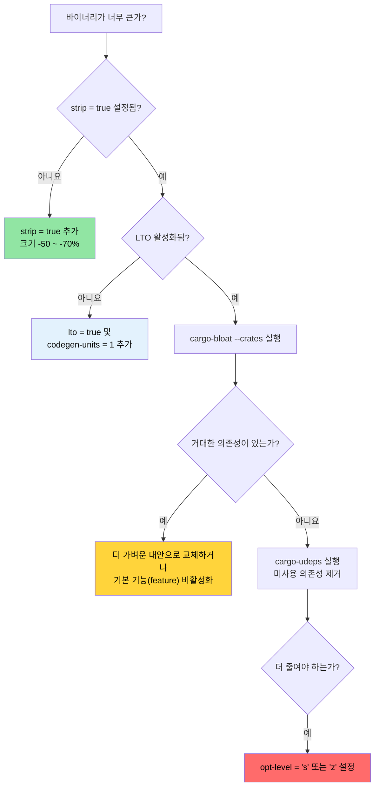

# 릴리스 프로필 및 바이너리 크기 🟡

> **학습 내용:**
> - 릴리스 프로필 분석: LTO, codegen-units, panic 전략, strip, opt-level
> - Thin vs Fat vs 교차 언어 LTO 트레이드오프
> - `cargo-bloat`을 이용한 바이너리 크기 분석
> - `cargo-udeps`, `cargo-machete`, `cargo-shear`를 이용한 의존성 정리
>
> **교차 참조:** [컴파일 타임 도구](ch08-compile-time-and-developer-tools.md) — 최적화의 나머지 절반 · [벤치마킹](ch03-benchmarking-measuring-what-matters.md) — 최적화 전 실행 시간 측정 · [의존성](ch06-dependency-management-and-supply-chain-s.md) — 의존성 정리는 크기와 컴파일 시간을 모두 줄임

기본적인 `cargo build --release` 설정도 이미 훌륭합니다. 하지만 운영 환경 배포 — 특히 수천 대의 서버에 배포되는 단일 바이너리 도구의 경우 — "좋음"과 "최적화됨" 사이에는 상당한 차이가 있습니다. 이 장에서는 프로필의 설정값들과 바이너리 크기를 측정하는 도구들을 다룹니다.

### 릴리스 프로필 분석

Cargo 프로필은 `rustc`가 코드를 컴파일하는 방식을 제어합니다. 기본값은 보수적으로 설정되어 있어, 최대 성능보다는 광범위한 호환성을 위해 설계되었습니다.

```toml
# Cargo.toml — Cargo의 내장 기본값 (아무것도 지정하지 않았을 때의 상태)

[profile.release]
opt-level = 3        # 최적화 수준 (0=없음, 1=기본, 2=좋음, 3=공격적)
lto = false          # 링크 타임 최적화(LTO) 꺼짐
codegen-units = 16   # 병렬 컴파일 유닛 (컴파일은 빠르지만 최적화 기회는 적음)
panic = "unwind"     # 패닉 시 스택 되감기 (바이너리는 커지지만 catch_unwind 작동 가능)
strip = "none"       # 모든 심볼 및 디버그 정보 유지
overflow-checks = false  # 릴리스 빌드에서 정수 오버플로 검사 안 함
debug = false        # 릴리스 빌드에서 디버그 정보 제외
```

**운영 환경에 최적화된 프로필** (이 프로젝트에서 이미 사용 중인 설정):

```toml
[profile.release]
lto = true           # 전체 크레이트 간 최적화 활성화
codegen-units = 1    # 단일 코드 생성 유닛 — 최적화 기회 최대화
panic = "abort"      # 되감기 오버헤드 제거 — 더 작고 빠름
strip = true         # 모든 심볼 제거 — 바이너리 크기 감소
```

**각 설정의 영향:**

| 설정 | 기본값 → 최적화 | 바이너리 크기 | 실행 속도 | 컴파일 시간 |
|---------|---------------------|-------------|---------------|--------------|
| `lto = false → true` | — | -10 ~ -20% | +5 ~ +20% | 2-5배 느림 |
| `codegen-units = 16 → 1` | — | -5 ~ -10% | +5 ~ +10% | 1.5-2배 느림 |
| `panic = "unwind" → "abort"` | — | -5 ~ -10% | 무시할 수 있음 | 무시할 수 있음 |
| `strip = "none" → true` | — | -50 ~ -70% | 영향 없음 | 영향 없음 |
| `opt-level = 3 → "s"` | — | -10 ~ -30% | -5 ~ -10% | 비슷함 |
| `opt-level = 3 → "z"` | — | -15 ~ -40% | -10 ~ -20% | 비슷함 |

**추가적인 프로필 미세 조정:**

```toml
[profile.release]
# 위의 모든 설정에 더해:
overflow-checks = true    # 릴리스에서도 오버플로 검사 유지 (속도보다 안전)
debug = "line-tables-only" # 전체 DWARF 없이 백트레이스를 위한 최소한의 디버그 정보
rpath = false             # 런타임 라이브러리 경로를 포함하지 않음
incremental = false       # 증분 컴파일 비활성화 (더 깨끗한 빌드)

# 크기 최적화 빌드용 (임베디드, WASM):
# opt-level = "z"         # 공격적인 크기 최적화
# strip = "symbols"       # 심볼은 제거하되 디버그 섹션은 유지
```

**크레이트별 프로필 오버라이드** — 중요한 크레이트만 최적화하고 나머지는 그대로 두기:

```toml
# 개발 빌드: 의존성은 최적화하되 내 코드는 빠르게 리컴파일
[profile.dev.package."*"]
opt-level = 2          # 개발 모드에서도 모든 의존성 최적화

# 릴리스 빌드: 특정 크레이트의 최적화 설정 변경
[profile.release.package.serde_json]
opt-level = 3          # JSON 파싱 최적화 최대화
codegen-units = 1

# 테스트 프로필: 정확한 통합 테스트를 위해 릴리스 동작과 일치시킴
[profile.test]
opt-level = 1          # 느린 테스트에서 타임아웃을 방지하기 위한 최소한의 최적화
```

### LTO 심층 분석 — Thin vs Fat vs 교차 언어

링크 타임 최적화(LTO)를 사용하면 LLVM이 크레이트 경계를 넘어 최적화를 수행할 수 있습니다. 예를 들어 `serde_json`의 함수를 파싱 코드에 인라이닝하거나, `regex`에서 사용되지 않는 코드를 제거하는 등의 작업이 가능합니다. LTO가 없으면 각 크레이트는 독립된 최적화 섬과 같습니다.

```toml
[profile.release]
# 옵션 1: Fat LTO (lto = true일 때의 기본값)
lto = true
# 모든 코드를 하나의 LLVM 모듈로 병합 → 최적화 극대화
# 컴파일은 가장 느리지만, 가장 작고 빠른 바이너리 생성

# 옵션 2: Thin LTO
lto = "thin"
# 크레이트는 분리된 상태를 유지하되 LLVM이 모듈 간 최적화 수행
# Fat LTO보다 컴파일이 빠르며 최적화 효과도 거의 비슷함
# 대부분의 프로젝트에 가장 권장되는 트레이드오프

# 옵션 3: LTO 없음
lto = false
# 크레이트 내부에서만 최적화 수행
# 컴파일이 가장 빠르지만 바이너리가 커짐

# 옵션 4: Off (명시적)
lto = "off"
# false와 동일함
```

**Fat LTO vs Thin LTO:**

| 요인 | Fat LTO (`true`) | Thin LTO (`"thin"`) |
|--------|-------------------|----------------------|
| 최적화 품질 | 최고 | Fat의 약 95% 수준 |
| 컴파일 시간 | 느림 (모든 코드가 한 모듈에 있음) | 보통 (병렬 모듈 처리) |
| 메모리 사용량 | 높음 (모든 LLVM IR을 메모리에 로드) | 낮음 (스트리밍 방식) |
| 병렬성 | 없음 (단일 모듈) | 좋음 (모듈별 처리) |
| 권장 용도 | 최종 릴리스 빌드 | CI 빌드, 개발 단계 |

**교차 언어 LTO** — Rust와 C 경계를 넘나드는 최적화:

```toml
[profile.release]
lto = true

# cc 크레이트를 사용하는 크레이트의 Cargo.toml
[build-dependencies]
cc = "1.0"
```

```rust
// build.rs — 교차 언어(linker-plugin) LTO 활성화
fn main() {
    // cc 크레이트는 환경 변수의 CFLAGS를 따릅니다.
    // 교차 언어 LTO를 위해 C 코드를 다음 설정으로 컴파일합니다:
    //   -flto=thin -O2
    cc::Build::new()
        .file("csrc/fast_parser.c")
        .flag("-flto=thin")
        .opt_level(2)
        .compile("fast_parser");
}
```

```bash
# linker-plugin LTO 활성화 (호환 가능한 LLD 또는 gold 링커 필요)
RUSTFLAGS="-Clinker-plugin-lto -Clinker=clang -Clink-arg=-fuse-ld=lld" \
    cargo build --release
```

교차 언어 LTO를 통해 LLVM은 C 함수를 Rust 호출부로 인라이닝하거나 그 반대의 작업을 수행할 수 있습니다. 이는 작은 C 함수가 빈번하게 호출되는 FFI 비중이 높은 코드(예: IPMI ioctl 래퍼)에서 가장 큰 효과를 발휘합니다.

### cargo-bloat을 이용한 바이너리 크기 분석

[`cargo-bloat`](https://github.com/RazrFalcon/cargo-bloat)은 다음 질문에 답해줍니다:
"내 바이너리에서 어떤 함수와 크레이트가 가장 많은 공간을 차지하고 있는가?"

```bash
# 설치
cargo install cargo-bloat

# 가장 큰 함수들 표시
cargo bloat --release -n 20
# 출력 예시:
#  File  .text     Size          Crate    Name
#  2.8%   5.1%  78.5KiB  serde_json       serde_json::de::Deserializer::parse_...
#  2.1%   3.8%  58.2KiB  regex_syntax     regex_syntax::ast::parse::ParserI::p...
#  1.5%   2.7%  42.1KiB  accel_diag         accel_diag::vendor::parse_smi_output
#  ...

# 크레이트별 표시 (어떤 의존성이 가장 큰지 확인)
cargo bloat --release --crates
# 출력 예시:
#  File  .text     Size Crate
# 12.3%  22.1%  340KiB serde_json
#  8.7%  15.6%  240KiB regex
#  6.2%  11.1%  170KiB std
#  5.1%   9.2%  141KiB accel_diag
#  ...

# 두 빌드 결과 비교 (최적화 전후)
cargo bloat --release --crates > before.txt
# ... 변경 작업 수행 ...
cargo bloat --release --crates > after.txt
diff before.txt after.txt
```

**흔한 비대화 원인 및 해결책:**

| 원인 | 일반적인 크기 | 해결책 |
|-------------|-------------|-----|
| `regex` (전체 엔진) | 200-400 KB | 유니코드가 필요 없다면 `regex-lite` 사용 |
| `serde_json` (전체) | 200-350 KB | 성능이 중요하다면 `simd-json` 또는 `sonic-rs` 고려 |
| 제네릭 단일화 (Monomorphization) | 다양함 | API 경계에서 `dyn Trait` 사용 |
| 포맷팅 엔진 (`Display`, `Debug`) | 50-150 KB | 거대한 enum의 `#[derive(Debug)]`는 크기를 키움 |
| 패닉 메시지 문자열 | 20-80 KB | `panic = "abort"`는 되감기를 제거하고, `strip`은 문자열 제거 |
| 미사용 기능(Feature) | 다양함 | 기본 기능 비활성화: `serde = { version = "1", default-features = false }` |

### cargo-udeps를 이용한 의존성 정리

[`cargo-udeps`](https://github.com/est31/cargo-udeps)는 `Cargo.toml`에는 선언되어 있지만 실제 코드에서는 사용되지 않는 의존성을 찾아줍니다.

```bash
# 설치 (nightly 채널 필요)
cargo install cargo-udeps

# 사용되지 않는 의존성 찾기
cargo +nightly udeps --workspace
# 출력 예시:
# unused dependencies:
# `diag_tool v0.1.0`
# └── "tempfile" (dev-dependency)
#
# `accel_diag v0.1.0`
# └── "once_cell"    ← LazyLock 도입 전에는 필요했으나 지금은 사용 안 함
```

사용되지 않는 의존성은 다음과 같은 문제를 일으킵니다:
- 컴파일 시간 증가
- 바이너리 크기 증가
- 공급망 보안 위험 증가
- 잠재적인 라이선스 복잡성 추가

**대안: `cargo-machete`** — 휴리스틱 기반의 빠른 방식:

```bash
cargo install cargo-machete
cargo machete
# 빠르지만 휴리스틱 방식이라 오탐(false positive)이 있을 수 있음
```

**대안: `cargo-shear`** — `cargo-udeps`와 `cargo-machete` 사이의 절충안:

```bash
cargo install cargo-shear
cargo shear --fix
# cargo-machete보다 느리지만 cargo-udeps보다는 훨씬 빠름
# cargo-machete보다 오탐이 훨씬 적음
```

### 크기 최적화 의사결정 트리



### 🏋️ 실습

#### 🟢 실습 1: LTO 영향력 측정

기본 릴리스 설정으로 프로젝트를 빌드한 후, `lto = true` + `codegen-units = 1` + `strip = true` 설정을 적용하여 다시 빌드해 보세요. 바이너리 크기와 컴파일 시간을 비교해 봅니다.

<details>
<summary>솔루션</summary>

```bash
# 기본 릴리스 빌드
cargo build --release
ls -lh target/release/my-binary
time cargo build --release  # 시간 기록

# 최적화된 릴리스 — Cargo.toml에 추가:
# [profile.release]
# lto = true
# codegen-units = 1
# strip = true
# panic = "abort"

cargo clean
cargo build --release
ls -lh target/release/my-binary  # 보통 30-50% 작아짐
time cargo build --release       # 보통 컴파일이 2-3배 느려짐
```
</details>

#### 🟡 실습 2: 가장 큰 크레이트 찾기

프로젝트에서 `cargo bloat --release --crates`를 실행해 보세요. 가장 큰 의존성을 확인합니다. 기본 기능을 비활성화하거나 더 가벼운 대안으로 교체하여 크기를 줄일 수 있을까요?

<details>
<summary>솔루션</summary>

```bash
cargo install cargo-bloat
cargo bloat --release --crates
# 출력 예시:
#  File  .text     Size Crate
# 12.3%  22.1%  340KiB serde_json
#  8.7%  15.6%  240KiB regex

# regex의 경우 — 유니코드가 필요 없다면 regex-lite 시도:
# regex-lite = "0.1"  # 전체 regex보다 약 10배 작음

# serde의 경우 — std가 필요 없다면 기본 기능 비활성화:
# serde = { version = "1", default-features = false, features = ["derive"] }

cargo bloat --release --crates  # 변경 후 결과 비교
```
</details>

### 핵심 요약

- `lto = true` + `codegen-units = 1` + `strip = true` + `panic = "abort"`는 운영 환경용 릴리스 프로필의 표준입니다.
- Thin LTO (`lto = "thin"`)는 Fat LTO의 장점의 80%를 제공하면서도 컴파일 비용은 훨씬 적습니다.
- `cargo-bloat --crates`는 어떤 의존성이 바이너리 공간을 차지하는지 정확히 알려줍니다.
- `cargo-udeps`, `cargo-machete`, `cargo-shear`는 컴파일 시간과 바이너리 크기를 낭비하는 죽은 의존성을 찾아줍니다.
- 크레이트별 프로필 오버라이드를 통해 전체 빌드를 느리게 하지 않고도 중요한 크레이트만 최적화할 수 있습니다.

---
