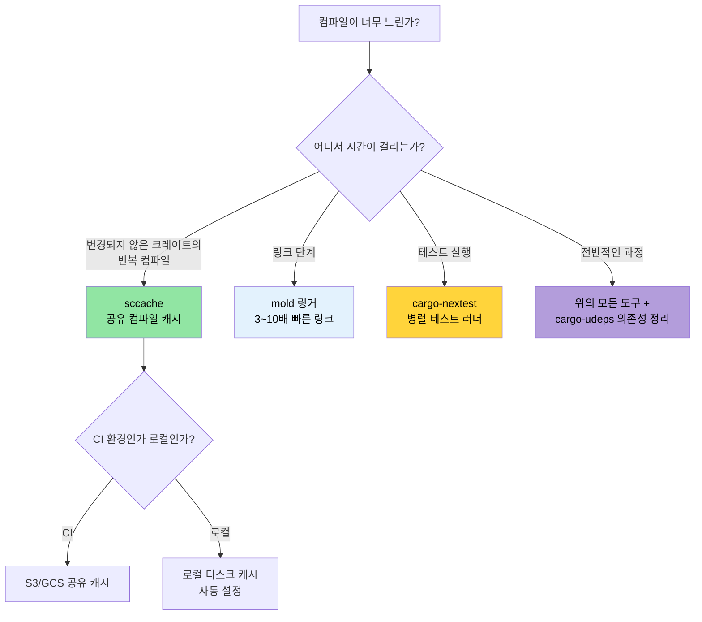

# 컴파일 시간 및 개발자 도구 🟡

> **학습 내용:**
> - 로컬 및 CI 빌드를 위한 `sccache` 컴파일 캐싱
> - 기본 링커보다 3~10배 빠른 `mold`를 이용한 고속 링크
> - `cargo-nextest`: 더 빠르고 정보가 풍부한 테스트 러너
> - 개발자 가독성 도구: `cargo-expand`, `cargo-geiger`, `cargo-watch`
> - 워크스페이스 린트, MSRV 정책, 문서화를 통한 CI 검증
>
> **교차 참조:** [릴리스 프로필](ch07-release-profiles-and-binary-size.md) — LTO 및 바이너리 크기 최적화 · [CI/CD 파이프라인](ch11-putting-it-all-together-a-production-cic.md) — 이 도구들을 파이프라인에 통합하는 방법 · [의존성](ch06-dependency-management-and-supply-chain-s.md) — 의존성 감소가 컴파일 속도 향상의 지름길

### 컴파일 시간 최적화: sccache, mold, cargo-nextest

긴 컴파일 시간은 Rust 개발자들이 겪는 가장 큰 고충입니다. 아래 도구들을 조합하면 반복적인 빌드 시간을 50~80%까지 단축할 수 있습니다.

**`sccache` — 공유 컴파일 캐시:**

```bash
# 설치
cargo install sccache

# Rust 래퍼로 설정
export RUSTC_WRAPPER=sccache

# 또는 .cargo/config.toml에 영구적으로 설정:
# [build]
# rustc-wrapper = "sccache"

# 첫 빌드: 정상 속도 (캐시 생성 중)
cargo build --release  # 3분 소요

# Clean 후 재빌드: 변경되지 않은 크레이트는 캐시 적중(hit)
cargo clean && cargo build --release  # 45초 소요

# 캐시 통계 확인
sccache --show-stats
# Compile requests        1,234
# Cache hits               987 (80%)
# Cache misses             247
```

`sccache`는 팀 전체 및 CI에서의 캐시 공유를 위해 클라우드 스토리지(S3, GCS, Azure Blob)를 지원합니다.

**`mold` — 고속 링커:**

링크 단계는 흔히 가장 느린 구간입니다. `mold`는 `lld`보다 3~5배, 기본 GNU `ld`보다는 10~20배 빠릅니다.

```bash
# 설치
sudo apt install mold  # Ubuntu 22.04+
# 참고: mold는 ELF 타겟(Linux)용입니다. macOS는 ELF가 아닌 Mach-O를 사용합니다.
# macOS 기본 링커(ld64)는 이미 상당히 빠릅니다. 더 빠른 속도가 필요하다면:
# brew install sold     # sold = Mach-O용 mold (실험적, 덜 성숙함)
# 실제 프로젝트에서 macOS의 링크 시간이 병목이 되는 경우는 드뭅니다.
```

```toml
# 링크에 mold 사용 설정
# .cargo/config.toml
[target.x86_64-unknown-linux-gnu]
rustflags = ["-C", "link-arg=-fuse-ld=mold"]
```

```bash
# 참고: https://github.com/rui314/mold/blob/main/docs/mold.md#environment-variables
export MOLD_JOBS=1

# mold가 사용되고 있는지 확인
cargo build -v 2>&1 | grep mold
```

**`cargo-nextest` — 고속 테스트 러너:**

```bash
# 설치
cargo install cargo-nextest

# 테스트 실행 (기본적으로 병렬 실행, 테스트별 타임아웃, 재시도 지원)
cargo nextest run

# cargo test 대비 주요 장점:
# - 각 테스트가 별도의 프로세스에서 실행됨 → 격리성 우수
# - 스마트 스케줄링을 통한 병렬 실행
# - 테스트별 타임아웃 (CI 중단 방지)
# - CI용 JUnit XML 출력 지원
# - 실패한 테스트 재시도 가능

# 설정 예시
cargo nextest run --retries 2 --fail-fast

# 테스트 바이너리 아카이브 (CI에서 유용: 한 곳에서 빌드하고 여러 머신에서 테스트)
cargo nextest archive --archive-file tests.tar.zst
cargo nextest run --archive-file tests.tar.zst
```

```toml
# .config/nextest.toml
[profile.default]
retries = 0
slow-timeout = { period = "60s", terminate-after = 3 }
fail-fast = true

[profile.ci]
retries = 2
fail-fast = false
junit = { path = "test-results.xml" }
```

**통합 개발 환경 설정:**

```toml
# .cargo/config.toml — 개발 반복 주기 최적화
[build]
rustc-wrapper = "sccache"       # 컴파일 결과물 캐싱

[target.x86_64-unknown-linux-gnu]
rustflags = ["-C", "link-arg=-fuse-ld=mold"]  # 고속 링크

# 개발용 프로필: 의존성은 최적화하되 내 코드는 그대로
# (Cargo.toml에 작성)
# [profile.dev.package."*"]
# opt-level = 2
```

### cargo-expand 및 cargo-geiger — 가시성 도구

**`cargo-expand`** — 매크로가 생성하는 코드 확인:

```bash
cargo install cargo-expand

# 특정 모듈의 모든 매크로 확장
cargo expand --lib accel_diag::vendor

# 특정 derive 확장 확인
# 예: #[derive(Debug, Serialize, Deserialize)]
# cargo expand는 생성된 impl 블록들을 보여줍니다.
cargo expand --lib --tests
```

`#[derive]` 매크로 출력, `macro_rules!` 확장, `serde`가 타입을 위해 생성하는 코드를 이해하고 디버깅하는 데 매우 유용합니다.

`cargo-expand` 외에도 rust-analyzer를 사용하여 매크로를 확장할 수 있습니다:

1. 확인하려는 매크로 위로 커서를 옮깁니다.
2. 커맨드 팔레트를 엽니다 (VSCode의 경우 `F1`).
3. `rust-analyzer: Expand macro recursively at caret`을 검색하여 실행합니다.

**`cargo-geiger`** — 의존성 트리 전체에서 `unsafe` 사용량 집계:

```bash
cargo install cargo-geiger

cargo geiger
# 출력 예시:
# Metric output format: x/y
#   x = 빌드 시 사용된 unsafe 코드
#   y = 크레이트 내에서 발견된 전체 unsafe 코드
#
# Functions  Expressions  Impls  Traits  Methods
# 0/0        0/0          0/0    0/0     0/0      ✅ my_crate
# 0/5        0/23         0/2    0/0     0/3      ✅ serde
# 3/3        14/14        0/0    0/0     2/2      ❗ libc
# 15/15      142/142      4/4    0/0     12/12    ☢️ ring

# 기호 설명:
# ✅ = unsafe 사용 안 함
# ❗ = 일부 unsafe 사용됨
# ☢️ = unsafe 집중 사용됨
```

프로젝트의 `zero-unsafe` 정책을 위해, `cargo geiger`는 의존성이 제공하는 기능 중 실제 호출 그래프 상에서 `unsafe` 코드가 유입되지 않는지 검증합니다.

### 워크스페이스 린트 — `[workspace.lints]`

Rust 1.74부터 Clippy와 컴파일러 린트를 `Cargo.toml`에서 중앙 집중식으로 관리할 수 있습니다. 더 이상 모든 크레이트 상단에 `#![deny(...)]`를 적지 않아도 됩니다.

```toml
# 루트 Cargo.toml — 모든 크레이트에 대한 린트 설정
[workspace.lints.clippy]
unwrap_used = "warn"         # ? 또는 expect("사유") 선호
dbg_macro = "deny"           # 커밋되는 코드에 dbg!() 금지
todo = "warn"                # 미완성 구현 추적
large_enum_variant = "warn"  # 예기치 않은 크기 비대화 방지

[workspace.lints.rust]
unsafe_code = "deny"         # zero-unsafe 정책 강제
missing_docs = "warn"        # 문서화 장려
```

```toml
# 각 크레이트의 Cargo.toml — 워크스페이스 린트 적용
[lints]
workspace = true
```

이 방식은 여기저기 흩어져 있던 `#![deny(clippy::unwrap_used)]` 속성을 대체하며, 워크스페이스 전체에 일관된 정책을 보장합니다.

**Clippy 경고 자동 수정:**

```bash
# Clippy가 자동으로 수정 가능한 제안들을 적용하게 함
cargo clippy --fix --workspace --all-targets --allow-dirty

# 동작을 변경할 수 있는 제안까지 적용 (주의 깊게 검토 필요!)
cargo clippy --fix --workspace --all-targets --allow-dirty -- -W clippy::pedantic
```

> **팁**: 커밋하기 전에 `cargo clippy --fix`를 실행하세요. 일일이 고치기 번거로운 사소한 문제들(미사용 import, 불필요한 clone, 타입 단순화 등)을 알아서 처리해 줍니다.

### MSRV 정책과 rust-version

최소 지원 Rust 버전(MSRV)은 크레이트가 오래된 툴체인에서도 컴파일되도록 보장합니다. 이는 Rust 버전이 고정된 시스템에 배포할 때 중요합니다.

```toml
# Cargo.toml
[package]
name = "diag_tool"
version = "0.1.0"
rust-version = "1.75"    # 필요한 최소 Rust 버전
```

```bash
# MSRV 준수 여부 확인
cargo +1.75.0 check --workspace

# 자동 MSRV 탐색
cargo install cargo-msrv
cargo msrv find
# 출력: Minimum Supported Rust Version is 1.75.0

# CI에서 검증
cargo msrv verify
```

**CI에서의 MSRV:**

```yaml
jobs:
  msrv:
    name: Check MSRV
    runs-on: ubuntu-latest
    steps:
      - uses: actions/checkout@v4
      - uses: dtolnay/rust-toolchain@master
        with:
          toolchain: "1.75.0"    # Cargo.toml의 rust-version과 일치시킴
      - run: cargo check --workspace
```

**MSRV 전략:**
- **바이너리 애플리케이션** (이 프로젝트와 같은 경우): 최신 안정 버전을 사용합니다. 특별한 MSRV가 필요하지 않을 수 있습니다.
- **라이브러리 크레이트** (crates.io 라이브러리): 사용 중인 모든 기능을 지원하는 가장 오래된 Rust 버전으로 설정합니다. 보통 `N-2` (현재 버전보다 2단계 낮음) 방식을 많이 사용합니다.
- **엔터프라이즈 배포**: 보유한 서버들에 설치된 가장 오래된 Rust 버전에 맞춥니다.

### 적용 사례: 운영용 바이너리 프로필

이 프로젝트는 이미 훌륭한 [릴리스 프로필](ch07-release-profiles-and-binary-size.md)을 갖추고 있습니다:

```toml
# 현재 워크스페이스 Cargo.toml
[profile.release]
lto = true           # ✅ 전체 크레이트 간 최적화
codegen-units = 1    # ✅ 최적화 기회 극대화
panic = "abort"      # ✅ 되감기 오버헤드 제거
strip = true         # ✅ 배포를 위한 심볼 제거

[profile.dev]
opt-level = 0        # ✅ 빠른 컴파일
debug = true         # ✅ 전체 디버그 정보 포함
```

**추천 추가 설정:**

```toml
# 개발 모드에서 의존성 최적화 (테스트 실행 속도 향상)
[profile.dev.package."*"]
opt-level = 2

# 테스트 프로필: 느린 테스트에서 타임아웃을 방지하기 위한 약간의 최적화
[profile.test]
opt-level = 1

# 릴리스 빌드에서 오버플로 검사 유지 (안전성)
[profile.release]
lto = true
codegen-units = 1
panic = "abort"
strip = true
overflow-checks = true    # ← 추가: 정수 오버플로 감지
debug = "line-tables-only" # ← 추가: 전체 DWARF 없이 백트레이스 지원
```

**추천 개발자 도구 설정:**

```toml
# .cargo/config.toml (제안)
[build]
rustc-wrapper = "sccache"  # 첫 빌드 이후 80% 이상의 캐시 적중률 기대

[target.x86_64-unknown-linux-gnu]
rustflags = ["-C", "link-arg=-fuse-ld=mold"]  # 3~5배 빠른 링크
```

**프로젝트에 기대되는 효과:**

| 지표 | 현재 | 제안 적용 후 |
|--------|---------|----------------|
| 릴리스 바이너리 | 약 10 MB (stripped, LTO) | 동일 |
| 개발 빌드 시간 | 약 45초 | 약 25초 (sccache + mold) |
| 재빌드 (파일 1개 변경) | 약 15초 | 약 5초 (sccache + mold) |
| 테스트 실행 | `cargo test` | `cargo nextest` — 2배 빠름 |
| 의존성 취약점 스캔 | 없음 | CI에서 `cargo audit` 실행 |
| 라이선스 준수 | 수동 확인 | `cargo deny` 자동화 |
| 미사용 의존성 감지 | 수동 확인 | CI에서 `cargo udeps` 실행 |

### `cargo-watch` — 파일 변경 시 자동 재빌드

[`cargo-watch`](https://github.com/watchexec/cargo-watch)는 소스 파일이 변경될 때마다 명령어를 다시 실행하여 빠른 피드백 루프를 만들어 줍니다.

```bash
# 설치
cargo install cargo-watch

# 저장할 때마다 즉시 check 실행 (빠른 피드백)
cargo watch -x check

# 변경 시 clippy 및 테스트 실행
cargo watch -x 'clippy --workspace --all-targets' -x 'test --workspace --lib'

# 특정 크레이트만 감시 (대규모 워크스페이스에서 유리)
cargo watch -w accel_diag/src -x 'test -p accel_diag'

# 매 실행 사이 화면 지우기
cargo watch -c -x check
```

> **팁**: 앞서 소개한 `mold` + `sccache`와 조합하면 증분 변경에 대해 1초 미만의 재확인 시간을 확보할 수 있습니다.

### `cargo doc` 및 워크스페이스 문서화

대규모 워크스페이스에서 생성된 문서는 코드 탐색에 필수적입니다. `cargo doc`은 doc-comment와 타입 시그니처를 바탕으로 HTML 문서를 만듭니다.

```bash
# 워크스페이스의 모든 크레이트에 대한 문서 생성 (브라우저에서 열기)
cargo doc --workspace --no-deps --open

# 프라이빗 항목 포함 (개발 중 유용)
cargo doc --workspace --no-deps --document-private-items

# HTML 생성 없이 문서 링크만 확인 (빠른 CI 검사)
cargo doc --workspace --no-deps 2>&1 | grep -E 'warning|error'
```

**문서 내부 링크 (Intra-doc links)** — URL 없이 크레이트 간 타입을 연결:

```rust
/// [`GpuConfig`] 설정을 사용하여 GPU 진단을 실행합니다.
///
/// 구현 상세는 [`crate::accel_diag::run_diagnostics`]를 참조하세요.
/// [`DiagResult`]를 반환하며, 이는 [`DerReport`](crate::core_lib::DerReport)
/// 형식으로 직렬화될 수 있습니다.
pub fn run_accel_diag(config: &GpuConfig) -> DiagResult {
    // ...
}
```

**문서에 플랫폼 전용 API 표시:**

```rust
// Cargo.toml: [package.metadata.docs.rs]
// all-features = true
// rustdoc-args = ["--cfg", "docsrs"]

/// Windows 전용: Win32 API를 통해 배터리 상태를 읽어옵니다.
///
/// `cfg(windows)` 빌드에서만 사용 가능합니다.
#[cfg(windows)]
#[doc(cfg(windows))]  // 문서에 "Available on Windows only" 배지 표시
pub fn get_battery_status() -> Option<u8> {
    // ...
}
```

**CI 문서 검사:**

```yaml
# CI 워크플로에 추가
- name: Check documentation
  run: RUSTDOCFLAGS="-D warnings" cargo doc --workspace --no-deps
  # 끊어진 문서 링크를 에러로 처리
```

> **프로젝트를 위해**: 크레이트가 많으므로 `cargo doc --workspace`는 새 팀원이 API 구성을 파악하는 가장 좋은 방법입니다. CI에 `RUSTDOCFLAGS="-D warnings"`를 추가하여 머지 전에 끊어진 링크를 잡아내세요.

### 컴파일 시간 의사결정 트리



### 🏋️ 실습

#### 🟢 실습 1: sccache + mold 설정하기

`sccache`와 `mold`를 설치하고 `.cargo/config.toml`에 설정한 뒤, 전체 재빌드 시 컴파일 시간이 얼마나 단축되는지 측정해 보세요.

<details>
<summary>솔루션</summary>

```bash
# 설치
cargo install sccache
sudo apt install mold  # Ubuntu 22.04+

# .cargo/config.toml 설정:
cat > .cargo/config.toml << 'EOF'
[build]
rustc-wrapper = "sccache"

[target.x86_64-unknown-linux-gnu]
linker = "clang"
rustflags = ["-C", "link-arg=-fuse-ld=mold"]
EOF

# 첫 빌드 (캐시 생성)
time cargo build --release  # 예: 180초

# Clean 후 재빌드 (캐시 활용)
cargo clean
time cargo build --release  # 예: 45초

sccache --show-stats
# 캐시 적중률이 60~80% 이상인지 확인
```
</details>

#### 🟡 실습 2: cargo-nextest로 전환하기

`cargo-nextest`를 설치하고 테스트 스위트를 실행해 보세요. `cargo test`와 전체 실행 시간을 비교했을 때 얼마나 빨라졌나요?

<details>
<summary>솔루션</summary>

```bash
cargo install cargo-nextest

# 표준 테스트 러너
time cargo test --workspace 2>&1 | tail -5

# nextest (테스트 바이너리별 병렬 실행)
time cargo nextest run --workspace 2>&1 | tail -5

# 대규모 워크스페이스의 경우 보통 2~5배 빨라집니다.
# nextest는 다음 기능도 제공합니다:
# - 테스트별 실행 시간 표시
# - 불안정한(flaky) 테스트 재시도
# - CI용 JUnit XML 출력
cargo nextest run --workspace --retries 2
```
</details>

### 핵심 요약

- S3/GCS 백엔드를 사용하는 `sccache`는 팀 전체와 CI 간에 컴파일 캐시를 공유합니다.
- `mold`는 가장 빠른 ELF 링커로, 링크 시간을 초 단위에서 밀리초 단위로 줄여줍니다.
- `cargo-nextest`는 바이너리별로 테스트를 병렬 실행하며, 향상된 출력 정보와 재시도를 지원합니다.
- `cargo-geiger`는 `unsafe` 사용량을 집계합니다. 새로운 의존성을 추가하기 전에 실행해 보세요.
- `[workspace.lints]`는 다중 크레이트 워크스페이스에서 Clippy와 rustc 린트 설정을 중앙 집중화합니다.

---
