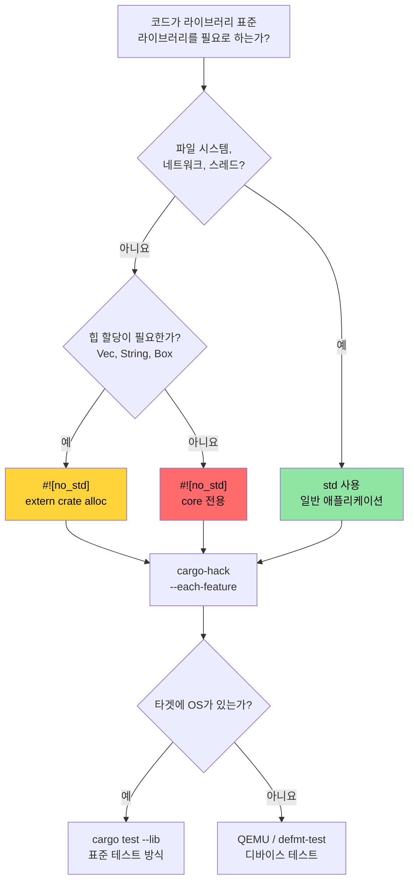

# `no_std` 및 기능(Feature) 검증 🔴

> **학습 내용:**
> - `cargo-hack`을 이용한 기능 조합의 체계적 검증
> - Rust의 세 가지 레이어: `core` vs `alloc` vs `std` 및 각각의 사용 시점
> - 커스텀 패닉 핸들러와 할당자를 포함한 `no_std` 크레이트 빌드
> - 호스트 및 QEMU에서 `no_std` 코드 테스트하기
>
> **교차 참조:** [Windows 및 조건부 컴파일](ch10-windows-and-conditional-compilation.md) — 이 주제의 플랫폼 측면 · [교차 컴파일](ch02-cross-compilation-one-source-many-target.md) — ARM 및 임베디드 타겟으로의 교차 빌드 설정 · [Miri 및 새니타이저](ch05-miri-valgrind-and-sanitizers-verifying-u.md) — `no_std` 환경에서의 `unsafe` 코드 검증 · [빌드 스크립트](ch01-build-scripts-buildrs-in-depth.md) — `build.rs`에서 내보내는 `cfg` 플래그

Rust는 8비트 마이크로컨트롤러부터 클라우드 서버까지 어디서나 실행됩니다. 이 장에서는 그 기초가 되는 내용을 다룹니다: `#![no_std]`를 사용하여 표준 라이브러리를 제거하고, 설정한 기능(feature) 조합들이 실제로 올바르게 컴파일되는지 검증하는 방법입니다.

### `cargo-hack`을 이용한 기능 조합 검증

[`cargo-hack`](https://github.com/taiki-e/cargo-hack)은 모든 기능 조합을 체계적으로 테스트합니다. 이는 `#[cfg(...)]` 코드가 포함된 크레이트에 필수적입니다.

```bash
# 설치
cargo install cargo-hack

# 모든 기능이 개별적으로 컴파일되는지 확인
cargo hack check --each-feature --workspace

# 모든 기능 조합 테스트 (지수적으로 증가하므로 주의!)
# 기능이 8개 미만인 크레이트에만 현실적입니다.
cargo hack check --feature-powerset --workspace

# 현실적인 타협안: 각 기능을 개별적으로 테스트 + 모든 기능 활성화 + 기능 모두 비활성화
cargo hack check --each-feature --workspace --no-dev-deps
cargo check --workspace --all-features
cargo check --workspace --no-default-features
```

**이 프로젝트에서 중요한 이유:**

플랫폼 기능(`linux`, `windows`, `direct-ipmi`, `direct-accel-api`)을 추가할 때, `cargo-hack`은 컴파일을 깨뜨리는 조합을 잡아냅니다.

```toml
# 예: 플랫폼 코드를 제어하는 기능들
[features]
default = ["linux"]
linux = []                          # Linux 전용 하드웨어 접근
windows = ["dep:windows-sys"]       # Windows 전용 API
direct-ipmi = []                    # unsafe IPMI ioctl (5장)
direct-accel-api = []               # unsafe accel-mgmt FFI (5장)
```

```bash
# 모든 기능이 단독으로 그리고 함께 올바르게 컴파일되는지 확인
cargo hack check --each-feature -p diag_tool
# 발견 예시: "feature 'windows'가 'direct-ipmi' 없이 컴파일되지 않음"
# 발견 예시: "#[cfg(feature = \"linux\")]에 오타가 있음 — 'lnux'로 되어 있음"
```

**CI 통합:**

```yaml
# CI 파이프라인에 추가 (단순 컴파일 확인이므로 빠름)
- name: Feature matrix check
  run: cargo hack check --each-feature --workspace --no-dev-deps
```

> **권장 사항**: 기능이 2개 이상인 크레이트는 CI에서 `cargo hack check --each-feature`를 실행하세요. `--feature-powerset`은 기능이 8개 미만인 핵심 라이브러리 크레이트에만 사용하세요 ($2^n$ 조합이므로 지수적으로 늘어납니다).

### `no_std` — 언제 그리고 왜 사용하는가

`#![no_std]`는 컴파일러에게 "표준 라이브러리를 링크하지 마라"고 지시합니다. 이 경우 크레이트는 `core`(그리고 선택적으로 `alloc`)만 사용할 수 있습니다. 왜 이런 작업이 필요할까요?

| 시나리오 | `no_std`를 사용하는 이유 |
|----------|-------------|
| 임베디드 펌웨어 (ARM Cortex-M, RISC-V) | OS 없음, 힙(heap) 없음, 파일 시스템 없음 |
| UEFI 진단 도구 | OS API가 없는 부팅 전 환경 |
| 커널 모듈 | 커널 공간에서는 유저 공간의 `std`를 사용할 수 없음 |
| WebAssembly (WASM) | 바이너리 크기 최소화, OS 의존성 제거 |
| 부트로더 | OS가 존재하기 전에 실행되어야 함 |
| C 인터페이스를 가진 공유 라이브러리 | 호출자에게 Rust 런타임 유입 방지 |

**하드웨어 진단** 분야에서 `no_std`는 다음과 같은 결과물을 빌드할 때 필요합니다:
- UEFI 기반 부팅 전 진단 도구 (OS 로드 전)
- BMC 펌웨어 진단 (자원이 제한된 ARM SoC)
- 커널 레벨 PCIe 진단 (커널 모듈 또는 eBPF 프로브)

### `core` vs `alloc` vs `std` — 세 가지 레이어

```text
┌─────────────────────────────────────────────────────────────┐
│ std                                                         │
│  core + alloc의 모든 기능을 포함하며, 추가로 다음을 제공:        │
│  • 파일 I/O (std::fs, std::io)                              │
│  • 네트워킹 (std::net)                                       │
│  • 스레드 (std::thread)                                     │
│  • 시간 (std::time)                                         │
│  • 환경 변수 (std::env)                                      │
│  • 프로세스 (std::process)                                   │
│  • OS 전용 (std::os::unix, std::os::windows)                │
├─────────────────────────────────────────────────────────────┤
│ alloc          (#! [no_std] + extern crate alloc로 사용 가능, │
│                 글로벌 할당자가 있는 경우)                     │
│  • String, Vec, Box, Rc, Arc                                │
│  • BTreeMap, BTreeSet                                       │
│  • format!() 매크로                                          │
│  • 힙 메모리가 필요한 컬렉션 및 스마트 포인터                  │
├─────────────────────────────────────────────────────────────┤
│ core           (#! [no_std]에서도 항상 사용 가능)              │
│  • 기본 타입 (u8, bool, char 등)                             │
│  • Option, Result                                           │
│  • Iterator, slice, array, str (String이 아닌 슬라이스)       │
│  • 트레이트: Clone, Copy, Debug, Display, From, Into          │
│  • 원자적 연산 (core::sync::atomic)                          │
│  • Cell, RefCell (core::cell)  — Pin (core::pin)            │
│  • core::fmt (할당 없는 포맷팅)                               │
│  • core::mem, core::ptr (저수준 메모리 조작)                  │
│  • 수학 연산: core::num, 기본 산술 연산                       │
└─────────────────────────────────────────────────────────────┘
```

**`std` 없이 잃게 되는 것들:**
- `HashMap` 없음 (해셔 필요 — `alloc`의 `BTreeMap`이나 `hashbrown` 사용)
- `println!()` 없음 (stdout 필요 — 버퍼에 쓰는 `core::fmt::Write` 사용)
- `std::error::Error` 없음 (Rust 1.81부터 `core`에 편입되었으나, 아직 많은 생태계가 마이너레이션 전임)
- 파일 I/O, 네트워킹, 스레드 없음 (플랫폼 HAL에서 제공하지 않는 한)
- `Mutex` 없음 (`spin::Mutex`나 플랫폼 전용 락 사용)

### `no_std` 크레이트 구축하기

```rust
// src/lib.rs — no_std 라이브러리 크레이트
#![no_std]

// 선택적으로 힙 할당 사용
extern crate alloc;
use alloc::string::String;
use alloc::vec::Vec;
use core::fmt;

/// 온도 센서의 읽기 값.
/// 이 구조체는 베어메탈부터 Linux까지 모든 환경에서 작동합니다.
#[derive(Clone, Copy, Debug)]
pub struct Temperature {
    /// 원시 센서 값 (일반적인 I2C 센서의 경우 LSB당 0.0625°C)
    raw: u16,
}

impl Temperature {
    pub const fn from_raw(raw: u16) -> Self {
        Self { raw }
    }

    /// 섭씨 온도로 변환 (고정 소수점, FPU 불필요)
    pub const fn millidegrees_c(&self) -> i32 {
        (self.raw as i32) * 625 / 10 // 0.0625°C 해상도
    }

    pub fn degrees_c(&self) -> f32 {
        self.raw as f32 * 0.0625
    }
}

impl fmt::Display for Temperature {
    fn fmt(&self, f: &mut fmt::Formatter<'_>) -> fmt::Result {
        let md = self.millidegrees_c();
        // -0.999°C ~ -0.001°C 사이의 값 처리 (md / 1000이 0이지만 값은 음수인 경우)
        if md < 0 && md > -1000 {
            write!(f, "-0.{:03}°C", (-md) % 1000)
        } else {
            write!(f, "{}.{:03}°C", md / 1000, (md % 1000).abs())
        }
    }
}

/// 공백으로 구분된 온도 값들을 파싱합니다.
/// alloc 사용 — 글로벌 할당자가 필요합니다.
pub fn parse_temperatures(input: &str) -> Vec<Temperature> {
    input
        .split_whitespace()
        .filter_map(|s| s.parse::<u16>().ok())
        .map(Temperature::from_raw)
        .collect()
}

/// 할당 없이 포맷팅 — 버퍼에 직접 씁니다.
/// core 전용 환경(alloc 없음, 힙 없음)에서 작동합니다.
pub fn format_temp_into(temp: &Temperature, buf: &mut [u8]) -> usize {
    use core::fmt::Write;
    struct SliceWriter<'a> {
        buf: &'a mut [u8],
        pos: usize,
    }
    impl<'a> Write for SliceWriter<'a> {
        fn write_str(&mut self, s: &str) -> fmt::Result {
            let bytes = s.as_bytes();
            let remaining = self.buf.len() - self.pos;
            if bytes.len() > remaining {
                // 버퍼 꽉 참 — 자동 절단 대신 에러 신호 전달
                return Err(fmt::Error);
            }
            self.buf[self.pos..self.pos + bytes.len()].copy_from_slice(bytes);
            self.pos += bytes.len();
            Ok(())
        }
    }
    let mut w = SliceWriter { buf, pos: 0 };
    let _ = write!(w, "{}", temp);
    w.pos
}
```

```toml
# no_std 크레이트의 Cargo.toml
[package]
name = "thermal-sensor"
version = "0.1.0"
edition = "2021"

[features]
default = ["alloc"]
alloc = []    # Vec, String 등 활성화
std = []      # 전체 std 활성화 (alloc 포함)

[dependencies]
# no_std 호환 크레이트 사용
serde = { version = "1.0", default-features = false, features = ["derive"] }
# ↑ default-features = false로 설정하면 std 의존성이 제거됩니다!
```

> **주요 크레이트 패턴**: 많은 인기 크레이트(serde, log, rand, embedded-hal)가 `default-features = false`를 통해 `no_std`를 지원합니다. `no_std` 환경에서 사용하기 전에 해당 의존성이 `std`를 요구하는지 항상 확인하세요. 일부 크레이트(예: `regex`)는 최소한 `alloc`이 필요하며 `core` 전용 환경에서는 작동하지 않습니다.

### 커스텀 패닉 핸들러 및 할당자

라이브러리가 아닌 `#![no_std]` 바이너리에서는 패닉 핸들러를 직접 제공해야 하며, 선택적으로 글로벌 할당자도 설정해야 합니다.

```rust
// src/main.rs — no_std 바이너리 (예: UEFI 진단 도구)
#![no_std]
#![no_main]

extern crate alloc;

use core::panic::PanicInfo;

// 필수: 패닉 발생 시 수행할 작업 (스택 되감기 사용 불가)
#[panic_handler]
fn panic(info: &PanicInfo) -> ! {
    // 임베디드: LED 깜빡이기, UART에 쓰기, 중단(hang)
    // UEFI: 콘솔에 출력, 중지(halt)
    // 최소 구현: 무한 루프
    loop {
        core::hint::spin_loop();
    }
}

// alloc 사용 시 필수: 글로벌 할당자 제공
use alloc::alloc::{GlobalAlloc, Layout};

struct BumpAllocator {
    // 임베디드/UEFI를 위한 단순한 범프 할당자
    // 실전에서는 linked_list_allocator나 embedded-alloc 크레이트 사용 권장
}

// 주의: 아래는 작동하지 않는 플레이스홀더입니다! alloc() 호출 시 null을 반환하며,
// 이는 즉각적인 정의되지 않은 동작(UB)을 유발합니다 (할당자 규약상 0이 아닌 크기 할당 시
// null이 아닌 값을 반환해야 함). 실제 코드에서는 검증된 할당자 크레이트를 사용하세요:
//   - embedded-alloc (임베디드 타겟)
//   - linked_list_allocator (UEFI / OS 커널)
//   - talc (범용 no_std)
unsafe impl GlobalAlloc for BumpAllocator {
    /// # Safety
    /// Layout의 size는 0이 아니어야 합니다. null을 반환합니다 (플레이스홀더 — 크래시 유발).
    unsafe fn alloc(&self, _layout: Layout) -> *mut u8 {
        // 플레이스홀더 — 실제 할당 로직으로 교체 필요!
        core::ptr::null_mut()
    }
    /// # Safety
    /// `_ptr`은 이전에 `alloc`이 호환되는 Layout으로 반환한 값이어야 합니다.
    unsafe fn dealloc(&self, _ptr: *mut u8, _layout: Layout) {
        // 범프 할당자에서는 아무 작업도 하지 않음
    }
}

#[global_allocator]
static ALLOCATOR: BumpAllocator = BumpAllocator {};

// 진입점 (플랫폼 전용, fn main 아님)
// UEFI의 경우: #[entry] 또는 efi_main
// 임베디드의 경우: #[cortex_m_rt::entry]
```

### `no_std` 코드 테스트하기

테스트는 `std`가 있는 호스트 머신에서 실행됩니다. 비결은 라이브러리는 `no_std`이지만, 테스트 하네스는 `std`를 사용하게 하는 것입니다.

```rust
// 크레이트: src/lib.rs에 #! [no_std] 선언
// 하지만 테스트는 자동으로 std 환경에서 실행됩니다:

#[cfg(test)]
mod tests {
    use super::*;
    // 여기서는 std를 사용할 수 있습니다 — println!, assert!, Vec 등이 모두 작동합니다.

    #[test]
    fn test_temperature_conversion() {
        let temp = Temperature::from_raw(800); // 50.0°C
        assert_eq!(temp.millidegrees_c(), 50000);
        assert!((temp.degrees_c() - 50.0).abs() < 0.01);
    }

    #[test]
    fn test_format_into_buffer() {
        let temp = Temperature::from_raw(800);
        let mut buf = [0u8; 32];
        let len = format_temp_into(&temp, &mut buf);
        let s = core::str::from_utf8(&buf[..len]).unwrap();
        assert_eq!(s, "50.000°C");
    }
}
```

**실제 타겟에서 테스트하기** (`std`를 전혀 사용할 수 없는 경우):

```bash
# 디바이스 테스트를 위해 defmt-test 사용 (임베디드 ARM)
# UEFI 타겟을 위해 uefi-test-runner 사용
# 하드웨어 없이 교차 아키텍처 테스트를 위해 QEMU 사용

# 호스트에서 no_std 라이브러리 테스트 실행 (항상 작동):
cargo test --lib

# no_std 타겟에 대해 컴파일 확인:
cargo check --target thumbv7em-none-eabihf  # ARM Cortex-M
cargo check --target riscv32imac-unknown-none-elf  # RISC-V
```

### `no_std` 의사결정 트리



### 🏋️ 실습

#### 🟡 실습 1: 기능 조합 검증

`cargo-hack`을 설치하고 여러 기능이 포함된 프로젝트에서 `cargo hack check --each-feature --workspace`를 실행해 보세요. 잘못된 조합을 찾아내나요?

<details>
<summary>솔루션</summary>

```bash
cargo install cargo-hack

# 각 기능을 개별적으로 체크
cargo hack check --each-feature --workspace --no-dev-deps

# 만약 특정 기능 조합이 실패한다면:
# error[E0433]: failed to resolve: use of undeclared crate or module `std`
# → 이는 특정 #[cfg] 가드에 기능 게이트가 누락되었음을 의미합니다.

# 모든 기능 + 기능 없음 + 각 개별 기능을 체크:
cargo hack check --each-feature --workspace
cargo check --workspace --all-features
cargo check --workspace --no-default-features
```
</details>

#### 🔴 실습 2: `no_std` 라이브러리 만들기

`#![no_std]` 환경에서 컴파일되는 라이브러리 크레이트를 만들어 보세요. 간단한 스택 기반의 링 버퍼(Ring Buffer)를 구현합니다. `thumbv7em-none-eabihf` (ARM Cortex-M) 타겟으로 올바르게 컴파일되는지 확인하세요.

<details>
<summary>솔루션</summary>

```rust
// lib.rs
#![no_std]

pub struct RingBuffer<const N: usize> {
    data: [u8; N],
    head: usize,
    len: usize,
}

impl<const N: usize> RingBuffer<N> {
    pub const fn new() -> Self {
        Self { data: [0; N], head: 0, len: 0 }
    }

    pub fn push(&mut self, byte: u8) -> bool {
        if self.len == N { return false; }
        let idx = (self.head + self.len) % N;
        self.data[idx] = byte;
        self.len += 1;
        true
    }

    pub fn pop(&mut self) -> Option<u8> {
        if self.len == 0 { return None; }
        let byte = self.data[self.head];
        self.head = (self.head + 1) % N;
        self.len -= 1;
        Some(byte)
    }
}

#[cfg(test)]
mod tests {
    use super::*;

    #[test]
    fn push_pop() {
        let mut rb = RingBuffer::<4>::new();
        assert!(rb.push(1));
        assert!(rb.push(2));
        assert_eq!(rb.pop(), Some(1));
        assert_eq!(rb.pop(), Some(2));
        assert_eq!(rb.pop(), None);
    }
}
```

```bash
rustup target add thumbv7em-none-eabihf
cargo check --target thumbv7em-none-eabihf
# ✅ 베어메탈 ARM용으로 컴파일 성공
```
</details>

### 핵심 요약

- 조건부 컴파일을 사용하는 모든 크레이트에는 `cargo-hack --each-feature`가 필수적입니다 (CI에서 실행 권장).
- `core` → `alloc` → `std` 순으로 계층화되어 있으며, 각 단계마다 기능이 추가되지만 요구되는 런타임 지원도 늘어납니다.
- 베어메탈 `no_std` 바이너리에는 커스텀 패닉 핸들러와 할당자가 필요합니다.
- `no_std` 라이브러리는 특별한 하드웨어 없이도 호스트에서 `cargo test --lib`로 테스트할 수 있습니다.
- `--feature-powerset`은 기능이 8개 미만인 핵심 라이브러리에만 사용하세요 ($2^n$ 조합).

---
