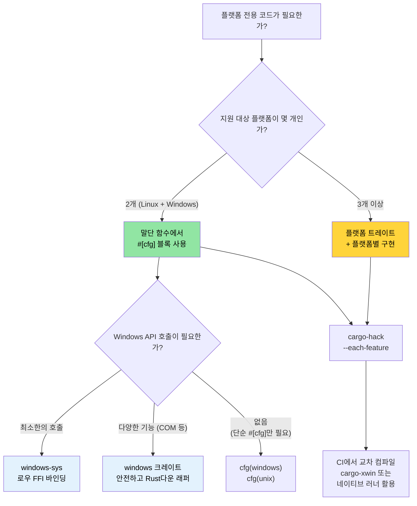

# Windows 및 조건부 컴파일 🟡

> **학습 내용:**
> - Windows 지원 패턴: `windows-sys`/`windows` 크레이트, `cargo-xwin`
> - `#[cfg]`를 이용한 조건부 컴파일 — 전처리기가 아닌 컴파일러가 검증함
> - 플랫폼 추상화 아키텍처: `#[cfg]` 블록으로 충분한 경우 vs 트레이트를 사용해야 하는 경우
> - Linux에서 Windows용으로 교차 컴파일하기
>
> **교차 참조:** [`no_std` 및 기능](ch09-no-std-and-feature-verification.md) — `cargo-hack` 및 기능 검증 · [교차 컴파일](ch02-cross-compilation-one-source-many-target.md) — 일반적인 교차 빌드 설정 · [빌드 스크립트](ch01-build-scripts-buildrs-in-depth.md) — `build.rs`에서 내보내는 `cfg` 플래그

### Windows 지원 — 플랫폼 추상화

Rust의 `#[cfg()]` 속성과 Cargo 기능을 사용하면 단일 코드베이스로 Linux와 Windows를 모두 깔끔하게 지원할 수 있습니다. 이 프로젝트의 `platform::run_command` 모듈은 이미 이 패턴을 보여주고 있습니다.

```rust
// 프로젝트의 실제 패턴 — 플랫폼별 쉘(shell) 호출
pub fn exec_cmd(cmd: &str, timeout_secs: Option<u64>) -> Result<CommandResult, CommandError> {
    #[cfg(windows)]
    let mut child = Command::new("cmd")
        .args(["/C", cmd])
        .stdout(Stdio::piped())
        .stderr(Stdio::piped())
        .spawn()?;

    #[cfg(not(windows))]
    let mut child = Command::new("sh")
        .args(["-c", cmd])
        .stdout(Stdio::piped())
        .stderr(Stdio::piped())
        .spawn()?;

    // ... 이후 로직은 플랫폼과 독립적입니다 ...
}
```

**사용 가능한 `cfg` 조건:**

```rust
// 운영체제
#[cfg(target_os = "linux")]         // Linux 전용
#[cfg(target_os = "windows")]       // Windows 전용
#[cfg(target_os = "macos")]         // macOS 전용
#[cfg(unix)]                        // Linux, macOS, BSD 등
#[cfg(windows)]                     // Windows (단축형)

// 아키텍처
#[cfg(target_arch = "x86_64")]      // x86 64비트
#[cfg(target_arch = "aarch64")]     // ARM 64비트
#[cfg(target_arch = "x86")]         // x86 32비트

// 포인터 너비 (아키텍처 대신 활용 가능한 호환성 옵션)
#[cfg(target_pointer_width = "64")] // 모든 64비트 플랫폼
#[cfg(target_pointer_width = "32")] // 모든 32비트 플랫폼

// 환경 / C 라이브러리
#[cfg(target_env = "gnu")]          // glibc
#[cfg(target_env = "musl")]         // musl libc
#[cfg(target_env = "msvc")]         // Windows의 MSVC 환경

// 엔디안(Endianness)
#[cfg(target_endian = "little")]
#[cfg(target_endian = "big")]

// any(), all(), not() 조합
#[cfg(all(target_os = "linux", target_arch = "x86_64"))]
#[cfg(any(target_os = "linux", target_os = "macos"))]
#[cfg(not(windows))]
```

### `windows-sys` 및 `windows` 크레이트

Windows API를 직접 호출해야 하는 경우:

```toml
# Cargo.toml — 로우(raw) FFI를 위해 windows-sys 사용 (가볍고 추상화 없음)
[target.'cfg(windows)'.dependencies]
windows-sys = { version = "0.59", features = [
    "Win32_Foundation",
    "Win32_System_Services",
    "Win32_System_Registry",
    "Win32_System_Power",
] }
# 참고: windows-sys는 유의적 버전(semver) 호환되지 않는 릴리스를 사용합니다 (0.48 → 0.52 → 0.59).
# 특정 마이너 버전에 고정하세요 — 각 릴리스마다 API 바인딩이 제거되거나 이름이 변경될 수 있습니다.
# 새 프로젝트를 시작하기 전에 https://github.com/microsoft/windows-rs 에서 최신 버전을 확인하세요.

# 또는 안전한 래퍼를 위해 windows 크레이트 사용 (더 무겁지만 인체공학적임)
# windows = { version = "0.59", features = [...] }
```

```rust
// src/platform/windows.rs
#[cfg(windows)]
mod win {
    use windows_sys::Win32::System::Power::{
        GetSystemPowerStatus, SYSTEM_POWER_STATUS,
    };

    pub fn get_battery_status() -> Option<u8> {
        let mut status = SYSTEM_POWER_STATUS::default();
        // SAFETY: GetSystemPowerStatus는 제공된 버퍼에 기록합니다.
        // 버퍼의 크기와 정렬이 올바르게 설정되어 있습니다.
        let ok = unsafe { GetSystemPowerStatus(&mut status) };
        if ok != 0 {
            Some(status.BatteryLifePercent)
        } else {
            None
        }
    }
}
```

**`windows-sys` vs `windows` 크레이트:**

| 비교 항목 | `windows-sys` | `windows` |
|--------|---------------|----------|
| API 스타일 | 로우 FFI (`unsafe` 호출) | 안전한 (Safe) Rust 래퍼 |
| 바이너리 크기 | 최소화 (extern 선언만 포함) | 더 큼 (래퍼 코드 포함) |
| 컴파일 시간 | 빠름 | 느림 |
| 사용성 | C-스타일, 수동 안전성 보장 필요 | Rust다운(idiomatic) 방식 |
| 에러 처리 | 원시 `BOOL` / `HRESULT` | `Result<T, windows::core::Error>` |
| 사용 추천 시점 | 성능이 중요하거나 얇은 래퍼 필요 시 | 일반 애플리케이션 코드, 사용 편의성 중시 시 |

### Linux에서 Windows용으로 교차 컴파일하기

```bash
# 방법 1: MinGW (GNU ABI)
rustup target add x86_64-pc-windows-gnu
sudo apt install gcc-mingw-w64-x86-64
cargo build --target x86_64-pc-windows-gnu
# .exe 생성 — Windows에서 실행되며 msvcrt와 링크됨

# 방법 2: xwin을 통한 MSVC ABI (완전한 MSVC 호환성)
cargo install cargo-xwin
cargo xwin build --target x86_64-pc-windows-msvc
# Microsoft의 CRT 및 SDK 헤더를 자동으로 다운로드하여 사용함

# 방법 3: Zig 기반 교차 컴파일
cargo zigbuild --target x86_64-pc-windows-gnu
```

**Windows에서의 GNU vs MSVC ABI:**

| 비교 항목 | `x86_64-pc-windows-gnu` | `x86_64-pc-windows-msvc` |
|--------|-------------------------|---------------------------|
| 링커 | MinGW `ld` | MSVC `link.exe` 또는 `lld-link` |
| C 런타임 | `msvcrt.dll` (보편적) | `ucrtbase.dll` (최신형) |
| C++ 상호 운용성 | GCC ABI | MSVC ABI |
| Linux에서 교차 빌드 | 쉬움 (MinGW 활용) | 가능 (`cargo-xwin` 활용) |
| Windows API 지원 | 전체 지원 | 전체 지원 |
| 디버그 정보 형식 | DWARF | PDB |
| 권장 용도 | 단순 도구, CI 빌드 | 완전한 Windows 통합 |

### 조건부 컴파일 패턴

**패턴 1: 플랫폼별 모듈 선택**

```rust
// src/platform/mod.rs — 운영체제별로 다른 모듈 컴파일
#[cfg(target_os = "linux")]
mod linux;
#[cfg(target_os = "linux")]
pub use linux::*;

#[cfg(target_os = "windows")]
mod windows;
#[cfg(target_os = "windows")]
pub use windows::*;

// 두 모듈 모두 동일한 공개(public) API를 구현해야 함:
// pub fn get_cpu_temperature() -> Result<f64, PlatformError>
// pub fn list_pci_devices() -> Result<Vec<PciDevice>, PlatformError>
```

**패턴 2: 기능을 이용한 플랫폼 지원 제어**

```toml
# Cargo.toml
[features]
default = ["linux"]
linux = []              # Linux 전용 하드웨어 접근
windows = ["dep:windows-sys"]  # Windows 전용 API

[target.'cfg(windows)'.dependencies]
windows-sys = { version = "0.59", features = [...], optional = true }
```

```rust
// 기능(feature) 없이 Windows용으로 빌드하려고 하면 컴파일 에러 발생:
#[cfg(all(target_os = "windows", not(feature = "windows")))]
compile_error!("Windows용으로 빌드하려면 'windows' 기능을 활성화하세요");
```

**패턴 3: 트레이트 기반 플랫폼 추상화**

```rust
/// 하드웨어 접근을 위한 플랫폼 독립적 인터페이스.
pub trait HardwareAccess {
    type Error: std::error::Error;

    fn read_cpu_temperature(&self) -> Result<f64, Self::Error>;
    fn read_gpu_temperature(&self, gpu_index: u32) -> Result<f64, Self::Error>;
    fn list_pci_devices(&self) -> Result<Vec<PciDevice>, Self::Error>;
    fn send_ipmi_command(&self, cmd: &IpmiCmd) -> Result<IpmiResponse, Self::Error>;
}

#[cfg(target_os = "linux")]
pub struct LinuxHardware;

#[cfg(target_os = "linux")]
impl HardwareAccess for LinuxHardware {
    type Error = LinuxHwError;

    fn read_cpu_temperature(&self) -> Result<f64, Self::Error> {
        // /sys/class/thermal/thermal_zone0/temp 읽기
        let raw = std::fs::read_to_string("/sys/class/thermal/thermal_zone0/temp")?;
        Ok(raw.trim().parse::<f64>()? / 1000.0)
    }
    // ...
}

#[cfg(target_os = "windows")]
pub struct WindowsHardware;

#[cfg(target_os = "windows")]
impl HardwareAccess for WindowsHardware {
    type Error = WindowsHwError;

    fn read_cpu_temperature(&self) -> Result<f64, Self::Error> {
        // WMI (Win32_TemperatureProbe) 또는 Open Hardware Monitor를 통해 읽기
        todo!("WMI 온도 쿼리 구현 필요")
    }
    // ...
}

/// 플랫폼에 맞는 적절한 구현체 생성
pub fn create_hardware() -> impl HardwareAccess {
    #[cfg(target_os = "linux")]
    { LinuxHardware }
    #[cfg(target_os = "windows")]
    { WindowsHardware }
}
```

### 플랫폼 추상화 아키텍처

여러 플랫폼을 타겟으로 하는 프로젝트의 경우, 코드를 다음의 세 계층으로 구성하세요:

```text
┌──────────────────────────────────────────────────┐
│ 애플리케이션 로직 (플랫폼 독립적)                    │
│  diag_tool, accel_diag, network_diag, event_log 등 │
│  플랫폼 추상화 트레이트만 사용함                      │
├──────────────────────────────────────────────────┤
│ 플랫폼 추상화 계층 (트레이트 정의)                   │
│  trait HardwareAccess { ... }                     │
│  trait CommandRunner { ... }                      │
│  trait FileSystem { ... }                         │
├──────────────────────────────────────────────────┤
│ 플랫폼별 구현 (cfg 게이트 적용)                      │
│  ┌──────────────┐  ┌──────────────┐              │
│  │ Linux 구현    │  │ Windows 구현 │              │
│  │ /sys, /proc  │  │ WMI, 레지스트리│              │
│  │ ipmitool     │  │ ipmiutil     │              │
│  │ lspci        │  │ devcon       │              │
│  └──────────────┘  └──────────────┘              │
└──────────────────────────────────────────────────┘
```

**추상화 테스트**: 유닛 테스트를 위해 플랫폼 트레이트를 모킹(Mock)합니다:

```rust
#[cfg(test)]
mod tests {
    use super::*;

    struct MockHardware {
        cpu_temp: f64,
        gpu_temps: Vec<f64>,
    }

    impl HardwareAccess for MockHardware {
        type Error = std::io::Error;

        fn read_cpu_temperature(&self) -> Result<f64, Self::Error> {
            Ok(self.cpu_temp)
        }

        fn read_gpu_temperature(&self, index: u32) -> Result<f64, Self::Error> {
            self.gpu_temps.get(index as usize)
                .copied()
                .ok_or_else(|| std::io::Error::new(
                    std::io::ErrorKind::NotFound,
                    format!("GPU {index}를 찾을 수 없음")
                ))
        }

        fn list_pci_devices(&self) -> Result<Vec<PciDevice>, Self::Error> {
            Ok(vec![]) // 모킹된 값 반환
        }

        fn send_ipmi_command(&self, _cmd: &IpmiCmd) -> Result<IpmiResponse, Self::Error> {
            Ok(IpmiResponse::default())
        }
    }

    #[test]
    fn test_thermal_check_with_mock() {
        let hw = MockHardware {
            cpu_temp: 75.0,
            gpu_temps: vec![82.0, 84.0],
        };
        let result = run_thermal_diagnostic(&hw);
        assert!(result.is_ok());
    }
}
```

### 적용 사례: Linux 우선, Windows 대응 완료

이 프로젝트는 이미 부분적으로 Windows를 지원할 준비가 되어 있습니다. [`cargo-hack`](ch09-no-std-and-feature-verification.md)을 사용하여 모든 기능 조합을 검증하고, Linux에서 Windows용으로 [교차 컴파일](ch02-cross-compilation-one-source-many-target.md)하여 테스트해 보세요.

**이미 완료된 작업:**
- `platform::run_command`에서 쉘 선택을 위해 `#[cfg(windows)]` 사용
- 테스트 코드에서 플랫폼별 적합한 명령어를 실행하기 위해 `#[cfg(windows)]` / `#[cfg(not(windows))]` 사용

**Windows 지원 강화를 위한 권장 단계:**

```text
1단계: 플랫폼 추상화 트레이트 추출 (현재 → 2주 소요)
  ├─ core_lib에 HardwareAccess 트레이트 정의
  ├─ 기존 Linux 코드를 LinuxHardware 구현체로 래핑
  └─ 모든 진단 모듈이 Linux 전용 코드 대신 트레이트에 의존하도록 수정

2단계: Windows 스텁(Stub) 추가 (2주 소요)
  ├─ TODO 주석이 포함된 WindowsHardware 구현
  ├─ x86_64-pc-windows-msvc 타겟에 대한 CI 빌드 추가 (컴파일 확인용)
  └─ 모든 플랫폼에서 MockHardware를 사용해 테스트 통과 확인

3단계: 실제 Windows 기능 구현 (진행 중)
  ├─ ipmiutil.exe 또는 OpenIPMI Windows 드라이버를 통한 IPMI 지원
  ├─ accel-mgmt (accel-api.dll)를 통한 GPU 지원 — Linux와 동일한 API 사용
  ├─ Windows Setup API (SetupDiEnumDeviceInfo)를 통한 PCIe 지원
  └─ WMI (Win32_NetworkAdapter)를 통한 NIC 지원
```

**교차 플랫폼 CI 추가:**

```yaml
# CI 매트릭스에 추가
- target: x86_64-pc-windows-msvc
  os: windows-latest
  name: windows-x86_64
```

이를 통해 실제 Windows 기능 구현이 완료되기 전에도 코드베이스가 Windows에서 컴파일되는지 확인할 수 있으며, `cfg` 관련 실수를 조기에 발견할 수 있습니다.

> **핵심 통찰**: 추상화가 처음부터 완벽할 필요는 없습니다. 먼저 (이미 `exec_cmd`가 하는 것처럼) 말단 함수에서 `#[cfg]` 블록으로 시작하고, 지원하는 플랫폼이 3개 이상으로 늘어나거나 플랫폼별 차이가 커질 때 트레이트로 리팩토링하세요. 성급한 추상화는 단순한 `#[cfg]` 블록보다 해로울 수 있습니다.

### 조건부 컴파일 의사결정 트리



### 🏋️ 실습

#### 🟢 실습 1: 플랫폼별 조건부 모듈

`#[cfg(unix)]`와 `#[cfg(windows)]` 환경에서 각각 작동하는 `get_hostname()` 함수를 구현해 보세요. `cargo check`와 `cargo check --target x86_64-pc-windows-msvc`를 통해 양쪽 환경 모두에서 컴파일되는지 확인합니다.

<details>
<summary>솔루션</summary>

```rust
// src/hostname.rs
#[cfg(unix)]
pub fn get_hostname() -> String {
    use std::fs;
    fs::read_to_string("/etc/hostname")
        .unwrap_or_else(|_| "unknown".to_string())
        .trim()
        .to_string()
}

#[cfg(windows)]
pub fn get_hostname() -> String {
    use std::env;
    env::var("COMPUTERNAME").unwrap_or_else(|_| "unknown".to_string())
}

#[cfg(test)]
mod tests {
    use super::*;

    #[test]
    fn hostname_is_not_empty() {
        let name = get_hostname();
        assert!(!name.is_empty());
    }
}
```

```bash
# Linux 컴파일 확인
cargo check

# Windows 교차 컴파일 확인
rustup target add x86_64-pc-windows-msvc
cargo check --target x86_64-pc-windows-msvc
```
</details>

#### 🟡 실습 2: cargo-xwin으로 Windows용 교차 컴파일

`cargo-xwin`을 설치하고 Linux에서 `x86_64-pc-windows-msvc`용 간단한 바이너리를 빌드해 보세요. 출력 결과물이 `.exe` 파일인지 확인합니다.

<details>
<summary>솔루션</summary>

```bash
cargo install cargo-xwin
rustup target add x86_64-pc-windows-msvc

cargo xwin build --release --target x86_64-pc-windows-msvc
# Windows SDK 헤더 및 라이브러리를 자동으로 다운로드함

file target/x86_64-pc-windows-msvc/release/my-binary.exe
# 출력 예시: PE32+ executable (console) x86-64, for MS Windows

# Wine이 설치되어 있다면 테스트 가능:
wine target/x86_64-pc-windows-msvc/release/my-binary.exe
```
</details>

### 핵심 요약

- 말단 함수에서는 `#[cfg]` 블록으로 시작하고, 플랫폼 간 차이가 커질 때 트레이트로 리팩토링하세요.
- `windows-sys`는 로우 FFI용이며, `windows` 크레이트는 안전하고 관용적인 래퍼를 제공합니다.
- `cargo-xwin`을 사용하면 Windows 머신 없이도 Linux에서 Windows MSVC ABI로 교차 컴파일할 수 있습니다.
- Linux 서비스만 제공하더라도 CI에서 `--target x86_64-pc-windows-msvc`를 주기적으로 체크하여 `cfg` 관련 실수를 유의하세요.
- `#[cfg]`를 Cargo 기능과 조합하여 선택적인 플랫폼 지원(예: `feature = "windows"`)을 구현하세요.

---
