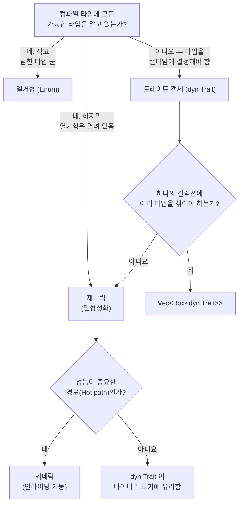

# 1. 제네릭의 모든 것 🟢

> **학습 목표:**
> - **단형성화(Monomorphization)**가 어떻게 제로 비용 제네릭을 구현하는지, 그리고 언제 **코드 팽창(Code Bloat)**을 일으키는지 이해합니다.
> - 의사 결정 프레임워크: 제네릭 vs 열거형 vs 트레이트 객체의 선택 기준을 익힙니다.
> - 컴파일 타임 배열 크기를 위한 **상수 제네릭(Const Generics)**과 컴파일 타임 연산을 위한 **`const fn`**을 배웁니다.
> - 성능이 중요하지 않은 경로(Cold path)에서 정적 디스패치 대신 동적 디스패치를 선택하는 시점을 파악합니다.

---

### 단형성화와 제로 비용 (Monomorphization and Zero Cost)

Rust의 제네릭은 **단형성화** 방식으로 동작합니다. 즉, 컴파일러가 해당 제네릭 함수가 사용된 구체적인 타입마다 별도의 특화된 코드를 생성합니다. 이는 런타임에 제네릭 정보가 사라지는 Java나 C#의 방식과는 정반대입니다.

```rust
fn max_of<T: PartialOrd>(a: T, b: T) -> T {
    if a >= b { a } else { b }
}

fn main() {
    max_of(3_i32, 5_i32);     // 컴파일러가 max_of_i32 생성
    max_of(2.0_f64, 7.0_f64); // 컴파일러가 max_of_f64 생성
    max_of("a", "z");         // 컴파일러가 max_of_str 생성
}
```

**컴파일러가 실제로 생성하는 코드 (개념적)**:

```rust
// 세 개의 별도 함수 — 런타임 디스패치나 vtable이 없음:
fn max_of_i32(a: i32, b: i32) -> i32 { if a >= b { a } else { b } }
fn max_of_f64(a: f64, b: f64) -> f64 { if a >= b { a } else { b } }
fn max_of_str<'a>(a: &'a str, b: &'a str) -> &'a str { if a >= b { a } else { b } }
```

> **왜 `max_of_str`에는 `<'a>`가 필요한가요?** `i32`와 `f64`는 `Copy` 타입이므로 값이 소유권과 함께 반환됩니다. 하지만 `&str`은 참조자이므로, 컴파일러는 반환될 참조자의 수명을 알아야 합니다. `<'a>` 주석은 "반환되는 `&str`은 입력된 두 참조자 모두보다 짧거나 같게 유지된다"는 것을 보장합니다.

**장점**: 런타임 비용이 전혀 없습니다. 수동으로 작성된 특화 코드와 성능이 동일하며, 최적화 도구(Optimizer)가 각 복사본에 대해 개별적인 인라이닝과 벡터화 최적화를 수행할 수 있습니다.

---

### 제네릭이 독이 될 때: 코드 팽창 (Code Bloat)

단형성화의 대가는 바이너리 크기입니다. 각 고유한 타입 인스턴스마다 함수 본문이 복제되기 때문입니다.

```rust
// 이 평범해 보이는 함수가...
fn serialize<T: serde::Serialize>(value: &T) -> Vec<u8> {
    serde_json::to_vec(value).unwrap()
}

// ...50개의 서로 다른 타입과 함께 사용되면 → 바이너리에 50개의 복사본이 생깁니다.
```

**완화 전략**:

1.  **비제네릭 핵심 로직 추출 (Outline 패턴)**:
    ```rust
    fn serialize<T: serde::Serialize>(value: &T) -> Result<Vec<u8>, serde_json::Error> {
        // 제네릭 부분: 직렬화 호출만 수행
        let json_value = serde_json::to_value(value)?;
        // 비제네릭 부분: 별도 함수로 추출
        serialize_value(json_value)
    }

    fn serialize_value(value: serde_json::Value) -> Result<Vec<u8>, serde_json::Error> {
        // 이 함수는 바이너리에 단 '하나'만 존재합니다.
        serde_json::to_vec(&value)
    }
    ```
2.  **트레이트 객체(동적 디스패치) 사용**: 인라이닝이 코드 성능에 결정적이지 않은 경우(예: 로깅, 에러 처리) `dyn Trait`를 고려하세요.

---

### 제네릭 vs 열거형 vs 트레이트 객체 결정 가이드

| 접근 방식 | 디스패치 | 타입 확정 시점 | 확장 가능성 | 오버헤드 |
| :--- | :--- | :--- | :--- | :--- |
| **제네릭** (`<T: Trait>`) | 정적 (단형성화) | 컴파일 타임 | ✅ (누구나 확장 가능) | 제로 — 인라이닝 가능 |
| **열거형 (Enum)** | 매치 암 (Match) | 컴파일 타임 | ❌ (정해진 타입만 가능) | 제로 — vtable 없음 |
| **트레이트 객체** (`dyn Trait`) | 동적 (vtable) | 런타임 | ✅ (누구나 확장 가능) | vtable 포인터 + 간접 호출 |

#### 의사 결정 흐름도:


---

### 상수 제네릭 (Const Generics)

Rust 1.51부터는 타입뿐만 아니라 **상수 값**을 제네릭 파라미터로 사용할 수 있습니다.

```rust
struct Matrix<const ROWS: usize, const COLS: usize> {
    data: [[f64; COLS]; ROWS],
}

impl<const ROWS: usize, const COLS: usize> Matrix<ROWS, COLS> {
    fn transpose(&self) -> Matrix<COLS, ROWS> {
        let mut result = Matrix::<COLS, ROWS>::new();
        // ... 전치 로직
        result
    }
}

// 컴파일러가 차원(Dimension)의 일치 여부를 검사합니다:
fn multiply<const M: usize, const N: usize, const P: usize>(
    a: &Matrix<M, N>,
    b: &Matrix<N, P>, // N이 반드시 일치해야 함!
) -> Matrix<M, P> { /* ... */ }
```

---

### 상수 함수 (const fn)

`const fn`은 컴파일 타임에 평가될 수 있는 함수를 의미합니다. 결과값은 `const`나 `static` 문취에서 바로 사용할 수 있습니다. (C++의 `constexpr`과 유사)

```rust
const fn celsius_to_fahrenheit(c: f64) -> f64 {
    c * 9.0 / 5.0 + 32.0
}

const BOILING_F: f64 = celsius_to_fahrenheit(100.0); // 컴파일 타임에 계산됨

// 상수 생성자 — lazy_static! 없이도 정적 변수 생성이 가능함
impl BitMask {
    const fn new(bit: u32) -> Self { BitMask(1 << bit) }
}
```

---

### 📝 연습 문제: 만료 정책이 있는 제네릭 캐시 ★★ (~30분)

설정된 최대 용량을 가진 제네릭 `Cache<K, V>` 구조체를 작성하세요. 용량이 가득 차면 가장 오래된 항목이 제거됩니다(FIFO).

- **요구 사항**:
  - `fn new(capacity: usize) -> Self`
  - `fn insert(&mut self, key: K, value: V)` — 용량 초과 시 가장 오래된 항목 제거
  - `fn get(&self, key: &K) -> Option<&V>`
  - 제약 조건: `K: Eq + Hash + Clone`

<details>
<summary>🔑 정답 및 힌트 보기</summary>

```rust
use std::collections::{HashMap, VecDeque};
use std::hash::Hash;

struct Cache<K, V> {
    map: HashMap<K, V>,
    order: VecDeque<K>,
    capacity: usize,
}

impl<K: Eq + Hash + Clone, V> Cache<K, V> {
    fn new(capacity: usize) -> Self {
        Cache {
            map: HashMap::with_capacity(capacity),
            order: VecDeque::with_capacity(capacity),
            capacity,
        }
    }

    fn insert(&mut self, key: K, value: V) {
        if self.map.contains_key(&key) {
            self.map.insert(key, value);
            return;
        }
        if self.map.len() >= self.capacity {
            if let Some(oldest) = self.order.pop_front() {
                self.map.remove(&oldest);
            }
        }
        self.order.push_back(key.clone());
        self.map.insert(key, value);
    }

    fn get(&self, key: &K) -> Option<&V> {
        self.map.get(key)
    }
}
```
</details>

---

### 📌 요약
- **단형성화**는 제로 비용 추상화를 제공하지만 코드 팽창을 야기할 수 있으므로, Cold path에서는 `dyn Trait`를 고려하세요.
- **상수 제네릭**은 배열 크기 등을 컴파일 타임에 안전하게 검사하게 해줍니다.
- **`const fn`**은 `lazy_static!`과 같은 런타임 비용을 줄여 컴파일 타임 계산으로 대체해 줍니다.

