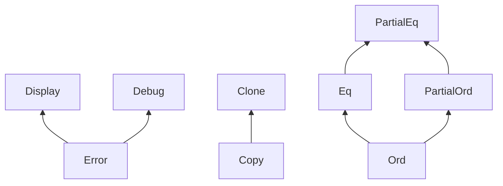

# 2. 트레이트 심층 분석 🟡

> **학습 목표:**
> - 연관 타입(Associated Types)과 제네릭 파라미터의 차이점 및 각각의 사용 시점을 이해합니다.
> - GAT(Generic Associated Types), 담요 구현(Blanket impl), 마커 트레이트, 트레이트 객체 안전성 규칙을 마스터합니다.
> - vtable과 뚱뚱한 포인터(Fat Pointer)가 하부 구조에서 어떻게 작동하는지 배웁니다.
> - 확장 트레이트(Extension traits), 열거형 디스패치(Enum dispatch), 타입화된 커맨드 패턴 등 실전 기술을 익힙니다.

---

### 연관 타입 vs 제네릭 파라미터

두 방식 모두 트레이트가 여러 타입과 함께 작동하도록 해주지만, 그 목적은 완전히 다릅니다.

```rust
// --- 연관 타입: 타입당 하나의 구현만 허용 ---
trait Iterator {
    type Item; // 각 반복자는 정확히 한 종류의 아이템만 생성함

    fn next(&mut self) -> Option<Self::Item>;
}

// Counter는 오직 i32만 생성할 수 있습니다. 선택의 여지가 없습니다.
struct Counter { max: i32, current: i32 }

impl Iterator for Counter {
    type Item = i32; // 구현 시점에 Item 타입이 고정됨
    fn next(&mut self) -> Option<i32> {
        if self.current < self.max {
            self.current += 1;
            Some(self.current)
        } else {
            None
        }
    }
}

// --- 제네릭 파라미터: 타입당 여러 구현을 허용 ---
trait Convert<T> {
    fn convert(&self) -> T;
}

// 하나의 타입(i32)이 여러 대상 타입에 대해 Convert를 구현할 수 있습니다.
impl Convert<f64> for i32 {
    fn convert(&self) -> f64 { *self as f64 }
}
impl Convert<String> for i32 {
    fn convert(&self) -> String { self.to_string() }
}
```

**언제 무엇을 사용할까요?**

| 구분 | 사용 시점 | 예시 |
| :--- | :--- | :--- |
| **연관 타입** | 해당 타입을 구현할 때 결과/출력 타입이 **단 하나**로 고정될 때 | `Iterator::Item`, `Deref::Target`, `Add::Output` |
| **제네릭 파라미터** | 한 타입이 **여러 다른 타입**에 대해 해당 트레이트를 유효하게 구현할 수 있을 때 | `From<T>`, `AsRef<T>`, `PartialEq<Rhs>` |

**직관적인 구분**: "이 반복자의 `Item`이 무엇인가?"라고 묻는 것이 자연스러우면 **연관 타입**을 쓰세요. "이 타입이 `f64`로 변환될 수 있는가? `String`으로는? `bool`로는?"와 같이 여러 가능성을 묻는다면 **제네릭 파라미터**가 정답입니다.

---

### 제네릭 연관 타입 (GAT, Generic Associated Types)

Rust 1.65부터 연관 타입 자체가 제네릭 파라미터를 가질 수 있게 되었습니다. 이는 **빌려주는 반복자(Lending Iterator)** 구현을 가능하게 하는 핵심 기능입니다. 이는 반복자가 반환하는 참조자의 수명을 컬렉션이 아닌 반복자 자신에게 묶을 수 있게 해줍니다.

```rust
// GAT가 없으면 빌려주는 반복자를 표현할 수 없었습니다.
// LendingIterator 구현 예시 (Rust 1.65+)
trait LendingIterator {
    type Item<'a> where Self: 'a;

    fn next(&mut self) -> Option<Self::Item<'_>>;
}

// 예: 겹치는 윈도우(Window)를 반환하는 반복자
struct WindowIter<'data> {
    data: &'data [u8],
    pos: usize,
    window_size: usize,
}

impl<'data> LendingIterator for WindowIter<'data> {
    type Item<'a> = &'a [u8] where Self: 'a;

    fn next(&mut self) -> Option<&[u8]> {
        if self.pos + self.window_size <= self.data.len() {
            let window = &self.data[self.pos..self.pos + self.window_size];
            self.pos += 1;
            Some(window)
        } else {
            None
        }
    }
}
```

---

### 슈퍼트레이트와 트레이트 계층 구조

트레이트는 다른 트레이트를 전제 조건으로 요구할 수 있습니다. 이를 통해 강력한 타입 계층을 형성합니다.


> 화살표는 서브트레이트에서 슈퍼트레이트를 가리킵니다: `Error`를 구현하려면 `Display`와 `Debug`가 필수입니다.

---

### 담요 구현 (Blanket Implementations)

특정 조건을 만족하는 전 세계의 **모든** 타입에 대해 트레이트를 일괄적으로 구현하는 강력한 기능입니다.

```rust
// 표준 라이브러리의 예: Display를 구현한 모든 타입은 자동으로 ToString을 얻습니다.
impl<T: fmt::Display> ToString for T {
    fn to_string(&self) -> String {
        format!("{self}")
    }
}
```
> **주의**: 담요 구현은 매우 강력하지만 한 번 정의하면 되돌리기 어렵습니다 (고아 규칙 및 일관성 문제). 설계 시 신중해야 합니다.

---

### 마커 트레이트 (Marker Traits)

메서드가 하나도 없고, 단순히 타입이 특정 속성을 가지고 있음을 컴파일러에게 알리는 역할을 합니다.

- **`Send`**: 스레드 간에 데이터 소유권을 넘겨도 안전함.
- **`Sync`**: 여러 스레드에서 참조(`&T`)를 공유해도 안전함.
- **`Copy`**: 단순 비트 복사(`memcpy`)로 복제 가능함.
- **`Sized`**: 컴파일 타임에 크기를 알 수 있음.

---

### 트레이트 객체 안전성 (Trait Object Safety)

모든 트레이트가 `dyn Trait`로 사용될 수 있는 것은 아닙니다. 다음 규칙을 지켜야 **객체 안전**한 트레이트가 됩니다.

1.  트레이트 자체에 `Self: Sized` 제약이 없어야 합니다.
2.  메서드에 제네릭 파라미터가 없어야 합니다.
3.  `Self`를 반환 타입으로 직접 사용하지 않아야 합니다 (간접 참조 가능).
4.  모든 메서드가 `self/&self/&mut self`를 인자로 받아야 합니다 (연관 함수 불가).

---

### vtable과 뚱뚱한 포인터 (Fat Pointers)

`&dyn Trait` (또는 `Box<dyn Trait>`)는 내부적으로 두 개의 포인터로 구성됩니다.
1.  **데이터 포인터**: 실제 데이터의 메모리 주소.
2.  **vtable 포인터**: 해당 타입의 트레이트 메서드 주소들이 담긴 표(vtable)의 주소.

| 디스패치 방식 | 특징 | 성 능 |
| :--- | :--- | :--- |
| **정적 (impl Trait)** | 컴파일 타임에 타입 확정 및 복제 | 초고속 (인라이닝 가능) |
| **동적 (dyn Trait)** | 런타임에 vtable을 통한 간접 호출 | 상대적으로 느림 (포인터 점프) |

---

### 확장 트레이트 (Extension Traits)

내가 소유하지 않은 외부 타입에 새로운 메서드를 추가할 때 사용하는 패턴입니다 (`itertools`, `tokio` 등에서 널리 쓰임).

```rust
pub trait IteratorExt: Iterator {
    fn mean(self) -> Option<f64>
    where
        Self: Sized,
        Self::Item: Into<f64>;
}

// 모든 Iterator에 .mean() 메서드를 주입합니다.
impl<I: Iterator> IteratorExt for I {
    fn mean(self) -> Option<f64>
    where
        Self: Sized,
        Self::Item: Into<f64>,
    {
        // ... (평균 계산 로직)
        None
    }
}
```

---

### 열거형 디스패치 (Enum Dispatch)

타입의 종류가 고정되어 있다면 `dyn Trait` 대신 열거형을 쓰세요. 힙 할당이 없고, 컴파일러가 분기 예측 최적화와 인라이닝을 수행할 수 있어 훨씬 빠릅니다.

---

### 능력 믹스인 (Capability Mixins)

연관 타입과 담요 구현을 조합하여, 복잡한 하드웨어 버스나 기능을 부품처럼 조합(Mixin)하는 기법입니다. 상속이 없는 Rust에서 유연하게 기능을 확장하는 핵심 패턴입니다.

---

### 타입화된 커맨드 (Typed Commands)

Haskell의 GADT와 유사하게, 각 명령(Command) 타입이 특정 응답(Response) 타입을 결정하도록 설계하는 패턴입니다. `Vec<u8>` 같은 불투명한 데이터 대신, 강한 타입 안전성을 보장합니다.

```rust
trait IpmiCmd {
    type Response; // 명령마다 다른 응답 타입을 정의
    fn parse_response(&self, raw: &[u8]) -> io::Result<Self::Response>;
}
```

---

### 📝 연습 문제: 연관 타입을 활용한 저장소 패턴 ★★★

`Item`, `Id`, `Error` 연관 타입을 가진 `Repository` 트레이트를 설계하고, 사용자(User) 정보를 관리하는 인메모리 저장소를 구현해 보세요.

---

### 📌 요약
- **연관 타입**은 하나로 고정된 출력을, **제네릭**은 열린 가능성을 의미합니다.
- **GAT**는 수명에 의존적인 복잡한 타입을 설계할 때 필수입니다.
- **성능**이 중요하다면 열거형 디스패치를, **확장성**이 중요하다면 트레이트 객체를 선택하세요.
- **확장 트레이트**와 **믹스인**은 Rust의 구성(Composition) 철학을 실현하는 도구입니다.

