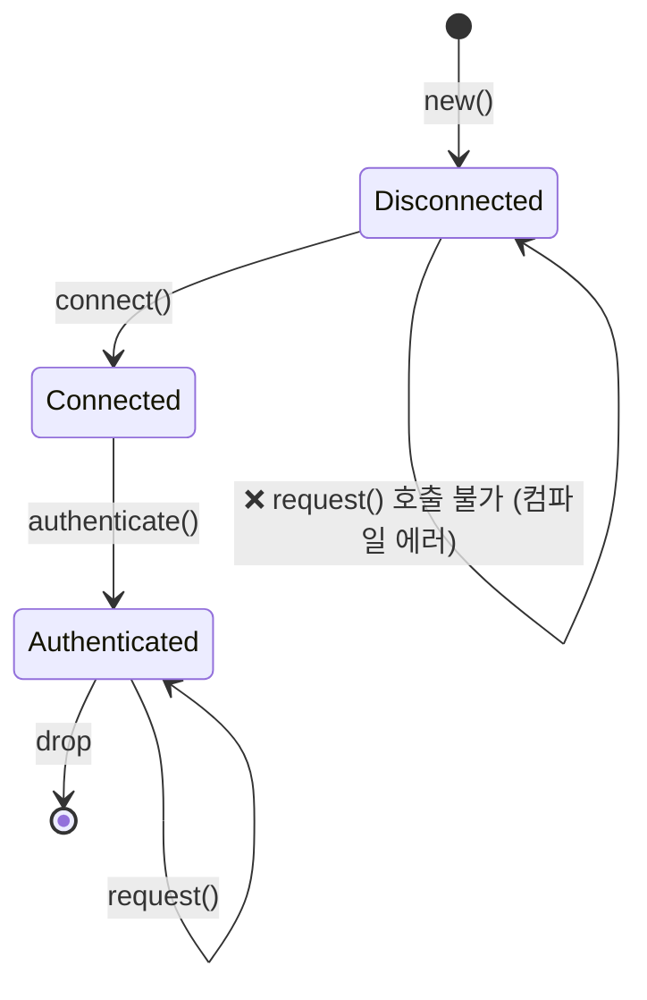
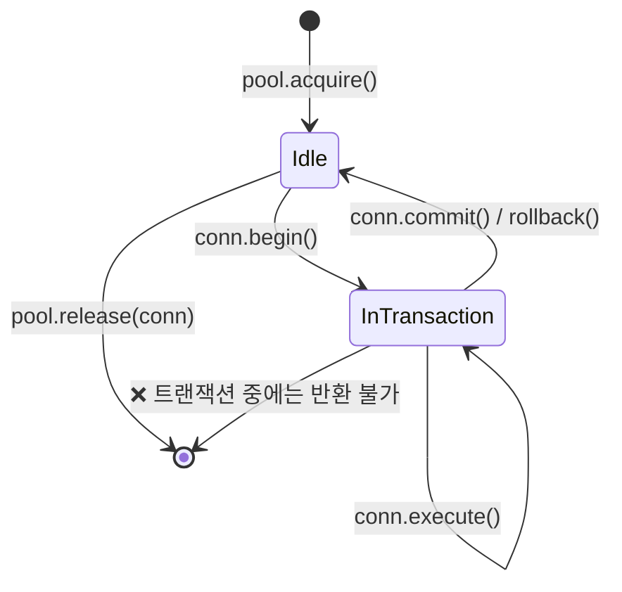

# 3. 뉴타입과 타입 상태 패턴 🟡

> **학습 목표:**
> - 제로 비용 컴파일 타임 타입 안전성을 위한 **뉴타입(Newtype)** 패턴을 익힙니다.
> - **타입 상태(Type-state)** 패턴을 통해 잘못된 상태 전이를 아예 표현 불가능하게 만드는 법을 배웁니다.
> - 컴파일 타임에 필수 필드 입력을 강제하는 **타입 상태 빌더** 패턴을 학습합니다.
> - 제네릭 파라미터 폭발 문제를 해결하는 **설정 트레이트(Config trait)** 패턴을 이해합니다.

---

### 뉴타입: 제로 비용 타입 안전성 (Newtype Pattern)

뉴타입 패턴은 기존 타입을 단일 필드 튜플 구조체로 감싸서, 런타임 오버헤드 없이 고유한 타입을 만드는 기술입니다.

```rust
// 뉴타입 미사용 — 인자 순서를 섞기 쉽고 찾아내기 어렵습니다.
fn create_user(name: String, email: String, age: u32, id: u32) { }
// create_user(name, email, id, age); // ❌ 버그: age와 id가 바뀌었지만 컴파일은 성공함

// 뉴타입 사용 — 컴파일러가 실수를 즉시 잡아냅니다.
struct Age(u32);
struct EmployeeId(u32);

fn create_user(name: String, email: String, age: Age, id: EmployeeId) { }
// create_user(name, email, EmployeeId(42), Age(30)); // ❌ 컴파일 에러: 타입을 잘못 전달함
```

#### `impl Deref`의 양날의 검
뉴타입에 `Deref`를 구현하면 내부 타입의 모든 메서드를 "공짜"로 쓸 수 있지만, 캡슐화 경계에 구멍을 뚫는 위험이 있습니다.

- **권장 시점**: `Box<T>`, `Arc<T>` 같은 스마트 포인터나 `String` → `str` 처럼 래퍼가 내부 타입의 완벽한 상위 집합일 때.
- **비권장 시점**: 불변식(Invariant)을 보호해야 하는 도메인 타입(예: `Email`은 항상 `@`를 포함해야 함). `Deref`를 통해 내부 `String`의 메서드를 멋대로 호출하면 불변식이 깨질 수 있습니다.

> **철칙**: 뉴타입의 목적이 **타입 안전성 추가**나 **API 제한**이라면 `Deref`를 구현하지 마세요. 대신 필요한 메서드만 명시적으로 위임(Delegation)하세요.

---

### 타입 상태 패턴: 불가능한 상태를 표현 불가능하게 만들기

타입 시스템을 사용하여 작업이 반드시 올바른 순서대로 일어나도록 강제하는 패턴입니다.

#### 상태 전이도 설계


각 상태 전이는 기존 상태 객체를 **소비(Consume)**하고 새로운 타입의 객체를 반환합니다.

```rust
struct Disconnected;
struct Connected;
struct Authenticated;

struct Connection<State> {
    address: String,
    _state: std::marker::PhantomData<State>, // 런타임 비용 없는 마커
}

impl Connection<Disconnected> {
    fn connect(self) -> Connection<Connected> { /* ... */ }
}

impl Connection<Authenticated> {
    fn request(&self, path: &str) -> String { /* ... */ }
}
```
> **핵심 통찰**: `Option`이나 `match`로 런타임에 상태를 체크하는 대신, 타입 시스템이 컴파일 타임에 순서를 보장합니다.

---

### 실전 사례: 타입 안전한 커넥션 풀 (Connection Pool)

운영 환경에서 트랜잭션 도중에 커넥션을 풀에 반환하면 데이터베이스 락(Lock)이 무한히 유지될 위험이 있습니다.



Rust에서는 `release(conn: PooledConnection<Idle>)`와 같이 **유휴(Idle) 상태의 커넥션만 인자로 받도록** 설계함으로써, 트랜잭션 중인 커넥션을 실수로 반환하는 버그를 원천 봉쇄할 수 있습니다.

---

### 설정 트레이트(Config Trait) 패턴: 제네릭 파라미터 폭발 방지

구조체가 관리하는 하드웨어 버스나 컴포넌트가 늘어날수록 제네릭 파라미터 리스트가 걷잡을 수 없이 길어집니다.

```rust
// ❌ 제네릭 파라미터 지옥
struct Controller<S: Spi, I: I2c, U: Uart, G: Gpio, E: Eth> { ... }
```

이를 해결하기 위해 모든 연관 타입을 하나의 **설정 트레이트**로 묶습니다.

```rust
trait BoardConfig {
    type Spi: SpiBus;
    type I2c: I2cBus;
    type Uart: UartBus;
    // ...
}

// ✅ 이제 제네릭 파라미터는 단 하나입니다.
struct Controller<Cfg: BoardConfig> {
    spi: Cfg::Spi,
    i2c: Cfg::I2c,
    // ...
}
```
> 이 패턴을 쓰면 새로운 부품을 추가하더라도 함수 시그니처나 테스트 코드를 일일이 수정할 필요가 없습니다.

---

### 📝 연습 문제: 타입 상태를 활용한 교통 신호등 ★★ (~30분)

타입 상태 패턴을 사용하여 `Red → Green → Yellow → Red` 순서로만 전이되는 신호등 시스템을 구현해 보세요. 순서를 어기는 코드가 컴파일되지 않음을 확인하세요.

---

### 📌 요약
- **뉴타입**은 런타임 비용 없이 도메인 타입을 명확히 구분해 줍니다.
- **타입 상태**는 비즈니스 로직의 논리적 버그를 컴파일 타임 에러로 바꿔 줍니다.
- **설정 트레이트**는 대규모 시스템 아키텍처에서 제네릭 복잡성을 관리하는 표준 패턴입니다.

