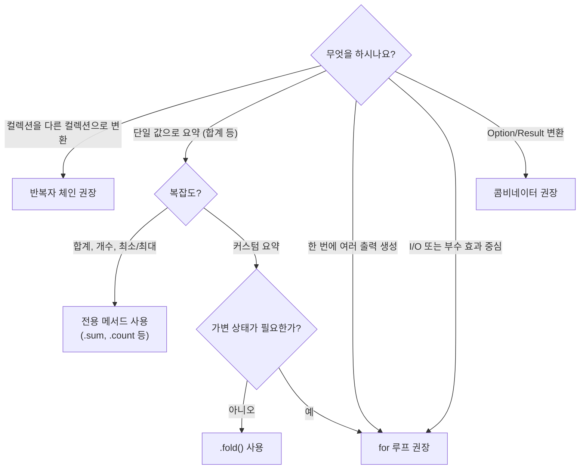

# 8. 함수형 vs 명령형: 우아함이 승리할 때 (그리고 아닐 때) 🟡

> **학습 목표:**
> - 데이터 변환 파이프라인과 부수 효과 중심의 상태 관리 사이에서 최적의 스타일을 선택하는 안목을 기릅니다.
> - `Option`과 `Result`의 콤비네이터를 활용해 중복되는 `if let` 코드를 제거합니다.
> - 반복자 체인과 루프 중 무엇이 더 읽기 쉽고 효율적인지 판단하는 기준을 배웁니다.
> - 함수형 에러 처리와 명령형 가독성을 결합하는 `?` 연산자의 가치를 이해합니다.

---

### 함수형 vs 명령형: 선택의 핵심 원칙

Rust는 함수형 언어(Haskell 등)와 명령형 언어(C 등)의 장점을 모두 갖추고 있습니다.

- **함수형 스타일**: 데이터를 파이프라인을 통해 **변환(Transforming)**할 때 빛을 발합니다.
- **명령형 스타일**: 부수 효과가 있는 **상태 전이(State transitions)**를 관리할 때 더 명학합니다.

---

### Option과 Result 콤비네이터 가족

`if let`이나 `match`로 도배된 코드를 콤비네이터로 바꾸면 의도가 더 명확해집니다.

| 콤비네이터 | 대신 사용법 | 전달하는 의도 |
| :--- | :--- | :--- |
| `opt.unwrap_or(def)` | `if let Some(x) = opt { x } else { def }` | "값이 없으면 이 기본값을 쓰겠다" |
| `opt.map(f)` | `match opt { Some(x) => Some(f(x)), ... }` | "안에 든 값을 변환하되, 없으면 없는 대로 둠" |
| `opt.and_then(f)` | `match opt { Some(x) => f(x), ... }` | "실패할 수 있는 연산들을 체인으로 엮음" |
| `opt.filter(p)` | `match opt { Some(x) if p(&x) => ..., _ => None }` | "조건을 만족할 때만 값을 남김" |
| `res.map_err(f)` | `match res { OK(x) => OK(x), Err(e) => Err(f(e)) }` | "에러 타입만 다른 것으로 변환함" |

---

### 반복자 체인 vs 루프: 결정 가이드

#### 반복자 체인이 이기는 경우 (데이터 파이프라인)
- 여러 단계의 필터링, 매핑, 수집이 일어날 때.
- 가변 변수(`mut`)를 없애고 데이터의 흐름을 일방통행으로 만들고 싶을 때.
- 중간 결과물을 보관할 필요가 없을 때.

#### 루프가 이기는 경우 (복잡한 상태 및 부수 효과)
- 한 번의 순회로 여러 종류의 컬렉션을 동시에 구축해야 할 때.
- 루프 중간에 DB 저장, 로그 출력 등 복잡한 부수 효과가 섞여 있을 때.
- 상태 머신 로직이 포함되어 `match state`가 핵심일 때.

#### 결정 순서도


---

### 스코프 가변성 (Scoped Mutability)

"내부는 명령형으로, 외부는 함수형으로" 처리하는 Rust의 강력한 패턴입니다. 블록(`{}`) 자체가 식(Expression)이 될 수 있음을 활용합니다.

```rust
let samples = {
    let mut buf = Vec::new(); // 이 가변 변수는 블록 안에서만 존재
    while buf.len() < 10 {
        buf.push(generate_data());
    }
    buf // 결과물 반환
};
// 이제 samples는 불변(immutable)입니다!
```

---

### ? 연산자: 함수형과 명령형의 우아한 결합

`?` 연산자는 내부적으로는 `.and_then()`과 같지만, 가독성은 명령형 코드와 같습니다.

```rust
// 함수형 체이닝 (가끔 읽기 힘듦)
read_file()?.and_then(parse)?.and_then(validate)

// ? 연산자 활용 (변수 이름을 지을 수 있어 명확함)
let contents = read_file()?;
let config = parse(contents)?;
validate(config)
```
> **팁**: 중간 변수 이름이 로직의 이해에 도움을 준다면 `?` 연산자를, 단순한 변환의 연속이라면 콤비네이터를 선택하세요.

---

### 📝 연습 문제: 명령형 코드를 함수형으로 리팩토링 ★★ (~30분)

서버 목록을 받아 상태별로 분류하고 평균 전력 소비량과 최고 온도를 계산하는 명령형 함수를 리팩토링해 보세요. 어떤 부분이 함수형으로 고쳤을 때 더 나빠지는지(혹은 좋아지는지) 분석해 보세요.

---

### 📌 요약
- **`Option`과 `Result`를 컬렉션처럼** 취급하여 콤비네이터를 활용하세요.
- 데이터 변환은 **반복자 체인**이, 상태 관리는 **루프**가 적합합니다.
- **제로 비용 추상화**: 함수형으로 짜더라도 릴리즈 빌드에서는 루프와 동일한 기계어로 최적화됩니다. 성능 걱정 말고 가독성을 우선하세요.
- **안티 패턴**: 5단계 이상의 너무 긴 체인은 가독성을 해칩니다. 중간 변수로 끊어 가세요.

